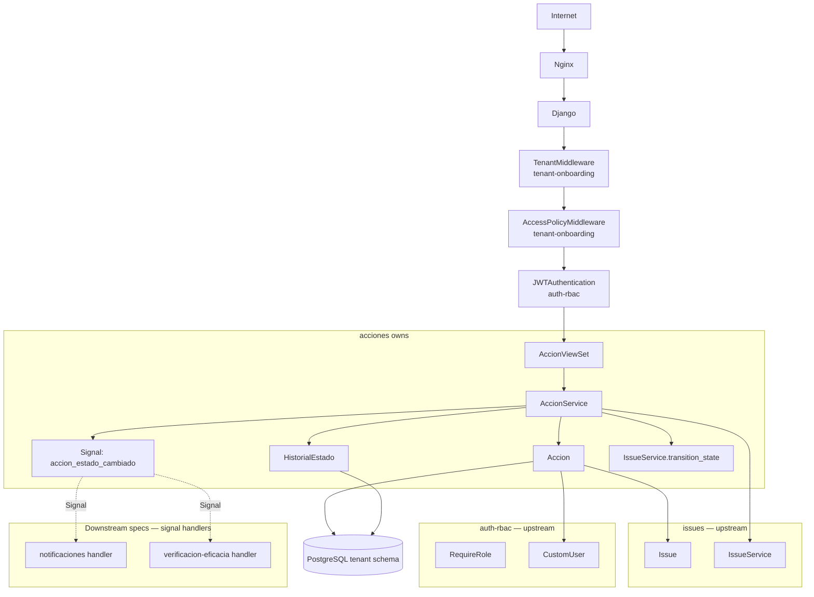
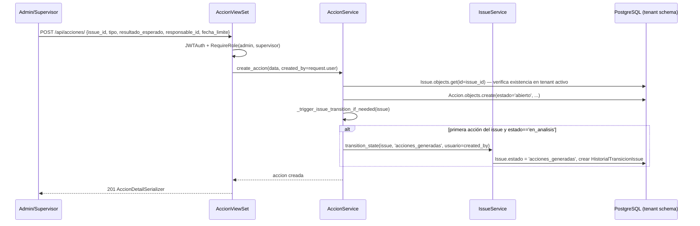
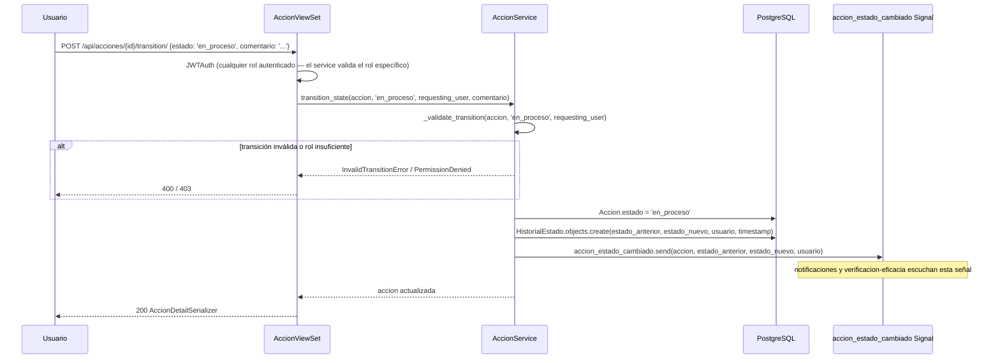
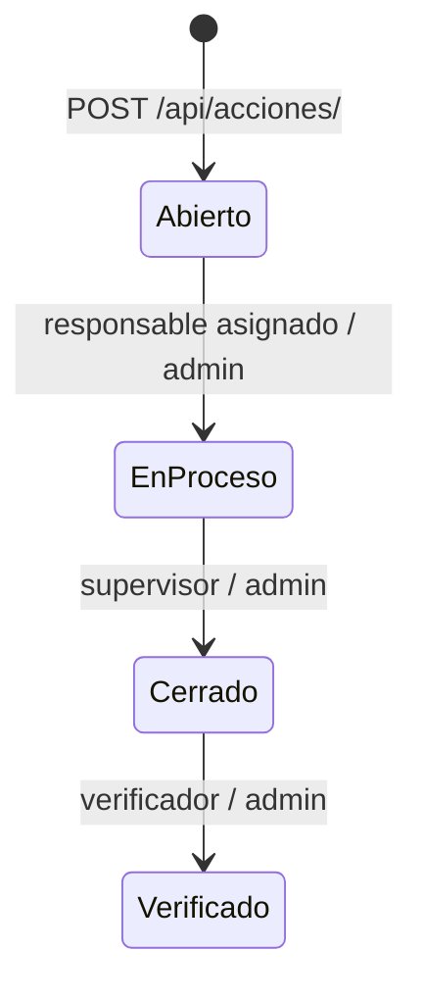
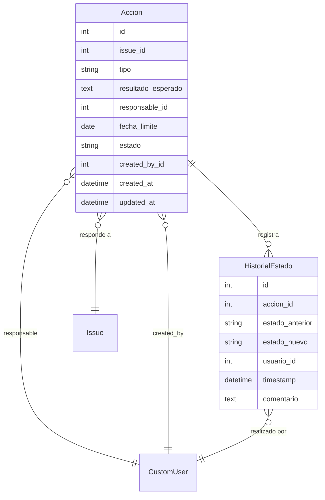

# Design: acciones

## Overview

Acciones implementa el ciclo de vida formal de las respuestas a eventos de seguridad industrial en SGCA. Proporciona una máquina de estados unidireccional (Abierto → En proceso → Cerrado → Verificado) con validación de rol en cada transición y un historial de estados inmutable que sirve de evidencia auditable ante inspecciones de cumplimiento normativo.

**Purpose**: Registrar formalmente la decisión de respuesta de la empresa ante incidentes de seguridad, con trazabilidad completa de quién hizo qué y cuándo.
**Users**: Admin (gestión completa), supervisor (cierre de acciones), responsable (ejecución), verificador (verificación de eficacia). Specs downstream acceden al modelo Accion como fuente de datos.
**Impact**: Establece el modelo `Accion` y la señal `accion_estado_cambiado` que planes-trabajo, verificacion-eficacia y notificaciones consumen. Cambios en el modelo o la señal requieren revalidación en esas specs.

### Goals
- Modelo Accion con FK a Issue y máquina de estados validada por rol
- HistorialEstado inmutable para auditoría completa
- Señal `accion_estado_cambiado` como contrato de salida hacia specs downstream
- CRUD de acciones con permisos por rol y filtros paginados

### Non-Goals
- Plan de trabajo con actividades (→ planes-trabajo)
- Envío de emails de notificación (→ notificaciones)
- Programación de verificaciones de eficacia (→ verificacion-eficacia)
- Generación de reportes (→ reportes-dashboard)

---

## Boundary Commitments

### This Spec Owns
- Modelos `Accion` y `HistorialEstado` en el schema privado del tenant
- Máquina de estados con reglas de transición y validación de rol
- Señal `accion_estado_cambiado` (definición + emisión)
- Lógica que dispara la transición automática del Issue a "Acciones Generadas"
- Endpoints REST: CRUD de acciones, transition, historial
- Serializers, filters, viewsets de `apps/acciones/`
- La FK `Accion.id` como contrato de salida hacia planes-trabajo y verificacion-eficacia

### Out of Boundary
- PlanTrabajo y Actividades (→ planes-trabajo)
- Handlers de la señal `accion_estado_cambiado` (→ notificaciones, verificacion-eficacia los registran en sus propios apps)
- Emails de notificación (→ notificaciones)
- Verificaciones de eficacia programadas (→ verificacion-eficacia)
- El modelo Issue (→ issues; acciones solo escribe su estado vía IssueService)

### Allowed Dependencies
- `apps.issues.models.Issue` — FK obligatoria; `apps.issues.services.IssueService.transition_state` para disparar cambio a "Acciones Generadas"
- `apps.users.models.CustomUser` — FK responsable y created_by
- `apps.users.permissions.RequireRole`, `IsAdminTenant` — permisos en endpoints
- `apps.tenants.models.TenantModel` — herencia para aislamiento por schema
- `django.db.models.signals.Signal` — definición de señal de dominio
- `django-filter` — filtros de listado
- `djangorestframework` — ViewSet, Serializer, Pagination

### Revalidation Triggers
- Si cambia la firma de la señal `accion_estado_cambiado` (args, nombre) → revalidar notificaciones y verificacion-eficacia
- Si se añaden o renombran estados de Accion → revalidar notificaciones (templates de email), verificacion-eficacia (condición de trigger), reportes-dashboard (aggregations)
- Si cambia el modelo Issue (campos de estado) → revalidar la lógica de transición automática a "Acciones Generadas"
- Si cambia `RequireRole` de auth-rbac → revalidar todos los endpoints de acciones

---

## Architecture

### Architecture Pattern & Boundary Map



**Architecture Integration**:
- Pattern: DRF ViewSet + Service Layer + TenantModel + Django Signals
- `Accion` hereda de `TenantModel` → todas las queries restringidas al schema activo automáticamente
- `AccionService` centraliza toda la lógica de negocio (validación de transiciones, emisión de señales)
- La señal `accion_estado_cambiado` desacopla acciones de sus consumidores downstream
- `IssueService.transition_state` se invoca desde `AccionService` (no al revés) para respetar la dirección de dependencia

### Technology Stack

| Layer | Elección | Rol en este feature |
|-------|----------|---------------------|
| Backend | Python 3.12 + Django 5 + DRF | Modelos, API, lógica de negocio |
| Multi-tenancy | django-tenants (TenantModel) | Aislamiento por schema PostgreSQL |
| Señales | Django Signals | Desacoplamiento con specs downstream |
| Filtros | django-filter | Filtros tipados en listado |
| DB | PostgreSQL 16 | Schema privado del tenant |
| Frontend | React 18 + Vite + TailwindCSS | Listado, detalle, formulario y botones de transición |

---

## File Structure Plan

### Directory Structure

```
backend/
└── apps/
    └── acciones/
        ├── __init__.py
        ├── models.py         # Accion, HistorialEstado
        ├── signals.py        # accion_estado_cambiado Signal + post_save handler para issue transition
        ├── serializers.py    # AccionListSerializer, AccionDetailSerializer,
        │                     # AccionWriteSerializer, HistorialEstadoSerializer, TransitionSerializer
        ├── services.py       # AccionService: CRUD, transition_state, queryset_for_user
        ├── filters.py        # AccionFilter (django-filter)
        ├── views.py          # AccionViewSet con @action transition y historial
        ├── urls.py           # /api/acciones/
        └── tests/
            ├── test_models.py        # Accion state machine, HistorialEstado cascade
            ├── test_services.py      # AccionService: CRUD, transitions, permisos, señales
            ├── test_api.py           # Endpoints CRUD, filtros, paginación, transition
            └── test_permissions.py   # Visibilidad y acceso por rol, aislamiento de tenant

frontend/
└── src/
    ├── pages/
    │   └── acciones/
    │       ├── AccionListPage.tsx    # Lista con filtros, paginación
    │       ├── AccionDetailPage.tsx  # Detalle + historial de estados + botones de transición
    │       └── AccionFormPage.tsx    # Crear/editar acción
    ├── components/
    │   └── acciones/
    │       ├── AccionCard.tsx        # Tarjeta resumen en lista
    │       ├── AccionStatusBadge.tsx # Badge de estado con color semántico
    │       └── TransitionButton.tsx  # Botón de transición según rol
    └── services/
        └── acciones.ts               # accionesService: CRUD, transition, historial
```

### Modified Files
- `backend/config/settings/base.py` — añadir `'apps.acciones'` a TENANT_APPS
- `backend/apps/acciones/apps.py` — conectar señales en `ready()`

---

## System Flows

### Flujo de Creación de Acción



### Flujo de Transición de Estado



### Máquina de Estados



---

## Requirements Traceability

| Requisito | Resumen | Componentes | Contratos | Flujos |
|-----------|---------|-------------|-----------|--------|
| 1.1–1.7 | Creación de acciones | AccionViewSet, AccionService | POST /api/acciones/ | Flujo de Creación |
| 2.1–2.9 | Máquina de estados | AccionService._validate_transition, HistorialEstado | POST /api/acciones/{id}/transition/ | Flujo de Transición |
| 3.1–3.5 | Historial de auditoría | HistorialEstado, AccionService | GET /api/acciones/{id}/historial/ | Flujo de Transición |
| 4.1–4.5 | Control de acceso por rol | RequireRole, AccionService.queryset_for_user | — | — |
| 5.1–5.5 | Listado y filtros | AccionFilter, AccionViewSet, AccionListSerializer | GET /api/acciones/ | — |
| 6.1–6.3 | Edición de acciones | AccionViewSet, AccionService.update_accion | PUT/PATCH /api/acciones/{id}/ | — |

---

## Components and Interfaces

### Resumen de Componentes

| Componente | Layer | Intent | Req Coverage | Dependencias Clave |
|------------|-------|--------|--------------|---------------------|
| Accion | Modelo | Registro formal de acción de respuesta | 1, 2, 4, 5, 6 | TenantModel, Issue, CustomUser (P0) |
| HistorialEstado | Modelo | Auditoría inmutable de transiciones | 3 | Accion, CustomUser (P0) |
| AccionService | Service | CRUD, state machine, señal, issue transition | 1–6 | Accion, IssueService, Signal (P0) |
| accion_estado_cambiado | Signal | Contrato de salida hacia downstream | 2 (implícito) | Django Signals (P0) |
| AccionViewSet | API | Endpoints REST + transition + historial | 1, 2, 3, 4, 5, 6 | AccionService, RequireRole (P0) |
| AccionFilter | Filtro | Filtros por estado/tipo/responsable/fechas | 5 | django-filter (P0) |

---

### Modelos

#### Accion

| Field | Detail |
|-------|--------|
| Intent | Registro formal de una acción de respuesta vinculada a un incidente de seguridad |
| Requirements | 1.1, 1.2, 1.3, 2.1, 4.1–4.5, 5.1, 6.1–6.3 |

**Contracts**: Service [x]

```python
class Accion(TenantModel):
    TIPOS = [
        ('correctiva', 'Correctiva'),
        ('preventiva', 'Preventiva'),
        ('mejora', 'De Mejora'),
    ]
    ESTADOS = [
        ('abierto', 'Abierto'),
        ('en_proceso', 'En Proceso'),
        ('cerrado', 'Cerrado'),
        ('verificado', 'Verificado'),
    ]
    TRANSICIONES_VALIDAS = {
        'abierto': ['en_proceso'],
        'en_proceso': ['cerrado'],
        'cerrado': ['verificado'],
        'verificado': [],
    }
    # roles que pueden ejecutar cada transición (además de admin, que puede hacer cualquiera)
    ROLES_TRANSICION = {
        ('abierto', 'en_proceso'): 'responsable_asignado',  # solo el responsable asignado a esta acción
        ('en_proceso', 'cerrado'): 'supervisor',
        ('cerrado', 'verificado'): 'verificador',
    }

    issue = ForeignKey('issues.Issue', on_delete=PROTECT, related_name='acciones')
    tipo = CharField(max_length=20, choices=TIPOS)
    resultado_esperado = TextField()
    responsable = ForeignKey(
        'users.CustomUser', on_delete=PROTECT, related_name='acciones_asignadas'
    )
    fecha_limite = DateField()
    estado = CharField(max_length=20, choices=ESTADOS, default='abierto')
    created_by = ForeignKey(
        'users.CustomUser', on_delete=PROTECT, related_name='acciones_creadas'
    )
    created_at = DateTimeField(auto_now_add=True)
    updated_at = DateTimeField(auto_now=True)
```

**Invariants**:
- `estado` siempre tiene uno de los 4 valores definidos; no retrocede
- `issue`, `tipo`, `resultado_esperado`, `responsable`, `fecha_limite` son non-null
- `responsable` pertenece al tenant activo (validado en AccionService)
- Las acciones con `estado='verificado'` no pueden ser editadas

---

#### HistorialEstado

| Field | Detail |
|-------|--------|
| Intent | Registro inmutable de cada transición de estado de una Accion para auditoría |
| Requirements | 3.1–3.5 |

**Contracts**: Service [x]

```python
class HistorialEstado(TenantModel):
    accion = ForeignKey(Accion, on_delete=CASCADE, related_name='historial_estados')
    estado_anterior = CharField(max_length=20)
    estado_nuevo = CharField(max_length=20)
    usuario = ForeignKey('users.CustomUser', on_delete=PROTECT)
    timestamp = DateTimeField(auto_now_add=True)
    comentario = TextField(blank=True, default='')
    # No hay campos updatable — todos auto o readonly
```

**Invariants**:
- Solo `AccionService.transition_state` puede crear registros de HistorialEstado
- Ninguna vista ni endpoint permite PUT/PATCH/DELETE de HistorialEstado
- Si se elimina una Accion, el historial se elimina en cascada (CASCADE)

---

### Señal de Dominio

#### accion_estado_cambiado

| Field | Detail |
|-------|--------|
| Intent | Señal Django emitida tras cada transición de estado exitosa; desacopla acciones de notificaciones y verificacion-eficacia |
| Requirements | 2 (implícito en todas las transiciones exitosas) |

**Contracts**: Event [x]

```python
# Definida en apps/acciones/signals.py
from django.dispatch import Signal

accion_estado_cambiado = Signal()
# Kwargs enviados con la señal:
# - accion: Accion — la instancia actualizada con el nuevo estado
# - estado_anterior: str — estado previo a la transición
# - estado_nuevo: str — estado después de la transición
# - usuario: CustomUser — quién realizó la transición
# - timestamp: datetime — momento exacto de la transición

# Uso desde AccionService:
accion_estado_cambiado.send(
    sender=Accion,
    accion=accion,
    estado_anterior=estado_anterior,
    estado_nuevo=estado_nuevo,
    usuario=usuario,
    timestamp=historial.timestamp,
)
```

**Ordering / delivery guarantees**:
- La señal se emite sincrónicamente dentro de la misma transacción DB después de guardar HistorialEstado
- Si un handler lanza excepción, NO revierte la transición (handlers downstream deben capturar sus propias excepciones)
- El handler de verificacion-eficacia solo actúa cuando `estado_nuevo == 'cerrado'`
- El handler de notificaciones actúa en todos los cambios de estado

---

### Service Layer

#### AccionService

| Field | Detail |
|-------|--------|
| Intent | Centraliza CRUD de acciones, validación de transiciones, emisión de señal y trigger de issue |
| Requirements | 1.1–1.7, 2.1–2.9, 3.1, 4.1–4.5, 6.1–6.3 |

**Contracts**: Service [x]

```python
class AccionService:
    def create_accion(
        self,
        issue: Issue,
        tipo: str,
        resultado_esperado: str,
        responsable: CustomUser,
        fecha_limite: date,
        created_by: CustomUser,
    ) -> Accion:
        """
        Crea Accion con estado='abierto'. Valida que responsable pertenece al tenant activo.
        Si es la primera acción del issue y issue.estado=='en_analisis', dispara transición
        del issue a 'acciones_generadas' vía IssueService.
        Raises: ValidationError (tipo inválido, responsable fuera del tenant).
        """

    def update_accion(
        self,
        accion: Accion,
        data: dict,
        requesting_user: CustomUser,
    ) -> Accion:
        """
        Actualiza campos editables. Solo admin puede editar.
        Raises: PermissionDenied, ValidationError (accion verificada).
        """

    def transition_state(
        self,
        accion: Accion,
        nuevo_estado: str,
        requesting_user: CustomUser,
        comentario: str = '',
    ) -> Accion:
        """
        Valida transición y rol. Actualiza estado. Crea HistorialEstado.
        Emite accion_estado_cambiado. Raises: InvalidTransitionError, PermissionDenied.
        """

    def queryset_for_user(self, user: CustomUser) -> QuerySet[Accion]:
        """
        admin/supervisor/verificador: todas las acciones del tenant activo.
        responsable: solo acciones donde responsable=user.
        TenantModel ya garantiza el scope del tenant.
        """

    def _validate_transition(
        self, accion: Accion, nuevo_estado: str, requesting_user: CustomUser
    ) -> None:
        """
        Raises InvalidTransitionError si la transición no está en TRANSICIONES_VALIDAS.
        Raises PermissionDenied si el rol del usuario no está autorizado para la transición.
        Admin bypasses todas las restricciones de rol.
        """

    def _trigger_issue_transition_if_needed(
        self, issue: Issue, created_by: CustomUser
    ) -> None:
        """
        Comprueba si es la primera acción del issue y el issue está en 'en_analisis'.
        Si sí, llama IssueService.transition_state(issue, 'acciones_generadas', created_by).
        """
```

**Preconditions**: `connection.schema_name` es el schema del tenant activo
**Postconditions**: Accion y HistorialEstado creados en el schema activo; señal emitida
**Invariants**: Nunca modifica Issues de otro schema; HistorialEstado siempre creado en la misma transacción que el cambio de estado

---

### API

#### AccionViewSet

| Field | Detail |
|-------|--------|
| Intent | Endpoints REST para CRUD de acciones, transición de estados e historial |
| Requirements | 1.1–1.7, 2.1–2.9, 3.1–3.5, 4.1–4.5, 5.1–5.5, 6.1–6.3 |

**Contracts**: API [x]

| Method | Endpoint | Roles | Request | Response | Errors |
|--------|----------|-------|---------|----------|--------|
| GET | `/api/acciones/` | todos | query params (filtros) | `Page[AccionListSerializer]` | 401, 403 |
| POST | `/api/acciones/` | admin, supervisor | `AccionWriteSerializer` | `AccionDetailSerializer` | 400, 401, 403 |
| GET | `/api/acciones/{id}/` | todos (scope por rol) | — | `AccionDetailSerializer` | 401, 403, 404 |
| PUT | `/api/acciones/{id}/` | admin | `AccionWriteSerializer` | `AccionDetailSerializer` | 400, 401, 403, 404 |
| PATCH | `/api/acciones/{id}/` | admin | `AccionWriteSerializer (partial)` | `AccionDetailSerializer` | 400, 401, 403, 404 |
| POST | `/api/acciones/{id}/transition/` | todos (el service valida el rol) | `TransitionSerializer` | `AccionDetailSerializer` | 400, 401, 403, 404 |
| GET | `/api/acciones/{id}/historial/` | admin, supervisor | — | `[HistorialEstadoSerializer]` | 401, 403, 404 |

```python
# AccionListSerializer
class AccionListSerializer:
    id: int
    tipo: str
    resultado_esperado_resumen: str   # primeros 150 chars
    responsable: UserBasicSerializer  # {id, nombre_completo}
    estado: str
    fecha_limite: date
    issue: IssueBasicSerializer       # {id, titulo}
    created_at: datetime

# AccionDetailSerializer
class AccionDetailSerializer:
    id: int
    tipo: str
    resultado_esperado: str
    responsable: UserBasicSerializer
    estado: str
    fecha_limite: date
    issue: IssueBasicSerializer
    created_by: UserBasicSerializer
    created_at: datetime
    updated_at: datetime
    historial_estados: list[HistorialEstadoSerializer]  # solo admin/supervisor

# AccionWriteSerializer
class AccionWriteSerializer:
    issue_id: int           # required, FK
    tipo: str               # required, choices
    resultado_esperado: str # required
    responsable_id: int     # required, FK CustomUser del tenant
    fecha_limite: date      # required

# TransitionSerializer
class TransitionSerializer:
    estado: str             # required, debe ser un estado válido
    comentario: str         # optional, default=''

# HistorialEstadoSerializer
class HistorialEstadoSerializer:
    id: int
    estado_anterior: str
    estado_nuevo: str
    usuario: UserBasicSerializer
    timestamp: datetime
    comentario: str

# Error 400 (transición inválida)
{"detail": "Transición inválida: desde 'verificado' no hay transiciones disponibles."}

# Error 403 (rol insuficiente para transición)
{"detail": "Solo el supervisor puede cerrar una acción."}

# Error 403 (acción no pertenece al scope del responsable)
{"detail": "No tienes permiso para ver esta acción."}
```

---

## Data Models

### Domain Model



### Logical Data Model

**Accion** (TenantModel, schema privado):
- `issue`: FK(Issue, PROTECT) — non-null, immutable tras creación
- `tipo`: CharField(max_length=20), choices=[correctiva/preventiva/mejora], non-null
- `resultado_esperado`: TextField, non-null
- `responsable`: FK(CustomUser, PROTECT) — editable solo por admin
- `fecha_limite`: DateField, non-null
- `estado`: CharField(max_length=20), choices=[abierto/en_proceso/cerrado/verificado], default='abierto'
- `created_by`: FK(CustomUser, PROTECT), auto al crear
- Índices: `estado` (filtro frecuente), `fecha_limite` (ordenamiento y filtro), `responsable` (filtro por responsable), `issue` (joins)

**HistorialEstado** (TenantModel):
- `accion`: FK(Accion, CASCADE)
- `estado_anterior`: CharField(max_length=20), non-null
- `estado_nuevo`: CharField(max_length=20), non-null
- `usuario`: FK(CustomUser, PROTECT)
- `timestamp`: DateTimeField(auto_now_add=True) — inmutable
- `comentario`: TextField(blank=True, default='')

### Data Contracts & Integration

```python
# Contrato de salida hacia planes-trabajo
# from apps.acciones.models import Accion
# PlanTrabajo.accion = OneToOneField(Accion, on_delete=CASCADE)

# Contrato de salida hacia verificacion-eficacia
# VerificacionEficacia.accion = ForeignKey(Accion, on_delete=CASCADE)
# Handler de señal: accion_estado_cambiado -> si estado_nuevo=='cerrado', programar verificaciones

# Contrato de salida hacia notificaciones
# Handler de señal: accion_estado_cambiado -> enviar email según estado_nuevo y roles involucrados

# Contrato de salida hacia reportes-dashboard
# Accion.objects.filter(...).values('estado', 'tipo').annotate(count=Count('id'))
```

---

## Error Handling

### Error Strategy
Validación de campos en serializers. Validación de transición (estado válido, rol autorizado) en `AccionService._validate_transition` con excepciones de dominio. Aislamiento de tenant garantizado por TenantModel. Responsable del tenant verificado en `AccionService.create_accion`.

### Error Categories and Responses

| Categoría | Escenario | Respuesta |
|-----------|-----------|-----------|
| 400 Bad Request | Campo obligatorio ausente, tipo inválido, transición inválida, accion verificada no editable | `{"detail": "..."}` o `{"field": ["msg"]}` |
| 401 Unauthorized | Token JWT ausente o inválido | simplejwt default |
| 403 Forbidden | Rol insuficiente para la operación o acción fuera de scope del rol | `{"detail": "..."}` |
| 404 Not Found | Acción no existe en el tenant activo | `{"detail": "No encontrado."}` |

### Monitoring
- Log INFO en cada transición de estado: `accion_id`, `de`, `hacia`, `usuario_id`
- Log WARNING si se intenta acceder a una acción con id que no existe en el schema activo

---

## Testing Strategy

### Unit Tests
1. `Accion.TRANSICIONES_VALIDAS` — todas las transiciones válidas e inválidas
2. `AccionService._validate_transition` — rol correcto permite, rol incorrecto rechaza, admin bypasses, transición inválida rechaza
3. `AccionService.queryset_for_user` — admin/supervisor/verificador ven todas; responsable solo las suyas
4. `AccionService._trigger_issue_transition_if_needed` — solo actúa si es primera acción Y issue en 'en_analisis'
5. `accion_estado_cambiado` — señal emitida con kwargs correctos tras transición exitosa

### Integration Tests
1. `POST /api/acciones/` como admin — crea acción; like responsable → 403
2. `POST /api/acciones/` — issue no existe → 404; responsable de otro tenant → 400
3. `POST /api/acciones/{id}/transition/` — transición válida actualiza estado y crea HistorialEstado
4. `POST /api/acciones/{id}/transition/` — transición inválida → 400; rol incorrecto → 403
5. `PUT /api/acciones/{id}/` — acción verificada no editable → 400; rol no admin → 403
6. `GET /api/acciones/` como responsable — solo ve sus acciones; no ve las de otro responsable
7. Aislamiento de tenant: acción de tenant A no accesible desde tenant B (404)
8. `GET /api/acciones/{id}/historial/` — admin ve historial completo; responsable → 403
9. Primera acción del issue en 'en_analisis' → issue transiciona a 'acciones_generadas'

### E2E Tests
1. Admin crea issue → agrega Ishikawa → crea acción → responsable transiciona a 'en_proceso' → supervisor cierra → verificador verifica
2. Responsable crea acción (403) → admin crea → responsable ve solo sus acciones → supervisor ve todas
3. Admin crea acción verificada → intenta editar → 400 (verificada no editable)
