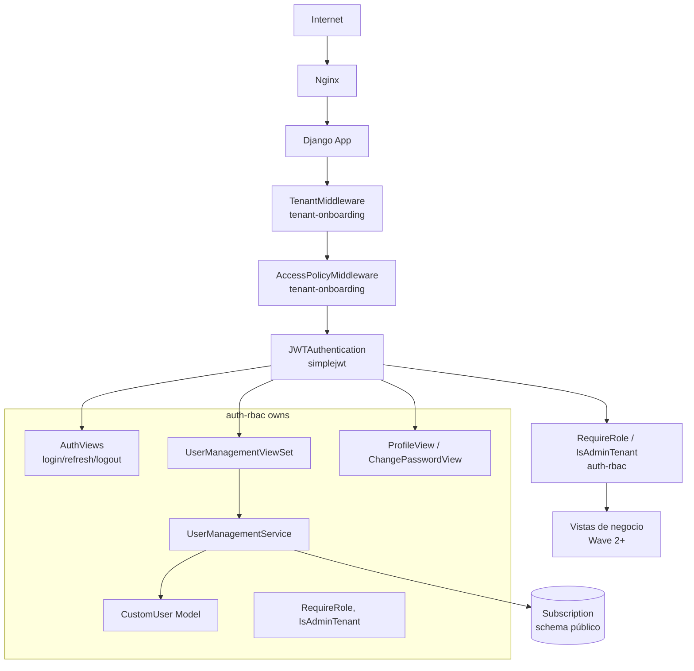
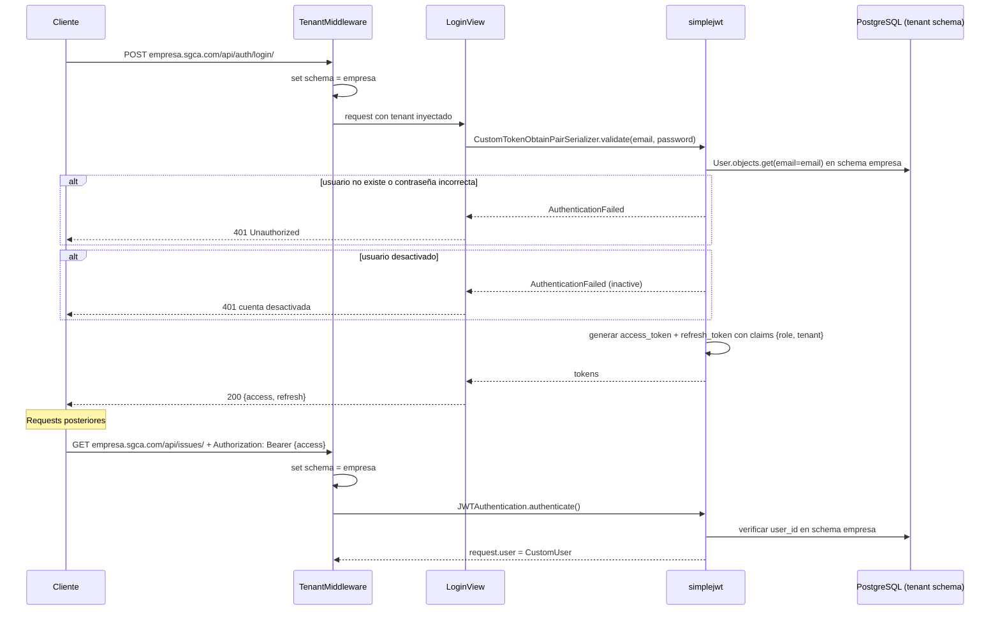
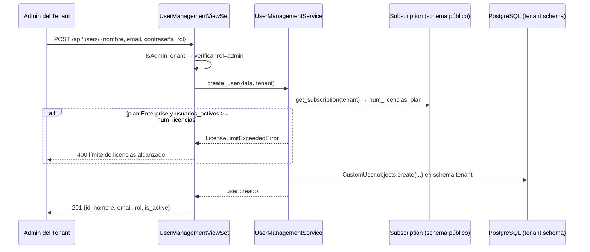
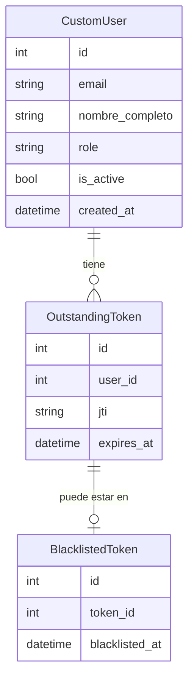

# Design: auth-rbac

## Overview

Auth RBAC provee autenticación JWT y control de acceso basado en roles (RBAC) para todos los tenants del SGCA. Emite access/refresh tokens firmados, gestiona el ciclo de vida de usuarios dentro de cada tenant con aislamiento de datos por schema PostgreSQL, y expone clases de permiso reutilizables que todos los specs de Wave 2+ deben usar para proteger sus endpoints.

**Purpose**: Dar a cada empresa un sistema de identidad aislado donde los usuarios se autentican con JWT y cada endpoint verifica el rol antes de ejecutar.
**Users**: Usuarios de todos los tenants (login/perfil), admin del tenant (CRUD de usuarios), specs de Wave 2+ (consumen los mixins de permiso).
**Impact**: Establece el contrato de autenticación y autorización; sin este spec ningún endpoint de negocio puede protegerse.

### Goals
- Custom user model con 4 roles en schema privado por tenant
- JWT (access 15 min / refresh 7 días) con blacklist en logout
- CRUD de usuarios por admin con validación de límite de licencias
- Clases de permiso reutilizables (`RequireRole`, `IsAdminTenant`) para Wave 2+
- Argon2 como hasher de contraseñas

### Non-Goals
- Recuperación de contraseña por email (→ notificaciones)
- SSO/OAuth, 2FA
- Notificaciones de bienvenida al crear usuario
- Autenticación del system admin (usa Django is_superuser, no este spec)
- Rate limiting en login (responsabilidad de Nginx)

---

## Boundary Commitments

### This Spec Owns
- Modelo `CustomUser` (schema privado del tenant): campos role, nombre_completo, is_active
- Endpoints JWT: `POST /api/auth/login/`, `/api/auth/refresh/`, `/api/auth/logout/`
- Endpoints de gestión de usuarios: `GET/POST /api/users/`, `GET/PUT /api/users/{id}/`, `POST /api/users/{id}/deactivate/`
- Endpoints de perfil: `GET/PUT /api/users/me/`, `PUT /api/users/me/change-password/`
- Clases de permiso exportadas: `RequireRole`, `IsAdminTenant`, `require_role()`
- `CustomTokenObtainPairSerializer` (añade claims `role` y `tenant` al JWT)
- `UserManagementService` (CRUD + validación de licencias)
- Settings de Django: `AUTH_USER_MODEL`, `PASSWORD_HASHERS` (Argon2), `SIMPLE_JWT` config
- Token blacklist (simplejwt `OutstandingToken`, `BlacklistedToken`)

### Out of Boundary
- Modelos `Tenant`, `Domain`, `Plan`, `Subscription` (→ tenant-onboarding, schema público)
- `TenantMiddleware` y `AccessPolicyMiddleware` (→ tenant-onboarding)
- Envío de email de bienvenida o recuperación de contraseña (→ notificaciones)
- Modelos de negocio: issues, acciones, planes (→ Wave 2+)
- Permisos específicos de negocio (qué rol puede crear un issue, etc.) → cada spec declara sus permisos usando las clases de este spec

### Allowed Dependencies
- `django-tenants`: schema activo ya configurado, `request.tenant` disponible (→ tenant-onboarding)
- `djangorestframework-simplejwt 5.x`: tokens JWT, blacklist
- `django[argon2]`: Argon2 password hasher
- `Subscription.num_licencias`: leído desde schema público para validar licencias (read-only)

### Revalidation Triggers
- Cambios en la firma del JWT (claims `role`, `tenant`) requieren revisión en todos los specs Wave 2+ que decodifiquen el token
- Cambios en los nombres de roles (`admin`, `responsable`, etc.) requieren actualización en todos los `RequireRole(...)` de Wave 2+
- Si `CustomUser` migra al schema público, todos los specs de Wave 2+ deben revisarse
- Si se cambia `AUTH_USER_MODEL` después de aplicar migraciones, se requiere `migrate --run-syncdb` en todos los schemas

---

## Architecture

### Architecture Pattern & Boundary Map



**Architecture Integration**:
- Pattern: Django REST Framework + simplejwt + schema-per-tenant (django-tenants)
- `CustomUser` vive en el schema privado del tenant (TENANT_APPS) → aislamiento total entre tenants
- `JWTAuthentication` usa el schema activo (inyectado por TenantMiddleware) para buscar al usuario → la misma user_id puede existir en distintos schemas sin colisión
- `RequireRole` y `IsAdminTenant` son clases DRF `BasePermission` exportadas para Wave 2+
- `CustomTokenObtainPairSerializer` añade claims `role` y `tenant` al JWT para que Wave 2+ pueda leerlos sin DB round-trip

### Technology Stack

| Layer | Elección | Rol en este feature |
|-------|----------|---------------------|
| Backend | Python 3.12 + Django 5 + DRF | Vistas, serializers, permisos |
| Auth | djangorestframework-simplejwt 5.x | JWT issue, refresh, blacklist |
| Passwords | django[argon2] (Argon2id) | Hashing de contraseñas |
| Multi-tenancy | django-tenants (ya configurado) | Schema context, CustomUser en tenant schema |
| DB | PostgreSQL 16 | Almacenamiento de CustomUser por schema |
| Frontend | React 18 + Vite | Formulario de login, gestión de usuarios |

---

## File Structure Plan

### Directory Structure

```
backend/
├── config/
│   └── settings/
│       └── base.py              # AUTH_USER_MODEL, PASSWORD_HASHERS, SIMPLE_JWT, TENANT_APPS
└── apps/
    └── users/
        ├── __init__.py
        ├── models.py            # CustomUser (AbstractUser + role + nombre_completo)
        ├── tokens.py            # CustomTokenObtainPairSerializer (añade role, tenant claims)
        ├── serializers.py       # LoginSerializer, UserSerializer, CreateUserSerializer,
        │                        # UpdateUserSerializer, ProfileSerializer, ChangePasswordSerializer
        ├── permissions.py       # RequireRole(roles), IsAdminTenant — exportados para Wave 2+
        ├── services.py          # UserManagementService: create, update, deactivate, license check
        ├── views.py             # LoginView, LogoutView, RefreshView,
        │                        # UserManagementViewSet, ProfileView, ChangePasswordView
        ├── urls.py              # /api/auth/* y /api/users/*
        └── tests/
            ├── test_auth.py     # login, refresh, logout, tenant isolation, token blacklist
            ├── test_users.py    # CRUD usuarios, límite de licencias, aislamiento de tenant
            └── test_permissions.py  # RequireRole, IsAdminTenant por cada rol

frontend/
└── src/
    ├── pages/
    │   └── Login/
    │       ├── LoginPage.tsx    # Formulario de login (email + contraseña)
    │       └── LoginPage.test.tsx
    ├── services/
    │   └── auth.ts              # authService: login, logout, refreshToken
    └── store/
        └── authSlice.ts         # Estado global: user, role, tokens (React state o Zustand)
```

### Modified Files
- `backend/config/settings/base.py` — añadir `AUTH_USER_MODEL = 'users.CustomUser'`, `PASSWORD_HASHERS = ['django.contrib.auth.hashers.Argon2PasswordHasher', ...]`, config `SIMPLE_JWT`, añadir `users` a TENANT_APPS, añadir `rest_framework_simplejwt.token_blacklist` a TENANT_APPS

---

## System Flows

### Flujo de Login y Uso de Token



### Flujo de Creación de Usuario con Validación de Licencias



---

## Requirements Traceability

| Requisito | Resumen | Componentes | Contratos | Flujos |
|-----------|---------|-------------|-----------|--------|
| 1.1–1.7 | Autenticación JWT | LoginView, LogoutView, RefreshView, CustomTokenObtainPairSerializer | POST /api/auth/login/, refresh, logout | Flujo de Login |
| 2.1–2.5 | Modelo de usuario con rol | CustomUser | — | — |
| 3.1–3.6 | CRUD de usuarios por admin | UserManagementViewSet, UserManagementService | GET/POST /api/users/, GET/PUT/deactivate /api/users/{id}/ | Flujo de Creación |
| 4.1–4.3 | Validación de licencias | UserManagementService | — | Flujo de Creación |
| 5.1–5.4 | Control de acceso por rol | RequireRole, IsAdminTenant, JWTAuthentication | — | — |
| 6.1–6.5 | Perfil propio | ProfileView, ChangePasswordView | GET/PUT /api/users/me/, PUT /api/users/me/change-password/ | — |

---

## Components and Interfaces

### Resumen de Componentes

| Componente | Layer | Intent | Req Coverage | Dependencias Clave |
|------------|-------|--------|--------------|---------------------|
| CustomUser | Modelo | Usuario del tenant con rol | 2.1–2.5 | django.contrib.auth (P0) |
| CustomTokenObtainPairSerializer | Auth | JWT con claims role + tenant | 1.1, 1.3 | simplejwt (P0) |
| LoginView / LogoutView / RefreshView | API | Endpoints JWT | 1.1–1.7 | simplejwt blacklist (P0) |
| RequireRole / IsAdminTenant | Permisos | RBAC reutilizable para Wave 2+ | 5.1–5.4 | DRF BasePermission (P0) |
| UserManagementService | Service | CRUD + validación de licencias | 3.1–3.6, 4.1–4.3 | CustomUser, Subscription (P0) |
| UserManagementViewSet | API | Endpoints CRUD de usuarios | 3.1–3.6 | UserManagementService, IsAdminTenant (P0) |
| ProfileView / ChangePasswordView | API | Endpoints de perfil propio | 6.1–6.5 | CustomUser (P0) |

---

### Modelos

#### CustomUser

| Field | Detail |
|-------|--------|
| Intent | Usuario del tenant con un rol que determina sus permisos en el sistema |
| Requirements | 2.1, 2.2, 2.3, 2.4, 2.5 |

**Contracts**: Service [x]

```python
class CustomUser(AbstractUser):
    ROLES = [
        ('admin', 'Admin'),
        ('responsable', 'Responsable'),
        ('supervisor', 'Supervisor'),
        ('verificador', 'Verificador'),
    ]
    # username heredado de AbstractUser; se usa email para login
    username = None  # deshabilitado
    email = EmailField(unique=True)           # login field
    nombre_completo = CharField(max_length=200)
    role = CharField(max_length=20, choices=ROLES)
    # is_active heredado de AbstractUser (True/False)
    # created_at: DateTimeField auto_now_add

    USERNAME_FIELD = 'email'
    REQUIRED_FIELDS = ['nombre_completo', 'role']
```

**Invariants**:
- Un `CustomUser` existe en el schema privado del tenant → jamás en el schema público
- `role` siempre tiene uno de los 4 valores; no puede ser null
- `email` es único dentro del schema del tenant (unique constraint)
- `is_active=False` bloquea el login (simplejwt verifica este campo)

---

### Auth

#### CustomTokenObtainPairSerializer

| Field | Detail |
|-------|--------|
| Intent | Extiende simplejwt para añadir claims `role` y `tenant` al JWT |
| Requirements | 1.1, 1.7 |

**Contracts**: Service [x]

```python
class CustomTokenObtainPairSerializer(TokenObtainPairSerializer):
    @classmethod
    def get_token(cls, user) -> RefreshToken:
        token = super().get_token(user)
        token['role'] = user.role
        token['tenant'] = connection.schema_name  # schema activo = tenant
        return token
```

**Implementation Notes**:
- `connection.schema_name` (django-tenants) es el schema activo en el momento del login → siempre el tenant correcto
- Los claims `role` y `tenant` permiten que Wave 2+ lea el rol sin round-trip a la DB

---

#### LoginView / RefreshView / LogoutView

| Field | Detail |
|-------|--------|
| Intent | Endpoints JWT: login, renovación de access token, e invalidación de refresh token |
| Requirements | 1.1, 1.2, 1.3, 1.4, 1.5, 1.6, 1.7 |

**Contracts**: API [x]

| Method | Endpoint | Request | Response | Errors |
|--------|----------|---------|----------|--------|
| POST | `/api/auth/login/` | `{email, password}` | `{access, refresh}` | 401 |
| POST | `/api/auth/refresh/` | `{refresh}` | `{access}` | 401 |
| POST | `/api/auth/logout/` | `{refresh}` | `{}` | 401 |

```python
# Response de login (200 OK)
{
    "access": "<JWT access token>",    # expira en 15 min
    "refresh": "<JWT refresh token>"   # expira en 7 días
}

# Error 401 (credenciales incorrectas o usuario inactivo)
{"detail": "Las credenciales proporcionadas no son válidas."}

# Error 401 (refresh expirado)
{"detail": "El token ha expirado.", "code": "token_not_valid"}
```

**Implementation Notes**:
- `LoginView` = `TokenObtainPairView` de simplejwt con `serializer_class = CustomTokenObtainPairSerializer`
- `LogoutView`: recibe `{refresh}`, llama `RefreshToken(refresh).blacklist()` de simplejwt
- El endpoint es accesible en el subdominio del tenant (no en el schema público)
- Aislamiento de tenant (Req 1.7): simplejwt busca al usuario en el schema activo (tenant); el mismo user_id en otro schema es un usuario diferente

---

### Permisos

#### RequireRole / IsAdminTenant

| Field | Detail |
|-------|--------|
| Intent | Clases de permiso DRF exportadas para que Wave 2+ pueda proteger sus endpoints declarativamente |
| Requirements | 5.1, 5.2, 5.3, 5.4 |

**Contracts**: Service [x]

```python
class RequireRole(BasePermission):
    """
    Uso en Wave 2+:
        permission_classes = [IsAuthenticated, RequireRole('admin', 'supervisor')]
    """
    def __init__(self, *roles: str):
        self.roles = roles

    def has_permission(self, request, view) -> bool:
        return (
            request.user
            and request.user.is_authenticated
            and request.user.role in self.roles
        )

class IsAdminTenant(BasePermission):
    """Shortcut: solo el rol 'admin' del tenant."""
    def has_permission(self, request, view) -> bool:
        return (
            request.user
            and request.user.is_authenticated
            and request.user.role == 'admin'
        )
```

**Implementation Notes**:
- Ambas clases se importan desde `apps.users.permissions` en todos los specs Wave 2+
- `RequireRole` se instancia con los roles permitidos: `RequireRole('supervisor', 'verificador')`
- Si el JWT es válido pero el rol no cumple → 403 Forbidden (no 401)

---

### Service Layer

#### UserManagementService

| Field | Detail |
|-------|--------|
| Intent | CRUD de usuarios del tenant con validación de límite de licencias |
| Requirements | 3.1–3.6, 4.1–4.3 |

**Contracts**: Service [x]

```python
class UserManagementService:
    def create_user(
        self,
        nombre_completo: str,
        email: str,
        password: str,
        role: str,
        tenant: Tenant
    ) -> CustomUser:
        """
        Crea un usuario en el schema activo.
        Raises: LicenseLimitExceededError, EmailAlreadyExistsError
        """

    def update_user(
        self,
        user_id: int,
        nombre_completo: str | None,
        email: str | None,
        role: str | None
    ) -> CustomUser:
        """
        Actualiza campos del usuario.
        Raises: UserNotFoundError, EmailAlreadyExistsError
        """

    def deactivate_user(self, user_id: int) -> CustomUser:
        """
        Marca is_active=False. No elimina datos.
        Raises: UserNotFoundError
        """

    def _check_license_limit(self, tenant: Tenant) -> None:
        """
        Lee Subscription del schema público.
        Si plan=Enterprise y activos >= num_licencias → raise LicenseLimitExceededError.
        Si plan=Trial → no verifica.
        """
```

**Preconditions**: `request.tenant` disponible, schema activo es el del tenant
**Postconditions**: usuario creado/modificado en el schema del tenant
**Invariants**: nunca modifica usuarios de otro schema; `_check_license_limit` accede al schema público con `connection.set_schema_to_public()` y restaura el schema del tenant al terminar

---

### API

#### UserManagementViewSet

| Field | Detail |
|-------|--------|
| Intent | Endpoints CRUD de usuarios, restringidos al rol admin del tenant |
| Requirements | 3.1–3.6 |

**Contracts**: API [x]

| Method | Endpoint | Request | Response | Errors |
|--------|----------|---------|----------|--------|
| GET | `/api/users/` | — | `[UserSerializer]` | 401, 403 |
| POST | `/api/users/` | `CreateUserRequest` | `UserSerializer` | 400, 401, 403 |
| GET | `/api/users/{id}/` | — | `UserSerializer` | 401, 403, 404 |
| PUT | `/api/users/{id}/` | `UpdateUserRequest` | `UserSerializer` | 400, 401, 403, 404 |
| POST | `/api/users/{id}/deactivate/` | — | `UserSerializer` | 401, 403, 404 |

```python
# UserSerializer (lectura)
class UserSerializer:
    id: int
    nombre_completo: str
    email: str
    role: str           # 'admin' | 'responsable' | 'supervisor' | 'verificador'
    is_active: bool
    created_at: datetime

# CreateUserRequest
class CreateUserRequest:
    nombre_completo: str   # required
    email: str             # required, EmailField
    password: str          # required, min_length=8
    role: str              # required, choices=['admin','responsable','supervisor','verificador']

# UpdateUserRequest
class UpdateUserRequest:
    nombre_completo: str | None
    email: str | None
    role: str | None

# Error 400 (límite de licencias)
{"detail": "Se alcanzó el límite de licencias para este tenant."}
```

---

#### ProfileView / ChangePasswordView

| Field | Detail |
|-------|--------|
| Intent | El usuario gestiona su propia información y contraseña |
| Requirements | 6.1–6.5 |

**Contracts**: API [x]

| Method | Endpoint | Request | Response | Errors |
|--------|----------|---------|----------|--------|
| GET | `/api/users/me/` | — | `UserSerializer` | 401 |
| PUT | `/api/users/me/` | `ProfileUpdateRequest` | `UserSerializer` | 400, 401 |
| PUT | `/api/users/me/change-password/` | `ChangePasswordRequest` | `{}` | 400, 401 |

```python
# ProfileUpdateRequest
class ProfileUpdateRequest:
    nombre_completo: str | None
    email: str | None

# ChangePasswordRequest
class ChangePasswordRequest:
    current_password: str
    new_password: str   # min_length=8

# Error 400 (contraseña actual incorrecta)
{"current_password": ["La contraseña actual es incorrecta."]}

# Error 400 (email en uso)
{"email": ["Este email ya está en uso."]}
```

---

## Data Models

### Domain Model



### Logical Data Model

**CustomUser** (schema privado del tenant, extiende AbstractUser):
- `email`: EmailField, unique=True — campo de login (USERNAME_FIELD)
- `nombre_completo`: CharField(max_length=200), required
- `role`: CharField(max_length=20), choices=['admin','responsable','supervisor','verificador'], required
- `is_active`: BooleanField, default=True (heredado de AbstractUser)
- `created_at`: DateTimeField, auto_now_add=True
- `username`: deshabilitado (None)

**OutstandingToken / BlacklistedToken**: modelos de simplejwt para el blacklist de refresh tokens (en schema del tenant via TENANT_APPS)

**Índices**:
- `CustomUser.email`: unique index (login lookup frecuente)

### Data Contracts & Integration

```python
# Contrato de salida hacia specs de Wave 2+
# request.user es una instancia de CustomUser con:
# - user.role: str  — uno de los 4 roles
# - user.is_active: bool
# - user.email: str
# - user.id: int

# Claims del JWT (decodificables sin DB):
# {
#     "user_id": int,
#     "role": "admin" | "responsable" | "supervisor" | "verificador",
#     "tenant": "schema_name_del_tenant",
#     "exp": int,
#     "iat": int
# }
```

---

## Error Handling

### Error Strategy
Validación temprana en serializers (campos obligatorios, formato email, longitud de contraseña). Manejo de `AuthenticationFailed` de simplejwt para credenciales incorrectas. Manejo de `TokenError` para refresh expirado o en blacklist. Excepción de dominio `LicenseLimitExceededError` en el service layer.

### Error Categories and Responses

| Categoría | Escenario | Respuesta |
|-----------|-----------|-----------|
| 400 Bad Request | Campos inválidos, contraseña actual incorrecta, email duplicado | `{"field": ["mensaje"]}` |
| 401 Unauthorized | Credenciales incorrectas, usuario inactivo, token expirado/inválido | `{"detail": "..."}` |
| 403 Forbidden | Rol insuficiente para el endpoint | `{"detail": "No tienes permiso..."}` |
| 404 Not Found | Usuario no existe en el tenant activo | `{"detail": "No encontrado."}` |

### Monitoring
- Log WARNING en `UserManagementService._check_license_limit` cuando se alcanza el límite (tenant próximo a saturación)
- Log INFO en cada login exitoso con `user_id` y `tenant` (sin datos sensibles)

---

## Testing Strategy

### Unit Tests
1. `CustomUser` — email como USERNAME_FIELD, is_active bloquea login, role con valor inválido falla validación
2. `CustomTokenObtainPairSerializer` — claims `role` y `tenant` presentes en el token generado
3. `UserManagementService._check_license_limit` — Trial sin límite, Enterprise bajo límite, Enterprise en límite exacto, Enterprise sobre límite
4. `RequireRole` — permite rol correcto, rechaza rol incorrecto, rechaza usuario anónimo

### Integration Tests
1. `POST /api/auth/login/` — login exitoso retorna access + refresh; credenciales incorrectas → 401; usuario inactivo → 401
2. `POST /api/auth/logout/` — refresh válido es blacklisted; refresh tras logout → 401
3. `POST /api/users/` como admin — crea usuario; límite de licencias → 400; email duplicado → 400
4. `POST /api/users/` como responsable — 403
5. `POST /api/users/{id}/deactivate/` — usuario queda inactivo; login del usuario desactivado → 401
6. Aislamiento de tenant: usuario de tenant A no existe en tenant B (mismo email, distinto schema)
7. `PUT /api/users/me/change-password/` — contraseña correcta actualiza; incorrecta → 400

### E2E Tests
1. Registro en tenant → login → acceso a endpoint protegido → logout → access expirado → 401
2. Admin crea usuario → usuario hace login → accede a endpoint con su rol → otro endpoint con rol incorrecto → 403
3. Plan Enterprise llega al límite de licencias → intento de crear usuario → 400 → desactivar un usuario → crear otro → 201

---

## Security Considerations

- **Argon2id**: más resistente a ataques de GPU que bcrypt. Configurar cost parameters adecuados en producción.
- **Token blacklist en logout**: sin blacklist, los refresh tokens permanecerían válidos hasta su expiración. El blacklist mitiga el robo de tokens.
- **No revelar qué campo es incorrecto en login**: previene enumeración de emails (Req 1.2).
- **Access token de 15 minutos**: ventana de uso corta en caso de intercepción.
- **Aislamiento de tenant a nivel de schema**: imposible acceder a usuarios de otro tenant por diseño de django-tenants — no requiere filtros adicionales en las queries.
- **HTTPS obligatorio en producción** (definido en steering): los tokens JWT viajan en headers, se requiere TLS.
