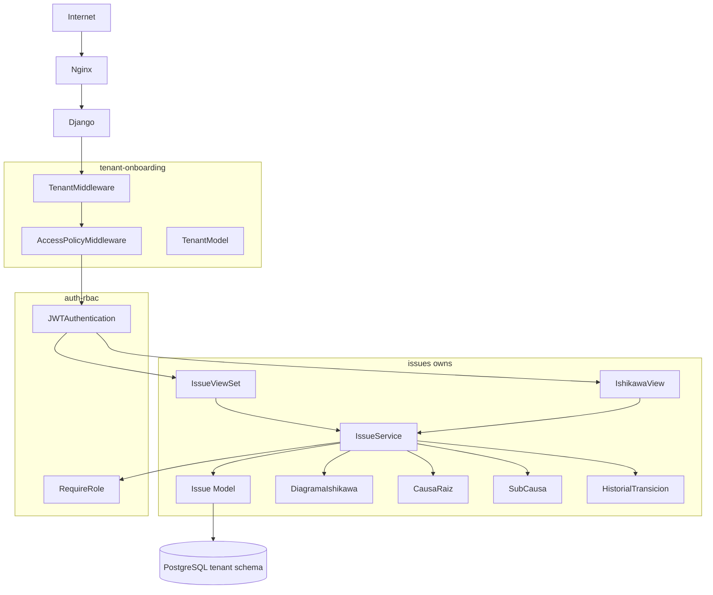
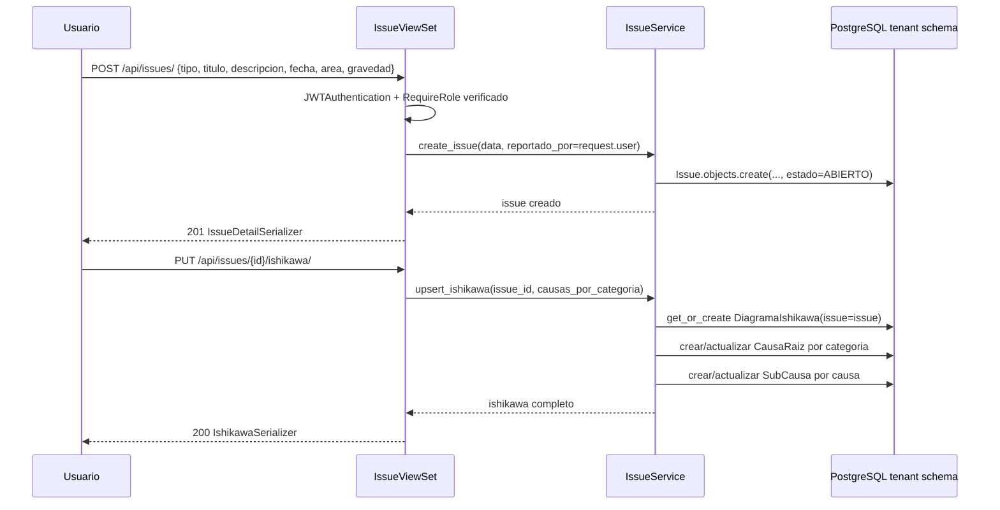
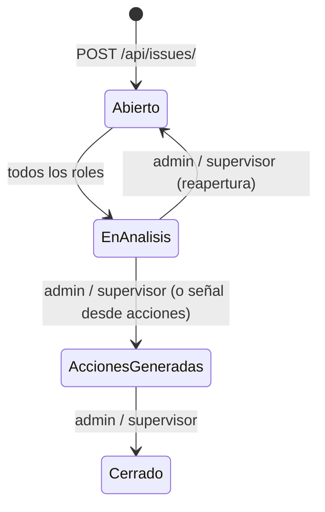
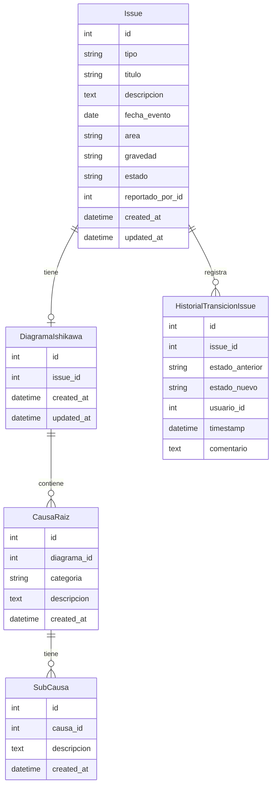

# Design: issues

## Overview

Issues es el primer módulo de negocio del SGCA. Permite registrar eventos de seguridad industrial (incidentes, casi incidentes, reuniones de seguridad) con sus datos básicos y análisis de causa raíz mediante Diagrama de Ishikawa. Todos los modelos residen en el schema privado del tenant y heredan de TenantModel, garantizando aislamiento total entre empresas.

**Purpose**: Proveer trazabilidad formal de eventos de seguridad con análisis estructurado de causa raíz, sirviendo de punto de entrada del ciclo de vida de acciones correctivas.
**Users**: Todos los roles autenticados del tenant (crear: admin/supervisor/responsable; ver: todos; gestionar estados: admin/supervisor).
**Impact**: Define el modelo Issue con sus estados y la FK que la spec `acciones` (Wave 2) usará para vincular acciones correctivas. Cambios en campos o nombres de estado requieren revalidación de `acciones`.

### Goals
- CRUD completo de Issues con campos de clasificación (tipo, área, gravedad)
- Diagrama de Ishikawa anidado (6 categorías fijas → causas → subcausas) por Issue
- Máquina de estados con registro de historial de transiciones
- Permisos por rol usando `RequireRole` de auth-rbac
- Listado paginado con filtros por tipo, estado, gravedad, área y rango de fecha

### Non-Goals
- Creación de acciones desde el issue (→ acciones)
- Upload de archivos adjuntos al issue (→ planes-trabajo)
- Generación de PDF del análisis Ishikawa (→ reportes-dashboard)
- Notificaciones por email al crear/actualizar un issue (→ notificaciones)
- Edición del historial de transiciones de estado

---

## Boundary Commitments

### This Spec Owns
- Modelos `Issue`, `DiagramaIshikawa`, `CausaRaiz`, `SubCausa` (schema privado del tenant)
- Modelo `HistorialTransicionIssue` para auditoría de cambios de estado
- Endpoints REST: CRUD de Issues, gestión de Ishikawa, transiciones de estado
- Lógica de filtros y paginación
- Reglas de visibilidad y permisos por rol para los endpoints de este módulo
- La FK `Issue.id` como contrato de salida hacia `acciones`

### Out of Boundary
- Creación de acciones correctivas/preventivas (→ acciones)
- Upload y almacenamiento de archivos adjuntos (→ planes-trabajo)
- Generación de reportes PDF/Excel (→ reportes-dashboard)
- Envío de emails al cambiar estado (→ notificaciones)
- La transición automática a "Acciones Generadas" (disparada por señal desde → acciones al crear la primera acción)

### Allowed Dependencies
- `auth-rbac`: `RequireRole`, `IsAdminTenant`, `request.user` (CustomUser), `request.tenant` — permisos y autenticación
- `tenant-onboarding`: `TenantModel`, `TenantMiddleware`, `AccessPolicyMiddleware` — schema activo y routing
- `django-filter`: filtros de listado
- `djangorestframework`: ViewSet, Serializer, Pagination

### Revalidation Triggers
- Si se renombran los estados del Issue (e.g. "En Análisis" → "En Proceso"), la spec `acciones` debe actualizar su lógica que dispara la transición a "Acciones Generadas"
- Si se agregan o eliminan campos en el modelo `Issue`, la spec `acciones` debe verificar que su FK siga siendo válida
- Si cambia la cardinalidad `Issue → DiagramaIshikawa` (1:1 a 1:N), la spec `reportes-dashboard` debe revalidar su lógica de exportación
- Si se modifica la estructura de `RequireRole` (auth-rbac), todos los endpoints de este spec deben revisarse

---

## Architecture

### Architecture Pattern & Boundary Map



**Architecture Integration**:
- Pattern: Django REST Framework + ViewSet + Service Layer + TenantModel
- `Issue` hereda de `TenantModel` → todas las queries están automáticamente restringidas al schema activo
- `IssueService` centraliza la lógica de negocio (transiciones de estado, validaciones de rol)
- `RequireRole` de auth-rbac se aplica como `permission_classes` en cada ViewSet
- Downstream: `acciones` spec importará `Issue` de `apps.issues.models` y escuchará señales de cambio de estado

### Technology Stack

| Layer | Elección | Rol en este feature |
|-------|----------|---------------------|
| Backend | Python 3.12 + Django 5 + DRF | Modelos, API, lógica de negocio |
| Multi-tenancy | django-tenants (TenantModel) | Aislamiento por schema PostgreSQL |
| Filtros | django-filter | Filtros tipados en el listado |
| DB | PostgreSQL 16 | Schema privado del tenant |
| Frontend | React 18 + Vite + TailwindCSS | Formulario Ishikawa, lista de issues |

---

## File Structure Plan

### Directory Structure

```
backend/
└── apps/
    └── issues/
        ├── __init__.py
        ├── models.py         # Issue, DiagramaIshikawa, CausaRaiz, SubCausa, HistorialTransicionIssue
        ├── serializers.py    # IssueListSerializer, IssueDetailSerializer, IssueWriteSerializer,
        │                     # IshikawaSerializer, CausaRaizSerializer, SubCausaSerializer
        ├── services.py       # IssueService: CRUD, transición de estados, permisos de visibilidad
        ├── filters.py        # IssueFilter (django-filter)
        ├── views.py          # IssueViewSet, IshikawaView
        ├── urls.py           # /api/issues/
        └── tests/
            ├── test_models.py        # Issue state machine, CausaRaiz cascade delete
            ├── test_api.py           # Endpoints CRUD, filtros, paginación
            └── test_permissions.py   # Visibilidad y acceso por rol, aislamiento de tenant

frontend/
└── src/
    ├── pages/
    │   └── issues/
    │       ├── IssueListPage.tsx     # Lista con filtros y paginación
    │       ├── IssueDetailPage.tsx   # Detalle del issue + Ishikawa + historial
    │       └── IssueFormPage.tsx     # Crear/editar issue con sección Ishikawa
    ├── components/
    │   └── issues/
    │       ├── IssueCard.tsx         # Tarjeta resumen del issue en lista
    │       ├── IssueStatusBadge.tsx  # Badge de estado con color
    │       └── IshikawaForm.tsx      # Formulario de 6 categorías fijas con causas/subcausas
    └── services/
        └── issues.ts                 # issuesService: CRUD, transitions, ishikawa
```

### Modified Files
- `backend/config/settings/base.py` — añadir `'apps.issues'` a TENANT_APPS

---

## System Flows

### Flujo de Registro y Análisis Ishikawa



### Máquina de Estados



---

## Requirements Traceability

| Requisito | Resumen | Componentes | Contratos | Flujos |
|-----------|---------|-------------|-----------|--------|
| 1.1–1.5 | Registro de evento | IssueViewSet, IssueService | POST /api/issues/ | Registro de Issue |
| 2.1–2.6 | Diagrama Ishikawa | IshikawaView, IssueService, CausaRaiz, SubCausa | PUT /api/issues/{id}/ishikawa/ | Flujo Ishikawa |
| 3.1–3.6 | Ciclo de vida + historial | IssueService, HistorialTransicionIssue | POST /api/issues/{id}/transition/ | Máquina de Estados |
| 4.1–4.5 | Control de acceso por rol | RequireRole, IssueService.queryset_for_user() | — | — |
| 5.1–5.6 | Listado y filtros | IssueFilter, IssueViewSet | GET /api/issues/ | — |
| 6.1–6.3 | Aislamiento multi-tenant | TenantModel, IssueService | — | — |

---

## Components and Interfaces

### Resumen de Componentes

| Componente | Layer | Intent | Req Coverage | Dependencias Clave |
|------------|-------|--------|--------------|---------------------|
| Issue | Modelo | Registro del evento de seguridad | 1, 3, 6 | TenantModel (P0) |
| DiagramaIshikawa | Modelo | Análisis Ishikawa vinculado al Issue | 2 | Issue (P0) |
| CausaRaiz | Modelo | Causa por categoría del Ishikawa | 2 | DiagramaIshikawa (P0) |
| SubCausa | Modelo | Subcausa de una CausaRaiz | 2 | CausaRaiz (P0) |
| HistorialTransicionIssue | Modelo | Auditoría de cambios de estado | 3.5, 3.6 | Issue, CustomUser (P0) |
| IssueService | Service | CRUD, transiciones, visibilidad por rol | 1–6 | Issue, RequireRole (P0) |
| IssueViewSet | API | Endpoints CRUD + transition + paginación | 1, 3, 4, 5 | IssueService (P0) |
| IshikawaView | API | GET/PUT del Ishikawa completo | 2 | IssueService (P0) |
| IssueFilter | Filtro | Filtros por tipo/estado/gravedad/área/fecha | 5 | django-filter (P0) |

---

### Modelos

#### Issue

| Field | Detail |
|-------|--------|
| Intent | Registro central del evento de seguridad con clasificación y estado |
| Requirements | 1.1, 1.2, 1.3, 1.4, 1.5, 3.1, 6.1, 6.2, 6.3 |

**Contracts**: Service [x]

```python
class Issue(TenantModel):
    TIPOS = [
        ('incidente', 'Incidente'),
        ('casi_incidente', 'Casi Incidente'),
        ('reunion_seguridad', 'Reunión de Seguridad'),
    ]
    GRAVEDADES = [
        ('baja', 'Baja'),
        ('media', 'Media'),
        ('alta', 'Alta'),
        ('critica', 'Crítica'),
    ]
    ESTADOS = [
        ('abierto', 'Abierto'),
        ('en_analisis', 'En Análisis'),
        ('acciones_generadas', 'Acciones Generadas'),
        ('cerrado', 'Cerrado'),
    ]
    TRANSICIONES_VALIDAS = {
        'abierto': ['en_analisis'],
        'en_analisis': ['acciones_generadas', 'abierto'],
        'acciones_generadas': ['cerrado'],
        'cerrado': [],
    }

    tipo = CharField(max_length=30, choices=TIPOS)
    titulo = CharField(max_length=300)
    descripcion = TextField()
    fecha_evento = DateField()
    area = CharField(max_length=200)
    gravedad = CharField(max_length=20, choices=GRAVEDADES)
    estado = CharField(max_length=30, choices=ESTADOS, default='abierto')
    reportado_por = ForeignKey('users.CustomUser', on_delete=PROTECT, related_name='issues_reportados')
    created_at = DateTimeField(auto_now_add=True)
    updated_at = DateTimeField(auto_now=True)
```

**Invariants**:
- `estado` siempre tiene uno de los 4 valores definidos
- `reportado_por` nunca es null
- Todos los campos obligatorios (tipo, titulo, descripcion, fecha_evento, area, gravedad) son non-null

---

#### DiagramaIshikawa

| Field | Detail |
|-------|--------|
| Intent | Análisis Ishikawa vinculado 1:1 a un Issue |
| Requirements | 2.1, 2.3, 2.4, 2.5 |

**Contracts**: Service [x]

```python
class DiagramaIshikawa(TenantModel):
    issue = OneToOneField(Issue, on_delete=CASCADE, related_name='ishikawa')
    created_at = DateTimeField(auto_now_add=True)
    updated_at = DateTimeField(auto_now=True)
```

---

#### CausaRaiz

| Field | Detail |
|-------|--------|
| Intent | Causa registrada en una de las 6 categorías fijas del Ishikawa |
| Requirements | 2.1, 2.2, 2.4, 2.5, 2.6 |

**Contracts**: Service [x]

```python
class CausaRaiz(TenantModel):
    CATEGORIAS = [
        ('metodo', 'Método'),
        ('maquina', 'Máquina'),
        ('material', 'Material'),
        ('mano_de_obra', 'Mano de Obra'),
        ('medicion', 'Medición'),
        ('medio_ambiente', 'Medio Ambiente'),
    ]
    diagrama = ForeignKey(DiagramaIshikawa, on_delete=CASCADE, related_name='causas')
    categoria = CharField(max_length=30, choices=CATEGORIAS)
    descripcion = TextField()
    created_at = DateTimeField(auto_now_add=True)
```

---

#### SubCausa

| Field | Detail |
|-------|--------|
| Intent | Subcausa de una causa raíz del Ishikawa |
| Requirements | 2.3, 2.6 |

**Contracts**: Service [x]

```python
class SubCausa(TenantModel):
    causa = ForeignKey(CausaRaiz, on_delete=CASCADE, related_name='subcausas')
    descripcion = TextField()
    created_at = DateTimeField(auto_now_add=True)
```

**Invariants**: Si se elimina una CausaRaiz, todas sus SubCausas se eliminan en cascada (CASCADE)

---

#### HistorialTransicionIssue

| Field | Detail |
|-------|--------|
| Intent | Registro auditable de cada cambio de estado del Issue |
| Requirements | 3.5, 3.6 |

**Contracts**: Service [x]

```python
class HistorialTransicionIssue(TenantModel):
    issue = ForeignKey(Issue, on_delete=CASCADE, related_name='historial_estados')
    estado_anterior = CharField(max_length=30)
    estado_nuevo = CharField(max_length=30)
    usuario = ForeignKey('users.CustomUser', on_delete=PROTECT)
    timestamp = DateTimeField(auto_now_add=True)
    comentario = TextField(blank=True, default='')
```

---

### Service Layer

#### IssueService

| Field | Detail |
|-------|--------|
| Intent | Centraliza CRUD de issues, transiciones de estado y lógica de visibilidad por rol |
| Requirements | 1.1–1.5, 3.1–3.6, 4.1–4.5, 6.1–6.3 |

**Contracts**: Service [x]

```python
class IssueService:
    def create_issue(
        self,
        tipo: str,
        titulo: str,
        descripcion: str,
        fecha_evento: date,
        area: str,
        gravedad: str,
        reportado_por: CustomUser,
    ) -> Issue:
        """
        Crea Issue con estado=abierto. TenantModel garantiza aislamiento.
        Raises: ValidationError si campos inválidos.
        """

    def update_issue(
        self,
        issue: Issue,
        data: dict,
        requesting_user: CustomUser,
    ) -> Issue:
        """
        Actualiza campos del issue. Solo admin/supervisor pueden actualizar cualquier issue;
        responsable solo puede actualizar sus propios issues.
        Raises: PermissionDenied, ValidationError.
        """

    def transition_state(
        self,
        issue: Issue,
        nuevo_estado: str,
        requesting_user: CustomUser,
        comentario: str = '',
    ) -> Issue:
        """
        Transiciona el estado del issue si la transición es válida y el rol está autorizado.
        Crea HistorialTransicionIssue. Raises: InvalidTransitionError, PermissionDenied.
        """

    def queryset_for_user(self, user: CustomUser) -> QuerySet[Issue]:
        """
        Retorna queryset filtrado por rol:
        - admin/supervisor: todos los issues del tenant activo
        - responsable: solo issues donde reportado_por=user
        - verificador: todos los issues (read-only — el caller controla el acceso write)
        TenantModel ya garantiza el scope del tenant activo.
        """

    def upsert_ishikawa(
        self,
        issue: Issue,
        causas_por_categoria: dict[str, list[dict]],
    ) -> DiagramaIshikawa:
        """
        Crea o actualiza el DiagramaIshikawa del issue.
        Recibe dict {categoria: [{descripcion, subcausas: [{descripcion}]}]}.
        Preserva causas de categorías no incluidas en el payload.
        """
```

**Preconditions**: `connection.schema_name` es el schema del tenant activo (inyectado por TenantMiddleware)
**Postconditions**: Todos los objetos creados residen en el schema del tenant activo
**Invariants**: Nunca modifica Issues de otro schema; `transition_state` siempre registra HistorialTransicionIssue

---

### API

#### IssueViewSet

| Field | Detail |
|-------|--------|
| Intent | Endpoints REST para CRUD de Issues, transiciones de estado y listado paginado con filtros |
| Requirements | 1.1–1.5, 3.1–3.6, 4.1–4.5, 5.1–5.6 |

**Contracts**: API [x]

| Method | Endpoint | Request | Response | Errors |
|--------|----------|---------|----------|--------|
| GET | `/api/issues/` | query params (filtros) | `Page[IssueListSerializer]` | 401, 403 |
| POST | `/api/issues/` | `IssueWriteSerializer` | `IssueDetailSerializer` | 400, 401, 403 |
| GET | `/api/issues/{id}/` | — | `IssueDetailSerializer` | 401, 403, 404 |
| PUT | `/api/issues/{id}/` | `IssueWriteSerializer` | `IssueDetailSerializer` | 400, 401, 403, 404 |
| PATCH | `/api/issues/{id}/` | `IssueWriteSerializer (partial)` | `IssueDetailSerializer` | 400, 401, 403, 404 |
| DELETE | `/api/issues/{id}/` | — | `{}` | 401, 403, 404 |
| POST | `/api/issues/{id}/transition/` | `{estado: str, comentario?: str}` | `IssueDetailSerializer` | 400, 401, 403, 404 |

```python
# IssueListSerializer (lectura en lista)
class IssueListSerializer:
    id: int
    tipo: str
    titulo: str
    area: str
    gravedad: str
    estado: str
    reportado_por: int       # user id
    fecha_evento: date
    created_at: datetime

# IssueDetailSerializer (lectura de detalle — incluye ishikawa si existe)
class IssueDetailSerializer:
    id: int
    tipo: str
    titulo: str
    descripcion: str
    area: str
    gravedad: str
    estado: str
    reportado_por: UserBasicSerializer   # {id, nombre_completo}
    fecha_evento: date
    created_at: datetime
    updated_at: datetime
    ishikawa: IshikawaSerializer | None
    historial_estados: list[HistorialTransicionSerializer]  # solo para admin/supervisor

# IssueWriteSerializer (escritura)
class IssueWriteSerializer:
    tipo: str           # required, choices
    titulo: str         # required, max_length=300
    descripcion: str    # required
    fecha_evento: date  # required
    area: str           # required, max_length=200
    gravedad: str       # required, choices

# Error 400 (campo inválido)
{"field": ["mensaje de error"]}

# Error 400 (transición inválida)
{"detail": "Transición inválida. Desde 'cerrado' no hay transiciones disponibles."}

# Error 403 (rol insuficiente)
{"detail": "No tienes permiso para realizar esta acción."}
```

---

#### IshikawaView

| Field | Detail |
|-------|--------|
| Intent | GET/PUT del Diagrama Ishikawa completo de un Issue |
| Requirements | 2.1–2.6 |

**Contracts**: API [x]

| Method | Endpoint | Request | Response | Errors |
|--------|----------|---------|----------|--------|
| GET | `/api/issues/{id}/ishikawa/` | — | `IshikawaSerializer` | 401, 403, 404 |
| PUT | `/api/issues/{id}/ishikawa/` | `IshikawaWriteSerializer` | `IshikawaSerializer` | 400, 401, 403, 404 |

```python
# IshikawaSerializer (lectura)
class IshikawaSerializer:
    id: int
    issue: int
    categorias: dict[str, list[CausaRaizSerializer]]
    # categorias = {
    #   "metodo": [...], "maquina": [...], "material": [...],
    #   "mano_de_obra": [...], "medicion": [...], "medio_ambiente": [...]
    # }

class CausaRaizSerializer:
    id: int
    categoria: str
    descripcion: str
    subcausas: list[SubCausaSerializer]

class SubCausaSerializer:
    id: int
    descripcion: str

# IshikawaWriteSerializer (escritura — solo incluir categorías a actualizar)
class IshikawaWriteSerializer:
    causas: list[CausaRaizWriteSerializer]

class CausaRaizWriteSerializer:
    id: int | None          # null para crear nueva causa
    categoria: str          # required
    descripcion: str        # required
    subcausas: list[SubCausaWriteSerializer]

class SubCausaWriteSerializer:
    id: int | None          # null para crear nueva subcausa
    descripcion: str        # required
```

**Implementation Notes**:
- GET retorna el Ishikawa con las 6 categorías como keys del dict, incluso si no tienen causas
- PUT es upsert: preserva causas de categorías no incluidas en el payload
- Si el DiagramaIshikawa no existe, GET retorna 404; PUT lo crea automáticamente

---

## Data Models

### Domain Model



### Logical Data Model

**Issue** (TenantModel, schema privado):
- `tipo`: CharField(max_length=30), choices=[incidente/casi_incidente/reunion_seguridad]
- `titulo`: CharField(max_length=300), non-null
- `descripcion`: TextField, non-null
- `fecha_evento`: DateField, non-null
- `area`: CharField(max_length=200), non-null
- `gravedad`: CharField(max_length=20), choices=[baja/media/alta/critica]
- `estado`: CharField(max_length=30), choices=[abierto/en_analisis/acciones_generadas/cerrado], default=abierto
- `reportado_por`: FK(CustomUser, PROTECT)
- Índices: `estado` (filtro frecuente), `fecha_evento` (filtro de rango), `reportado_por` (filtro por responsable)

**DiagramaIshikawa** (TenantModel): `issue` OneToOneField(CASCADE)

**CausaRaiz** (TenantModel): `diagrama` FK(CASCADE), `categoria` choices 6 valores fijos

**SubCausa** (TenantModel): `causa` FK(CASCADE)

**HistorialTransicionIssue** (TenantModel): `issue` FK(CASCADE), `usuario` FK(PROTECT), no editable

### Data Contracts & Integration

```python
# Contrato de salida hacia la spec `acciones` (Wave 2)
# acciones importa: from apps.issues.models import Issue
# acciones usa: Accion.issue = ForeignKey(Issue, on_delete=PROTECT)
# acciones dispara: Issue.transition_state('acciones_generadas') via señal post_save

# Contrato de salida hacia `reportes-dashboard` (Wave 4)
# reportes agrega: Issue.objects.filter(tenant=...).values('estado').annotate(count=Count('id'))
```

---

## Error Handling

### Error Strategy
Validación en serializers (campos obligatorios, choices inválidos). Validación de transición de estado en IssueService (raise `InvalidTransitionError` como subclase de ValidationError). Permisos verificados antes de acceder a datos (raise `PermissionDenied` → 403). Aislamiento de tenant garantizado por TenantModel (no requiere filtros adicionales).

### Error Categories and Responses

| Categoría | Escenario | Respuesta |
|-----------|-----------|-----------|
| 400 Bad Request | Campo obligatorio ausente, choice inválido, transición inválida | `{"field": ["msg"]}` o `{"detail": "..."}` |
| 401 Unauthorized | Token JWT ausente, expirado o inválido | `{"detail": "..."}` (simplejwt) |
| 403 Forbidden | Rol insuficiente para la operación | `{"detail": "No tienes permiso..."}` |
| 404 Not Found | Issue no existe en el tenant activo | `{"detail": "No encontrado."}` |

### Monitoring
- Log INFO en cada transición de estado (issue_id, de, hacia, usuario_id)
- Log WARNING si se intenta acceder a un issue con un id que no existe en el schema activo (posible probe entre tenants)

---

## Testing Strategy

### Unit Tests
1. `Issue.TRANSICIONES_VALIDAS` — todas las transiciones válidas e inválidas
2. `IssueService.queryset_for_user()` — admin ve todos, responsable solo los propios, verificador todos
3. `IssueService.upsert_ishikawa()` — preserva categorías no enviadas, cascada al eliminar causa
4. `IssueService.transition_state()` — transición válida crea HistorialTransicion; inválida lanza error

### Integration Tests
1. `POST /api/issues/` — creación exitosa con todos los campos; falta un campo → 400
2. `GET /api/issues/` con filtros — por tipo, estado, gravedad, área, rango de fecha
3. `GET /api/issues/` como responsable — solo ve sus issues; no ve issues de otro usuario
4. `POST /api/issues/{id}/transition/` — transición válida actualiza estado y crea historial
5. `POST /api/issues/{id}/transition/` — transición inválida → 400 con mensaje claro
6. `PUT /api/issues/{id}/ishikawa/` — upsert preserva categorías no enviadas; eliminar causa elimina subcausas
7. Aislamiento de tenant: issue de tenant A no accesible desde tenant B (mismo id, 404 en B)
8. `GET /api/issues/{id}/` como responsable sobre issue de otro usuario → 403

### E2E Tests
1. Usuario crea issue → admin transiciona a En Análisis → agrega Ishikawa → cierra issue
2. Responsable crea issue → ve su issue en lista → no ve issues de otro responsable
3. Verificador intenta crear issue → 403; puede ver lista de todos los issues → 200
