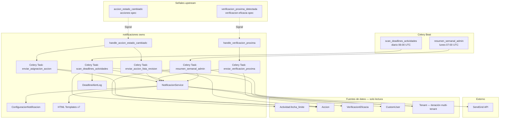
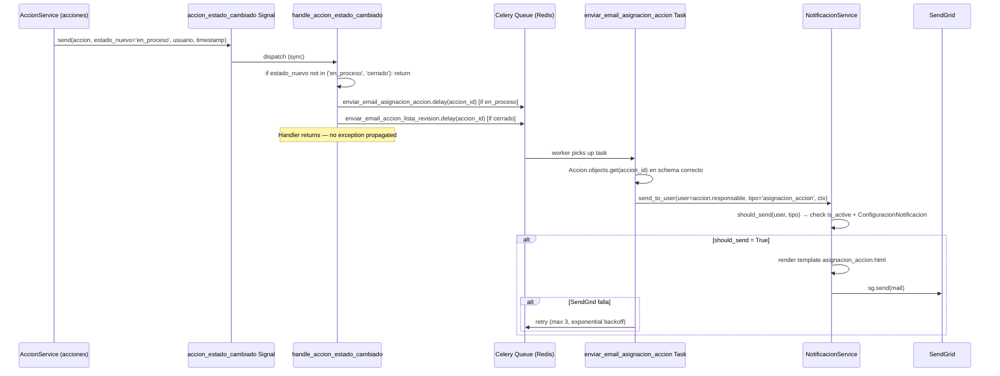
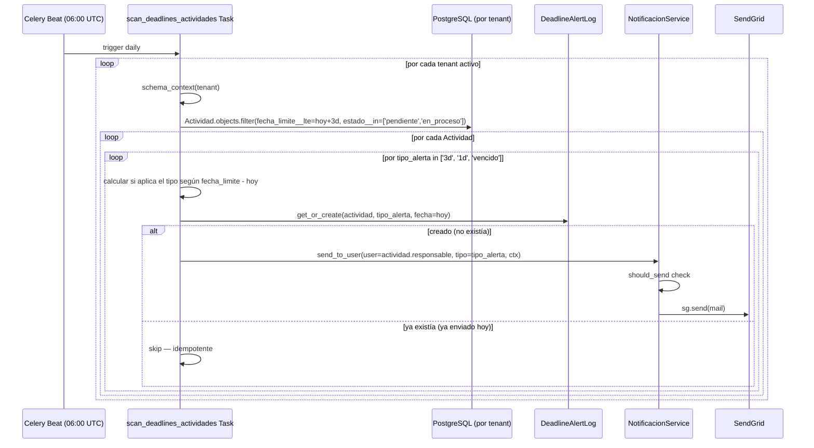
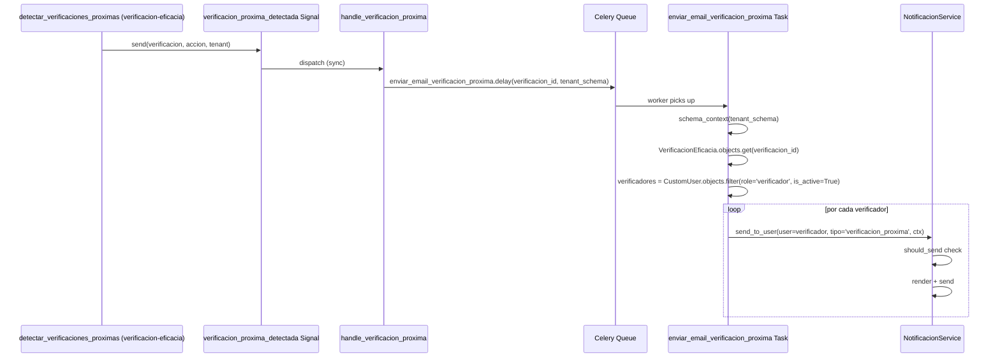
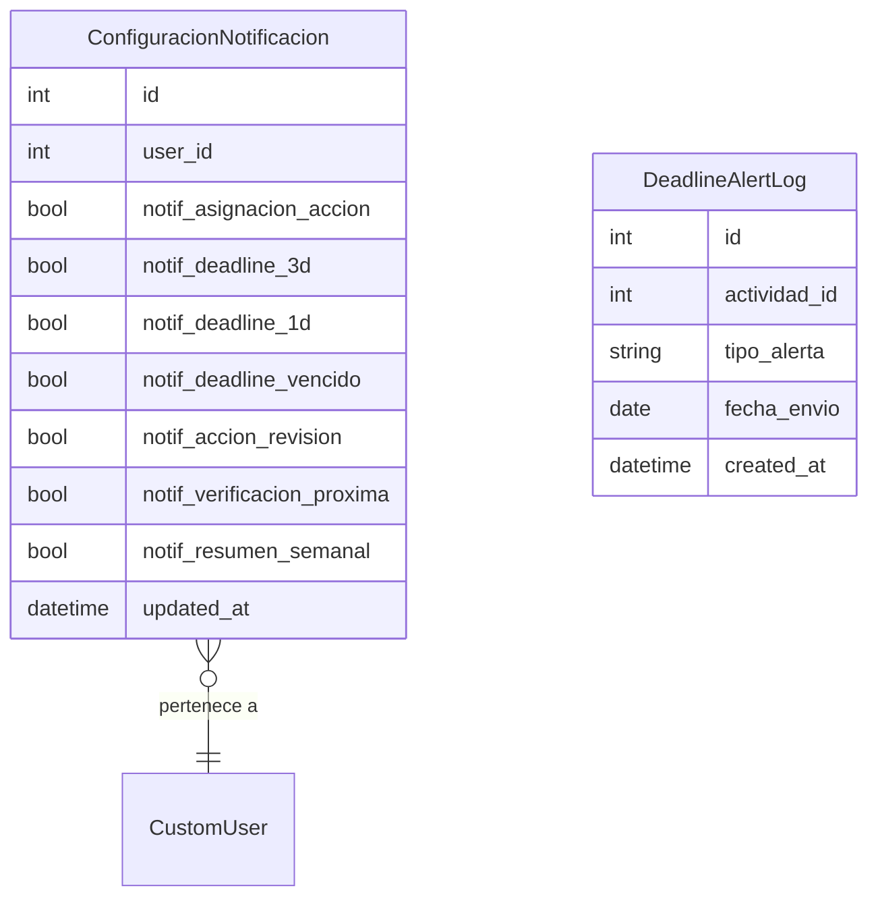

# Design: notificaciones

## Overview

Notificaciones implementa el sistema centralizado de despacho de emails del SGCA. Actúa como consumidor pasivo: escucha señales de los módulos upstream (`accion_estado_cambiado` de acciones, `verificacion_proxima_detectada` de verificacion-eficacia) y ejecuta tareas Celery Beat programadas para el scanning diario de deadlines y el resumen semanal. Todos los envíos son asíncronos vía Celery; ninguna operación de negocio queda bloqueada por el sistema de notificaciones.

**Purpose**: Entregar la información correcta al usuario correcto en el momento oportuno, sin acoplar la lógica de negocio de los módulos upstream al mecanismo de entrega de emails.
**Users**: Todos los roles (admin, responsable, supervisor, verificador) reciben distintos tipos de email según su función. El operador de la plataforma es el beneficiario indirecto de la fiabilidad del sistema.
**Impact**: Registra handlers de señales de acciones y verificacion-eficacia en `apps.py`. Crea los modelos `ConfiguracionNotificacion` y `DeadlineAlertLog`. Agrega dos tareas Celery Beat al scheduler. Cambios en la firma de las señales upstream requieren revalidación de este módulo.

### Goals
- Handlers de señal ligeros que solo extraen IDs y despachan tareas Celery async
- Tarea diaria idempotente de deadline scanning con log de alertas enviadas
- Tarea semanal de resumen al admin con métricas agregadas
- Configuración de preferencias de notificación por usuario con defaults automáticos
- Reintentos automáticos ante fallos de SendGrid sin impactar operaciones de negocio

### Non-Goals
- Notificaciones in-app, push, SMS, Slack/Teams
- Programación de verificaciones de eficacia (→ verificacion-eficacia)
- Generación de reportes en background (→ reportes-dashboard)
- Historial detallado de todos los emails enviados (nice-to-have futuro)
- Garantías de entrega de orden (los emails pueden llegar desordenados entre distintos tipos)

---

## Boundary Commitments

### This Spec Owns
- Modelos `ConfiguracionNotificacion` y `DeadlineAlertLog` en schema privado del tenant
- Handlers de señal: `handle_accion_estado_cambiado` y `handle_verificacion_proxima`
- Tareas Celery async: `enviar_email_asignacion_accion`, `enviar_email_accion_lista_revision`, `enviar_email_verificacion_proxima`
- Tareas Celery Beat: `sgca.notificaciones.scan_deadlines_actividades` (diario), `sgca.notificaciones.resumen_semanal_admin` (semanal)
- `NotificacionService`: lógica de envío vía SendGrid, validación de preferencias, filtro de usuarios activos
- Plantillas HTML de email (7 tipos) en `apps/notificaciones/templates/`
- Endpoint REST de preferencias de notificación

### Out of Boundary
- Emisión de `accion_estado_cambiado` (→ acciones)
- Emisión de `verificacion_proxima_detectada` (→ verificacion-eficacia)
- Detección de verificaciones próximas y su scheduling (→ verificacion-eficacia; esta spec solo reacciona a la señal)
- Generación de reportes PDF/Excel en background (→ reportes-dashboard)
- Datos de negocio: Accion, Actividad, VerificacionEficacia (solo los lee, no los modifica)

### Allowed Dependencies
- `apps.acciones.signals.accion_estado_cambiado` — señal upstream (listener, solo lectura)
- `apps.verificacion.signals.verificacion_proxima_detectada` — señal upstream (listener, solo lectura)
- `apps.planes.models.Actividad` — lectura directa de fecha_limite y estado para deadline scanning
- `apps.acciones.models.Accion` — lectura de datos para templates de email
- `apps.verificacion.models.VerificacionEficacia` — lectura de datos para template de email
- `apps.users.models.CustomUser` — emails, roles, is_active para destinatarios
- `apps.tenants.models.Tenant` — iteración multi-tenant en tareas Celery Beat
- `apps.tenants.models.TenantModel` — herencia para aislamiento por schema
- `celery`, `django_celery_beat` — tareas async y schedules
- `sendgrid-python` — envío de emails
- `django.template` — renderizado de templates HTML

### Revalidation Triggers
- Si cambia la firma de `accion_estado_cambiado` (kwargs, nombre) → revalidar handlers de este módulo
- Si cambia la firma de `verificacion_proxima_detectada` (kwargs, nombre) → revalidar handler de verificacion próxima
- Si cambia `Actividad.fecha_limite` o sus índices en planes-trabajo → revalidar tarea scan_deadlines_actividades
- Si se añaden nuevos estados a Accion → evaluar si requieren nuevos tipos de notificación
- Si cambia `RequireRole` de auth-rbac → revalidar endpoint de preferencias

---

## Architecture

### Architecture Pattern & Boundary Map



**Architecture Integration**:
- Pattern: Django Signals (consumer) + Celery async tasks + Celery Beat (producer) + TenantModel
- Los handlers de señal son síncronos pero mínimos: solo extraen IDs y hacen `.delay()` a tareas Celery
- Las tareas Celery hacen las queries y el envío en contexto async/worker; usan `schema_context` para multi-tenant donde aplica
- `NotificacionService` es el único punto de contacto con SendGrid; centraliza validación de preferencias y filtro de usuarios activos

### Technology Stack

| Layer | Elección | Rol en este feature |
|-------|----------|---------------------|
| Backend | Python 3.12 + Django 5 + DRF | Modelos, signal handlers, API de preferencias |
| Multi-tenancy | django-tenants (TenantModel) | ConfiguracionNotificacion y DeadlineAlertLog aislados por schema |
| Async tasks | Celery + Redis | Envío async de emails; fire-and-forget con retries |
| Scheduler | Celery Beat + django_celery_beat | Tareas diaria y semanal |
| Email provider | sendgrid-python | Envío de transactional emails |
| Templates | Django template engine | HTML emails locales (7 templates) |
| DB | PostgreSQL 16 | Schema privado por tenant |

---

## File Structure Plan

### Directory Structure

```
backend/
└── apps/
    └── notificaciones/
        ├── __init__.py
        ├── apps.py               # NotificacionesConfig — conecta signal handlers en ready()
        ├── models.py             # ConfiguracionNotificacion, DeadlineAlertLog
        ├── signals.py            # handle_accion_estado_cambiado, handle_verificacion_proxima
        ├── tasks.py              # Todas las tareas Celery (async + Beat)
        ├── services.py           # NotificacionService: send_email, should_send, get_config
        ├── serializers.py        # ConfiguracionNotificacionSerializer
        ├── views.py              # PreferenciasNotificacionView (retrieve + update)
        ├── urls.py               # /api/notificaciones/preferencias/
        ├── templates/
        │   └── notificaciones/
        │       ├── asignacion_accion.html
        │       ├── deadline_3d.html
        │       ├── deadline_1d.html
        │       ├── deadline_vencido.html
        │       ├── accion_lista_revision.html
        │       ├── verificacion_proxima.html
        │       └── resumen_semanal.html
        └── tests/
            ├── test_models.py          # ConfiguracionNotificacion, DeadlineAlertLog
            ├── test_signals.py         # handle_accion_estado_cambiado, handle_verificacion_proxima
            ├── test_tasks.py           # Todas las tareas Celery (con SendGrid mock)
            ├── test_services.py        # NotificacionService: should_send, send_email
            └── test_api.py             # GET/PATCH /api/notificaciones/preferencias/
```

### Modified Files
- `backend/config/settings/base.py` — añadir `'apps.notificaciones'` a TENANT_APPS; añadir `SENDGRID_API_KEY` y `DEFAULT_FROM_EMAIL`
- `backend/config/celery.py` — registrar schedules: `sgca.notificaciones.scan_deadlines_actividades` (daily 06:00 UTC) y `sgca.notificaciones.resumen_semanal_admin` (weekly Monday 07:00 UTC)

---

## System Flows

### Flujo: Asignación de acción → email al responsable



### Flujo: Celery Beat diario → alertas de deadline



### Flujo: verificacion_proxima_detectada → email al verificador



---

## Requirements Traceability

| Requisito | Resumen | Componentes | Contratos | Flujos |
|-----------|---------|-------------|-----------|--------|
| 1.1–1.4 | Email asignación de acción | handle_accion_estado_cambiado, enviar_email_asignacion_accion, NotificacionService | accion_estado_cambiado Signal (listener) | Flujo asignación |
| 2.1–2.7 | Alertas de deadline actividades | scan_deadlines_actividades, DeadlineAlertLog, NotificacionService | Celery Beat schedule, lectura Actividad | Flujo deadline |
| 3.1–3.4 | Notificación acción lista revisión | handle_accion_estado_cambiado, enviar_email_accion_lista_revision | accion_estado_cambiado Signal | Flujo asignación (rama cerrado) |
| 4.1–4.4 | Notificación verificación próxima | handle_verificacion_proxima, enviar_email_verificacion_proxima | verificacion_proxima_detectada Signal | Flujo verificacion |
| 5.1–5.4 | Resumen semanal admin | resumen_semanal_admin, NotificacionService | Celery Beat schedule | — |
| 6.1–6.4 | Preferencias de notificación | ConfiguracionNotificacion, PreferenciasNotificacionView | GET/PATCH /api/notificaciones/preferencias/ | — |
| 7.1–7.5 | Fiabilidad y aislamiento | Celery retries, captura de excepciones en handlers, idempotencia DeadlineAlertLog | — | Todos los flujos |

---

## Components and Interfaces

### Resumen de Componentes

| Componente | Layer | Intent | Req Coverage | Dependencias Clave |
|------------|-------|--------|--------------|---------------------|
| ConfiguracionNotificacion | Modelo | Preferencias de notificación por usuario | 6 | CustomUser, TenantModel (P0) |
| DeadlineAlertLog | Modelo | Registro idempotente de alertas de deadline enviadas | 2.7, 7.5 | Actividad (FK), TenantModel (P0) |
| handle_accion_estado_cambiado | Signal handler | Escucha accion_estado_cambiado, despacha tareas async | 1, 3 | accion_estado_cambiado Signal, Celery (P0) |
| handle_verificacion_proxima | Signal handler | Escucha verificacion_proxima_detectada, despacha tarea async | 4 | verificacion_proxima_detectada Signal, Celery (P0) |
| enviar_email_asignacion_accion | Celery Task | Email al responsable cuando se le asigna una acción | 1 | NotificacionService, Accion (P0) |
| enviar_email_accion_lista_revision | Celery Task | Email a supervisores cuando acción llega a cerrado | 3 | NotificacionService, Accion, CustomUser (P0) |
| enviar_email_verificacion_proxima | Celery Task | Email a verificadores con detalle de verificación | 4 | NotificacionService, VerificacionEficacia (P0) |
| scan_deadlines_actividades | Celery Beat Task | Detección diaria de deadlines y envío de alertas | 2 | NotificacionService, Actividad, DeadlineAlertLog, Tenant (P0) |
| resumen_semanal_admin | Celery Beat Task | Resumen semanal de métricas al admin | 5 | NotificacionService, Accion, Actividad, Tenant (P0) |
| NotificacionService | Service | Envío de emails vía SendGrid con validación de preferencias | 1–7 | ConfiguracionNotificacion, CustomUser, SendGrid (P0) |
| PreferenciasNotificacionView | API | GET y PATCH de preferencias del usuario autenticado | 6 | ConfiguracionNotificacion, RequireRole (P0) |

---

### Modelos

#### ConfiguracionNotificacion

| Field | Detail |
|-------|--------|
| Intent | Almacena las preferencias de notificación de un usuario; se crea con defaults en el primer acceso |
| Requirements | 6.1, 6.2, 6.4 |

**Contracts**: Service [x]

```python
class ConfiguracionNotificacion(TenantModel):
    user = OneToOneField(
        'users.CustomUser', on_delete=CASCADE, related_name='config_notificacion'
    )
    notif_asignacion_accion = BooleanField(default=True)
    notif_deadline_3d = BooleanField(default=True)
    notif_deadline_1d = BooleanField(default=True)
    notif_deadline_vencido = BooleanField(default=True)
    notif_accion_revision = BooleanField(default=True)
    notif_verificacion_proxima = BooleanField(default=True)
    notif_resumen_semanal = BooleanField(default=True)
    updated_at = DateTimeField(auto_now=True)
```

**Invariants**:
- Solo existe uno por usuario (OneToOneField)
- Se crea automáticamente con todos los campos en `True` vía `get_or_create` en `NotificacionService.get_config`
- Nunca se elimina manualmente; se elimina en cascada si se elimina el usuario

---

#### DeadlineAlertLog

| Field | Detail |
|-------|--------|
| Intent | Registro idempotente de alertas de deadline enviadas; impide duplicados en el mismo día |
| Requirements | 2.7, 7.5 |

**Contracts**: Service [x]

```python
class DeadlineAlertLog(TenantModel):
    TIPOS = [
        ('3d', 'Deadline en 3 días'),
        ('1d', 'Deadline en 1 día'),
        ('vencido', 'Deadline vencido'),
    ]
    actividad_id = IntegerField()  # FK lógica — no FK real para evitar CASCADE cross-app
    tipo_alerta = CharField(max_length=10, choices=TIPOS)
    fecha_envio = DateField()      # fecha en que se envió la alerta (hoy)
    created_at = DateTimeField(auto_now_add=True)

    class Meta:
        unique_together = [('actividad_id', 'tipo_alerta', 'fecha_envio')]
```

**Invariants**:
- `unique_together` garantiza que no se creen dos logs para la misma actividad, tipo y día
- `actividad_id` es una FK lógica (no real con ForeignKey) para evitar dependencia de schema cross-app en migrations
- Solo `scan_deadlines_actividades` escribe en esta tabla

---

### Signal Handlers

#### handle_accion_estado_cambiado y handle_verificacion_proxima

| Field | Detail |
|-------|--------|
| Intent | Handlers mínimos que despachan tareas Celery sin hacer queries; capturan excepciones para no propagar errores upstream |
| Requirements | 1.1–1.4, 3.1–3.4, 4.1–4.4, 7.3 |

**Contracts**: Event [x]

```python
# En apps/notificaciones/signals.py

from django.dispatch import receiver
from apps.acciones.signals import accion_estado_cambiado
from apps.verificacion.signals import verificacion_proxima_detectada

@receiver(accion_estado_cambiado)
def handle_accion_estado_cambiado(sender, accion, estado_nuevo, **kwargs):
    try:
        from apps.notificaciones.tasks import (
            enviar_email_asignacion_accion,
            enviar_email_accion_lista_revision,
        )
        if estado_nuevo == 'en_proceso':
            enviar_email_asignacion_accion.delay(accion.id)
        elif estado_nuevo == 'cerrado':
            enviar_email_accion_lista_revision.delay(accion.id)
    except Exception:
        import logging
        logging.getLogger('notificaciones').exception(
            'Error en handle_accion_estado_cambiado para accion_id=%s', accion.id
        )

@receiver(verificacion_proxima_detectada)
def handle_verificacion_proxima(sender, verificacion, accion, tenant, **kwargs):
    try:
        from apps.notificaciones.tasks import enviar_email_verificacion_proxima
        enviar_email_verificacion_proxima.delay(verificacion.id, tenant.schema_name)
    except Exception:
        import logging
        logging.getLogger('notificaciones').exception(
            'Error en handle_verificacion_proxima para verificacion_id=%s', verificacion.id
        )
```

**Ordering / delivery guarantees**:
- Los handlers se ejecutan sincrónicamente dentro de la transacción del emisor
- Si el handler lanza excepción, la captura internamente y la registra en log sin re-lanzar
- El `.delay()` de Celery puede fallar si Redis no está disponible — esto también se captura

---

### Service Layer

#### NotificacionService

| Field | Detail |
|-------|--------|
| Intent | Centraliza envío de emails, validación de preferencias, filtro de usuarios activos y renderizado de templates |
| Requirements | 1–7 |

**Contracts**: Service [x]

```python
class NotificacionService:
    def send_to_user(
        self,
        user: CustomUser,
        tipo: str,  # 'asignacion_accion' | 'deadline_3d' | 'deadline_1d' | 'deadline_vencido' |
                    # 'accion_revision' | 'verificacion_proxima' | 'resumen_semanal'
        context: dict,
        subject: str,
    ) -> bool:
        """
        Verifica is_active y preferencias. Si should_send=True, renderiza template y envía vía SendGrid.
        Returns True si el email fue enviado, False si fue omitido.
        Raises: SendGridException (para que Celery haga retry).
        """

    def get_config(self, user: CustomUser) -> ConfiguracionNotificacion:
        """
        Retorna o crea ConfiguracionNotificacion con defaults. Nunca retorna None.
        """

    def should_send(self, user: CustomUser, tipo: str) -> bool:
        """
        Returns False si user.is_active=False o si la preferencia del tipo está desactivada.
        Usa get_config internamente.
        """

    def send_to_role(
        self,
        role: str,  # 'supervisor' | 'verificador' | 'admin'
        tipo: str,
        context: dict,
        subject: str,
    ) -> int:
        """
        Envía email a todos los usuarios activos del tenant con el rol dado que tienen el tipo activado.
        Returns número de emails enviados.
        """

    def _render_email(self, template_name: str, context: dict) -> str:
        """Renderiza template HTML de email con el contexto dado."""

    def _send_via_sendgrid(self, to_email: str, subject: str, html_content: str) -> None:
        """
        Envía email vía SendGrid API. Raises SendGridException si falla.
        """
```

**Preconditions**: `connection.schema_name` es el schema del tenant activo (para ConfiguracionNotificacion)
**Postconditions**: Email enviado o skip registrado en log
**Invariants**: Nunca envía a usuarios con `is_active=False`; siempre verifica preferencias antes de enviar

---

### Celery Tasks

#### enviar_email_asignacion_accion

```python
@shared_task(
    name='sgca.notificaciones.enviar_email_asignacion_accion',
    bind=True,
    max_retries=3,
    default_retry_delay=60,
    autoretry_for=(Exception,),
    retry_backoff=True,
)
def enviar_email_asignacion_accion(self, accion_id: int):
    """
    Envía email al responsable de la acción indicando que tiene una nueva acción asignada.
    Req: 1.1, 1.2, 1.3, 1.4
    """
```

#### enviar_email_accion_lista_revision

```python
@shared_task(
    name='sgca.notificaciones.enviar_email_accion_lista_revision',
    bind=True, max_retries=3, default_retry_delay=60,
    autoretry_for=(Exception,), retry_backoff=True,
)
def enviar_email_accion_lista_revision(self, accion_id: int):
    """
    Envía email a todos los supervisores activos del tenant.
    Req: 3.1, 3.2, 3.3, 3.4
    """
```

#### enviar_email_verificacion_proxima

```python
@shared_task(
    name='sgca.notificaciones.enviar_email_verificacion_proxima',
    bind=True, max_retries=3, default_retry_delay=60,
    autoretry_for=(Exception,), retry_backoff=True,
)
def enviar_email_verificacion_proxima(self, verificacion_id: int, tenant_schema: str):
    """
    Con schema_context(tenant_schema): envía email a todos los verificadores activos.
    Req: 4.1, 4.2, 4.3, 4.4
    """
```

#### scan_deadlines_actividades (Celery Beat)

```python
@shared_task(name='sgca.notificaciones.scan_deadlines_actividades')
def scan_deadlines_actividades():
    """
    Itera tenants activos. Para cada tenant, detecta Actividades con deadline próximo
    (vencido, 1d, 3d) y estado != completada. Usa DeadlineAlertLog para idempotencia.
    Trigger: Celery Beat, diario, 06:00 UTC
    Req: 2.1, 2.2, 2.3, 2.4, 2.5, 2.6, 2.7
    """
```

#### resumen_semanal_admin (Celery Beat)

```python
@shared_task(name='sgca.notificaciones.resumen_semanal_admin')
def resumen_semanal_admin():
    """
    Itera tenants activos. Para cada tenant, agrega métricas de acciones y actividades.
    Envía resumen a todos los admins activos que tienen el tipo activado.
    Trigger: Celery Beat, semanal, lunes 07:00 UTC
    Req: 5.1, 5.2, 5.3, 5.4
    """
```

---

### API

#### PreferenciasNotificacionView

| Field | Detail |
|-------|--------|
| Intent | Endpoint REST para que el usuario autenticado consulte y actualice sus preferencias de notificación |
| Requirements | 6.1, 6.3, 6.4 |

**Contracts**: API [x]

| Method | Endpoint | Roles | Request | Response | Errors |
|--------|----------|-------|---------|----------|--------|
| GET | `/api/notificaciones/preferencias/` | todos (autenticado) | — | `ConfiguracionNotificacionSerializer` | 401 |
| PATCH | `/api/notificaciones/preferencias/` | todos (autenticado) | `ConfiguracionNotificacionSerializer (partial)` | `ConfiguracionNotificacionSerializer` | 400, 401 |

```python
# ConfiguracionNotificacionSerializer
class ConfiguracionNotificacionSerializer:
    notif_asignacion_accion: bool
    notif_deadline_3d: bool
    notif_deadline_1d: bool
    notif_deadline_vencido: bool
    notif_accion_revision: bool
    notif_verificacion_proxima: bool
    notif_resumen_semanal: bool
    updated_at: datetime  # readonly
```

---

## Data Models

### Domain Model



### Logical Data Model

**ConfiguracionNotificacion** (TenantModel):
- `user`: OneToOneField(CustomUser, CASCADE) — inmutable tras creación
- 7 campos BooleanField, todos default=True
- Se crea vía `get_or_create` — no requiere migración de datos al desplegar

**DeadlineAlertLog** (TenantModel):
- `actividad_id`: IntegerField (FK lógica — sin ForeignKey real para evitar cross-app migration dependency)
- `tipo_alerta`: CharField choices=['3d','1d','vencido']
- `fecha_envio`: DateField — siempre = fecha de ejecución de la tarea
- `unique_together`: ('actividad_id', 'tipo_alerta', 'fecha_envio')
- Sin `updated_at` — solo se crea, nunca se actualiza

### Data Contracts & Integration

```python
# DeadlineAlertLog — uso en scan_deadlines_actividades
log, created = DeadlineAlertLog.objects.get_or_create(
    actividad_id=actividad.id,
    tipo_alerta=tipo,
    fecha_envio=date.today(),
)
if created:
    service.send_to_user(actividad.responsable, tipo, ctx, subject)
# Si no se creó (ya existía) → skip idempotente

# ConfiguracionNotificacion — uso en NotificacionService
config, _ = ConfiguracionNotificacion.objects.get_or_create(
    user=user,
    defaults={f: True for f in TIPOS_NOTIFICACION}
)
```

---

## Error Handling

### Error Strategy
Los handlers de señal capturan todas las excepciones internamente (Req 7.3). Las tareas Celery usan `autoretry_for=(Exception,)` con `max_retries=3` y `retry_backoff=True` (Req 7.2). El SendGrid client puede lanzar `python_http_client.exceptions.HTTPError`; Celery lo intercepta y hace retry. Usuarios desactivados y preferencias se verifican antes del envío (Req 7.4).

### Error Categories and Responses

| Categoría | Escenario | Respuesta |
|-----------|-----------|-----------|
| SendGrid HTTP error | Email rebotado o fallo temporal de API | Celery retry (max 3, exponential backoff) |
| Handler exception | Cualquier error en signal handler | Log ERROR + swallow exception (no propaga) |
| Usuario desactivado | is_active=False | Skip silencioso, no log |
| Preferencia desactivada | config.notif_X=False | Skip silencioso, no log |
| DeadlineAlertLog duplicate | unique_together violation | get_or_create evita la excepción; skip si ya existe |
| API 400 (PATCH preferencias) | Campo booleano inválido | `{"field": ["Debe ser true o false."]}` |
| API 401 | Token JWT ausente | simplejwt default |

### Monitoring
- Log INFO por cada email enviado: `tipo`, `destinatario`, `tenant`
- Log WARNING si scan_deadlines_actividades no encuentra tenants activos
- Log ERROR si SendGrid falla las 3 veces (después de agotar retries)
- Log ERROR con traceback completo en handlers de señal cuando se captura excepción

---

## Testing Strategy

### Unit Tests
1. `NotificacionService.should_send` — user.is_active=False → False; preferencia desactivada → False; user activo con preferencia activa → True
2. `NotificacionService.get_config` — usuario sin config → crea con defaults; usuario con config → retorna existente
3. `DeadlineAlertLog` — get_or_create: primer llamado crea registro; segundo llamado en mismo día → no crea (unique_together)
4. `handle_accion_estado_cambiado` — estado_nuevo='en_proceso' → dispatch asignacion task; 'cerrado' → dispatch revision task; 'abierto' → no dispatch; excepción en task → capturada sin re-lanzar
5. `handle_verificacion_proxima` — dispatch correcto de task; excepción → capturada sin re-lanzar

### Integration Tests
1. `GET /api/notificaciones/preferencias/` — usuario sin config → 200 con todos True; usuario con config → 200 con valores correctos
2. `PATCH /api/notificaciones/preferencias/` — cambia notif_deadline_3d a False → 200; valor inválido → 400; no autenticado → 401
3. `scan_deadlines_actividades` (con SendGrid mock) — actividad vencida pendiente → email enviado + log creado; segunda ejecución en mismo día → no email (idempotente)
4. `enviar_email_asignacion_accion` — responsable activo con preferencia activa → email enviado; responsable desactivado → skip; SendGrid falla → retry
5. `resumen_semanal_admin` — tenant con admin activo → email enviado; tenant sin admins → skip sin error
6. Aislamiento de tenant: DeadlineAlertLog de tenant A no interfiere con tenant B

### E2E Tests
1. AccionService transiciona acción a 'en_proceso' → señal emitida → handler despacha tarea → email enviado al responsable (con SendGrid mock)
2. VerificacionService emite verificacion_proxima_detectada → handler despacha tarea → email enviado a todos los verificadores
3. Usuario actualiza preferencias (desactiva deadline_3d) → scan_deadlines_actividades → no envía alerta 3d a ese usuario
