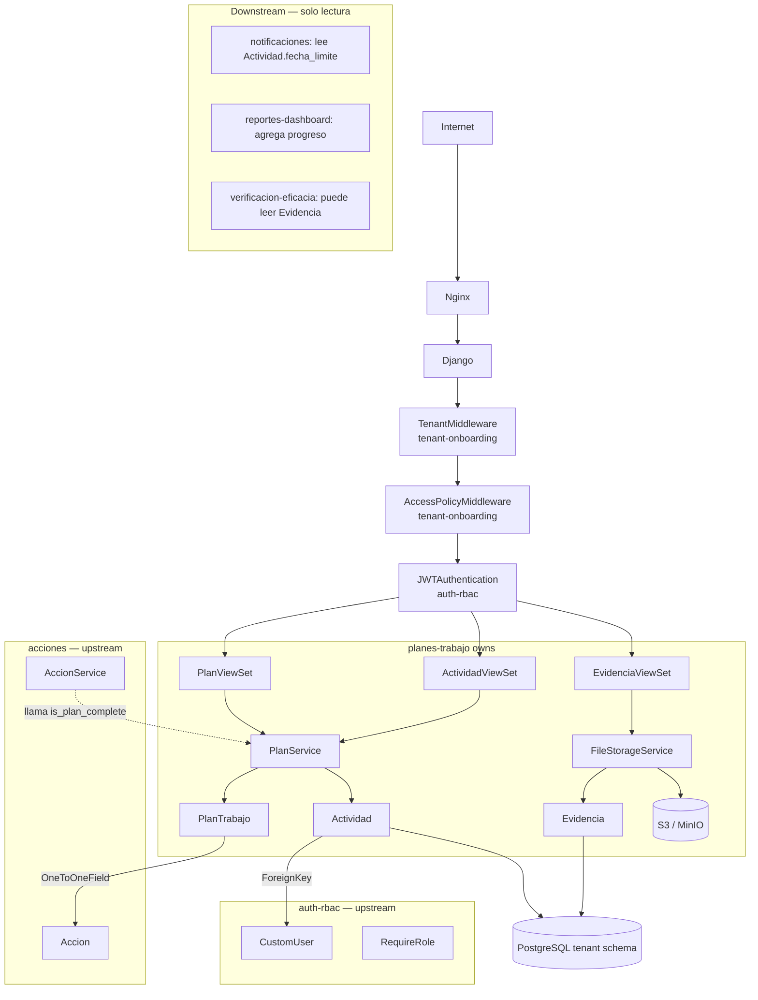
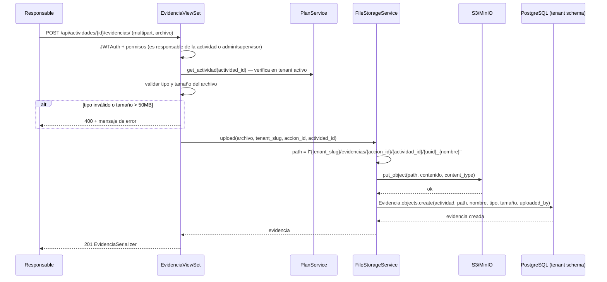
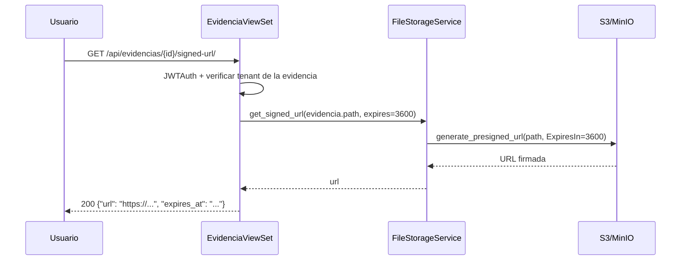
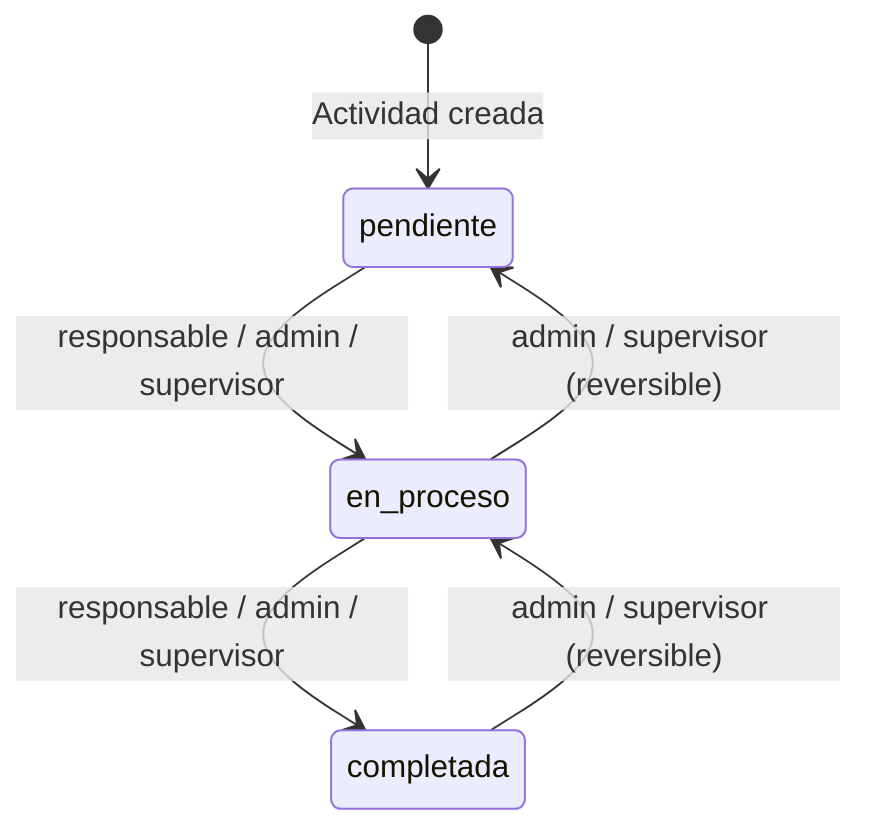
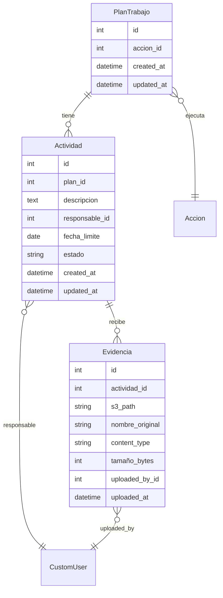

# Design: planes-trabajo

## Overview

Planes de Trabajo implementa la capa de ejecución de las acciones de seguridad en SGCA. Cada Accion tiene exactamente un PlanTrabajo con múltiples Actividades asignadas a responsables. Las Actividades transicionan por estados (pendiente→en_proceso→completada) y reciben Evidencias en forma de archivos almacenados en S3/MinIO con acceso exclusivamente por URLs firmadas. El progreso del plan se calcula en tiempo real.

**Purpose**: Dar estructura ejecutable a las acciones de seguridad mediante actividades concretas con responsables, fechas límite y evidencias verificables.
**Users**: Responsables (ejecutan actividades, suben evidencias), supervisores (supervisan y validan), admins (gestión completa), verificadores (solo lectura para verificación de eficacia).
**Impact**: Establece los modelos `PlanTrabajo`, `Actividad`, `Evidencia` y el contrato `PlanService.is_plan_complete()` que AccionService consume. Provee los modelos de deadline que notificaciones leerá para alertas.

### Goals
- PlanTrabajo 1:1 con Accion; Actividades con estados y responsables
- Subida de evidencias a S3/MinIO con tenant namespacing y URLs firmadas
- Progreso automático (% actividades completadas)
- `PlanService.is_plan_complete(accion_id)` como contrato de integración con acciones

### Non-Goals
- Notificaciones de deadline (→ notificaciones lee Actividad directamente)
- Generación de PDF/Excel del plan (→ reportes-dashboard)
- Programación de verificaciones de eficacia (→ verificacion-eficacia)
- Máquina de estados de la Accion (→ acciones)

---

## Boundary Commitments

### This Spec Owns
- Modelos `PlanTrabajo`, `Actividad`, `Evidencia` en schema privado del tenant
- Lógica de estados de Actividad con validación de rol
- Cálculo y almacenamiento del progreso del plan
- Upload/download/delete de archivos en S3/MinIO (django-storages)
- Generación de URLs firmadas para evidencias
- `PlanService.is_plan_complete(accion_id) -> bool` como contrato de salida hacia acciones
- Endpoints REST: CRUD de planes, actividades, evidencias; signed URL endpoint

### Out of Boundary
- Transición de estado de Accion y su validación (→ acciones; solo consume `is_plan_complete`)
- Envío de emails por deadline de actividad (→ notificaciones lee Actividad.fecha_limite)
- Generación de reporte PDF/Excel del plan (→ reportes-dashboard)
- Programación de VerificacionEficacia (→ verificacion-eficacia)

### Allowed Dependencies
- `apps.acciones.models.Accion` — OneToOneField en PlanTrabajo
- `apps.users.models.CustomUser` — FK responsable en Actividad
- `apps.users.permissions.RequireRole`, `IsAdminTenant` — permisos en endpoints
- `apps.tenants.models.TenantModel` — herencia para aislamiento por schema
- `django-storages` + `boto3` — abstracción S3/MinIO
- `djangorestframework` — ViewSet, Serializer, Parser (MultiPart)
- `django-filter` — filtros de listado

### Revalidation Triggers
- Si cambia la FK o el modelo `Accion` (→ acciones) requiere revisar `PlanService.is_plan_complete` y el OneToOneField
- Si cambia la estructura de rutas S3 (tenant-slug), revisar `FileStorageService._build_path`
- Si se añaden tipos de archivo aceptados o se cambia el límite de 50 MB, actualizar `EvidenciaSerializer.validate_archivo`
- Si `RequireRole` de auth-rbac cambia su firma, revisar todos los endpoints de esta spec

---

## Architecture

### Architecture Pattern & Boundary Map



**Architecture Integration**:
- Pattern: DRF ViewSet + Service Layer + TenantModel + django-storages
- Los modelos heredan de TenantModel → queries restringidas al schema activo automáticamente
- `PlanService` centraliza lógica de negocio (CRUD, estados, progreso, validaciones)
- `FileStorageService` encapsula toda interacción con S3/MinIO
- `is_plan_complete()` es el único contrato de salida activo de esta spec; notificaciones y reportes-dashboard leen los modelos directamente (sin contrato de servicio)

### Technology Stack

| Layer | Elección | Rol en este feature |
|-------|----------|---------------------|
| Backend | Python 3.12 + Django 5 + DRF | Modelos, API, lógica de negocio |
| Storage | django-storages + boto3 | Abstracción S3/MinIO |
| S3 Local | MinIO | Storage en desarrollo local |
| S3 Prod | Amazon S3 | Storage en producción |
| Multi-tenancy | django-tenants (TenantModel) | Aislamiento por schema PostgreSQL |
| DB | PostgreSQL 16 | Schema privado del tenant |
| Frontend | React 18 + Vite + TailwindCSS | Detalle de plan, lista de actividades, upload de evidencias |

---

## File Structure Plan

### Directory Structure

```
backend/
└── apps/
    └── planes/
        ├── __init__.py
        ├── models.py           # PlanTrabajo, Actividad, Evidencia
        ├── services.py         # PlanService (CRUD, estados, progreso, is_plan_complete)
        │                       # FileStorageService (upload, delete, signed_url)
        ├── serializers.py      # PlanTrabajoSerializer, ActividadSerializer,
        │                       # EvidenciaSerializer, ActividadTransitionSerializer
        ├── views.py            # PlanViewSet, ActividadViewSet, EvidenciaViewSet
        ├── urls.py             # /api/planes/, /api/actividades/, /api/evidencias/
        ├── storage.py          # TenantMediaStorage (subclase de S3Boto3Storage)
        └── tests/
            ├── test_models.py          # PlanTrabajo, Actividad, Evidencia invariants
            ├── test_services.py        # PlanService: CRUD, estados, progreso, is_plan_complete
            ├── test_storage.py         # FileStorageService: upload, delete, signed URL
            ├── test_api.py             # Endpoints: CRUD, upload, estados, permisos
            └── test_permissions.py     # Aislamiento de tenant, acceso por rol

frontend/
└── src/
    ├── pages/
    │   └── planes/
    │       ├── PlanTrabajoPage.tsx     # Vista detalle del plan con lista de actividades
    │       └── ActividadDetailPage.tsx # Actividad con evidencias + upload
    ├── components/
    │   └── planes/
    │       ├── ActividadCard.tsx       # Tarjeta de actividad con badge de estado
    │       ├── ActividadStatusBadge.tsx
    │       ├── ProgressBar.tsx         # Barra de progreso del plan
    │       └── EvidenciaUploader.tsx   # Dropzone de subida de archivo
    └── services/
        └── planes.ts                   # planesService: CRUD plan/actividad/evidencia, signed URL
```

### Modified Files
- `backend/config/settings/base.py` — añadir `'apps.planes'` a TENANT_APPS; configurar `DEFAULT_FILE_STORAGE`, `AWS_STORAGE_BUCKET_NAME`, `MINIO_*` variables
- `backend/config/settings/dev.py` — configurar MinIO endpoint local
- `backend/config/settings/prod.py` — configurar S3 real

---

## System Flows

### Flujo de Subida de Evidencia



### Flujo de Descarga Segura (URL Firmada)



### Flujo de Progreso del Plan



Progreso = `(count(completada) / count(total)) * 100` recalculado en cada transición de Actividad.

---

## Requirements Traceability

| Requisito | Resumen | Componentes | Contratos | Flujos |
|-----------|---------|-------------|-----------|--------|
| 1.1–1.5 | Creación del plan | PlanViewSet, PlanService | POST /api/planes/ | — |
| 2.1–2.6 | Gestión de actividades | ActividadViewSet, PlanService | CRUD /api/actividades/ | — |
| 3.1–3.5 | Transiciones de estado | ActividadViewSet, PlanService | POST /api/actividades/{id}/transition/ | Flujo de Progreso |
| 4.1–4.6 | Subida y gestión de evidencias | EvidenciaViewSet, FileStorageService | POST /api/actividades/{id}/evidencias/ | Flujo de Subida |
| 5.1–5.5 | Acceso seguro a evidencias | EvidenciaViewSet, FileStorageService | GET /api/evidencias/{id}/signed-url/ | Flujo de Descarga |
| 6.1–6.5 | Progreso y completitud | PlanService | is_plan_complete(accion_id); campo progreso en PlanTrabajo | Flujo de Progreso |
| 7.1–7.6 | Control de acceso por rol | RequireRole, PlanService.queryset_for_user | — | — |

---

## Components and Interfaces

### Resumen de Componentes

| Componente | Layer | Intent | Req Coverage | Dependencias Clave |
|------------|-------|--------|--------------|---------------------|
| PlanTrabajo | Modelo | Plan de trabajo 1:1 con Accion | 1, 6 | Accion, TenantModel (P0) |
| Actividad | Modelo | Unidad de trabajo con estado y responsable | 2, 3, 6, 7 | PlanTrabajo, CustomUser (P0) |
| Evidencia | Modelo | Metadatos de archivo subido a S3 | 4, 5 | Actividad, CustomUser (P0) |
| PlanService | Service | CRUD, estados, progreso, is_plan_complete | 1–3, 6, 7 | PlanTrabajo, Actividad (P0) |
| FileStorageService | Service | Upload/delete S3, URLs firmadas | 4, 5 | django-storages, boto3 (P0) |
| PlanViewSet | API | Endpoints CRUD de planes | 1, 6, 7 | PlanService, RequireRole (P0) |
| ActividadViewSet | API | Endpoints CRUD + transición de actividades | 2, 3, 7 | PlanService, RequireRole (P0) |
| EvidenciaViewSet | API | Upload, listado, delete, signed URL | 4, 5, 7 | FileStorageService, RequireRole (P0) |

---

### Modelos

#### PlanTrabajo

**Contracts**: Service [x]

```python
class PlanTrabajo(TenantModel):
    accion = OneToOneField('acciones.Accion', on_delete=CASCADE, related_name='plan_trabajo')
    created_at = DateTimeField(auto_now_add=True)
    updated_at = DateTimeField(auto_now=True)

    @property
    def progreso(self) -> int:
        """Porcentaje de actividades completadas. 0 si no hay actividades."""
        total = self.actividades.count()
        if total == 0:
            return 0
        completadas = self.actividades.filter(estado='completada').count()
        return round((completadas / total) * 100)
```

**Invariants**:
- Solo existe uno por Accion (unique garantizado por OneToOneField)
- Mientras la Accion esté en estado "verificado", PlanTrabajo es inmutable
- Debe tener al menos una Actividad (validado en PlanService al crear)

---

#### Actividad

**Contracts**: Service [x]

```python
class Actividad(TenantModel):
    ESTADOS = [
        ('pendiente', 'Pendiente'),
        ('en_proceso', 'En Proceso'),
        ('completada', 'Completada'),
    ]
    plan = ForeignKey(PlanTrabajo, on_delete=CASCADE, related_name='actividades')
    descripcion = TextField()
    responsable = ForeignKey('users.CustomUser', on_delete=PROTECT, related_name='actividades_asignadas')
    fecha_limite = DateField()
    estado = CharField(max_length=20, choices=ESTADOS, default='pendiente')
    created_at = DateTimeField(auto_now_add=True)
    updated_at = DateTimeField(auto_now=True)
```

**Invariants**:
- `descripcion` non-null, non-empty
- `responsable` pertenece al tenant activo (validado en PlanService)
- `fecha_limite` en el futuro al momento de creación (validado en serializer)
- Transiciones de estado válidas respetadas por PlanService
- Índices: `plan` (join frecuente), `fecha_limite` (deadline scanning de notificaciones), `estado` (filtros y progreso), `responsable` (filtro por responsable)

---

#### Evidencia

**Contracts**: Service [x]

```python
class Evidencia(TenantModel):
    TIPOS_PERMITIDOS = ['application/pdf', 'image/jpeg', 'image/png', 'video/mp4']
    MAX_SIZE_BYTES = 50 * 1024 * 1024  # 50 MB

    actividad = ForeignKey(Actividad, on_delete=CASCADE, related_name='evidencias')
    s3_path = CharField(max_length=500)   # ruta completa en S3/MinIO
    nombre_original = CharField(max_length=255)
    content_type = CharField(max_length=100)
    tamaño_bytes = PositiveIntegerField()
    uploaded_by = ForeignKey('users.CustomUser', on_delete=PROTECT)
    uploaded_at = DateTimeField(auto_now_add=True)
```

**Invariants**:
- `s3_path` único por tenant (incluye UUID para evitar colisiones)
- `content_type` solo puede ser uno de TIPOS_PERMITIDOS
- `tamaño_bytes` <= MAX_SIZE_BYTES
- Al eliminar Evidencia, el archivo en S3 se borra primero (en FileStorageService.delete)

---

### Service Layer

#### PlanService

**Contracts**: Service [x]

```python
class PlanService:
    def create_plan(
        self,
        accion: Accion,
        actividades_data: list[dict],
        created_by: CustomUser,
    ) -> PlanTrabajo:
        """
        Crea PlanTrabajo con actividades iniciales.
        Raises: PlanAlreadyExistsError, AccionVerificadaError, ValidationError
        """

    def add_actividad(
        self,
        plan: PlanTrabajo,
        descripcion: str,
        responsable: CustomUser,
        fecha_limite: date,
        requesting_user: CustomUser,
    ) -> Actividad:
        """
        Añade actividad al plan.
        Raises: AccionVerificadaError, ValidationError (responsable fuera del tenant)
        """

    def update_actividad(
        self,
        actividad: Actividad,
        data: dict,
        requesting_user: CustomUser,
    ) -> Actividad:
        """
        Actualiza actividad según rol. Responsable solo puede editar descripcion.
        Admin/supervisor pueden editar todos los campos.
        Raises: PermissionDenied, ValidationError
        """

    def delete_actividad(
        self,
        actividad: Actividad,
        requesting_user: CustomUser,
    ) -> None:
        """
        Elimina actividad. Si tiene evidencias, llama FileStorageService.delete por cada una.
        Raises: LastActividadError (no se puede eliminar la única actividad del plan), PermissionDenied
        """

    def transition_actividad(
        self,
        actividad: Actividad,
        nuevo_estado: str,
        requesting_user: CustomUser,
    ) -> Actividad:
        """
        Transiciona estado de actividad con validación de rol.
        Admin/supervisor: cualquier transición.
        Responsable de la actividad: pendiente→en_proceso y en_proceso→completada.
        Raises: PermissionDenied, InvalidEstadoError
        """

    def is_plan_complete(self, accion_id: int) -> bool:
        """
        Retorna True si el PlanTrabajo de la Accion existe y TODAS sus actividades
        tienen estado 'completada'. Retorna False si no existe plan o hay actividades
        no completadas. Usado por AccionService antes de transición 'En proceso→Cerrado'.
        """

    def queryset_for_user(self, user: CustomUser) -> QuerySet[PlanTrabajo]:
        """
        admin/supervisor/verificador: todos los planes del tenant activo.
        responsable: solo planes de acciones donde accion.responsable=user.
        TenantModel ya garantiza scope del tenant.
        """
```

**Preconditions**: `connection.schema_name` es el schema del tenant activo
**Postconditions**: Cambios persistidos en schema activo; progreso recalculado en cada modificación de Actividad
**Invariants**: Nunca modifica datos de otro schema; `is_plan_complete` no modifica estado

---

#### FileStorageService

**Contracts**: Service [x]

```python
class FileStorageService:
    def upload(
        self,
        file: InMemoryUploadedFile,
        tenant_slug: str,
        accion_id: int,
        actividad_id: int,
        uploaded_by: CustomUser,
        actividad: Actividad,
    ) -> Evidencia:
        """
        Valida tipo y tamaño. Genera path único. Sube a S3/MinIO. Crea registro Evidencia.
        path = f"{tenant_slug}/evidencias/{accion_id}/{actividad_id}/{uuid}_{nombre_original}"
        Raises: InvalidFileTypeError, FileTooLargeError
        """

    def delete(self, evidencia: Evidencia) -> None:
        """
        Elimina archivo de S3/MinIO y luego el registro Evidencia de la DB.
        Si S3 falla, lanza excepción y no borra el registro DB.
        """

    def get_signed_url(self, evidencia: Evidencia, expires: int = 3600) -> str:
        """
        Genera URL firmada de S3/MinIO con expiración en segundos.
        En desarrollo (MinIO): usa endpoint local. En producción (S3): usa AWS.
        """
```

**Preconditions**: django-storages configurado con credenciales correctas; tenant_slug disponible
**Postconditions**: Archivo en S3/MinIO + registro en DB (upload) | archivo eliminado + registro borrado (delete)
**Invariants**: Nunca deja archivos huérfanos en S3 (si DB falla, rollback; si S3 falla, no crear DB record)

---

### API

#### PlanViewSet

**Contracts**: API [x]

| Method | Endpoint | Roles | Request | Response | Errors |
|--------|----------|-------|---------|----------|--------|
| GET | `/api/planes/` | todos | query params | `Page[PlanTrabajoListSerializer]` | 401, 403 |
| POST | `/api/planes/` | admin, supervisor | `PlanTrabajoWriteSerializer` | `PlanTrabajoDetailSerializer` | 400, 401, 403 |
| GET | `/api/planes/{id}/` | todos (scope por rol) | — | `PlanTrabajoDetailSerializer` | 401, 403, 404 |
| PUT | `/api/planes/{id}/` | admin, supervisor | `PlanTrabajoWriteSerializer` | `PlanTrabajoDetailSerializer` | 400, 401, 403, 404 |

```python
# PlanTrabajoDetailSerializer
class PlanTrabajoDetailSerializer:
    id: int
    accion_id: int
    accion_titulo: str
    progreso: int                    # 0-100, calculado en tiempo real
    actividades: list[ActividadSerializer]
    created_at: datetime
    updated_at: datetime

# PlanTrabajoWriteSerializer
class PlanTrabajoWriteSerializer:
    accion_id: int                  # required, FK
    actividades: list[ActividadWriteSerializer]  # required, min 1 item
```

---

#### ActividadViewSet

**Contracts**: API [x]

| Method | Endpoint | Roles | Request | Response | Errors |
|--------|----------|-------|---------|----------|--------|
| POST | `/api/actividades/` | admin, supervisor | `ActividadWriteSerializer` | `ActividadSerializer` | 400, 401, 403 |
| GET | `/api/actividades/{id}/` | todos (scope) | — | `ActividadSerializer` | 401, 403, 404 |
| PUT | `/api/actividades/{id}/` | admin, supervisor, responsable (limitado) | `ActividadWriteSerializer` | `ActividadSerializer` | 400, 401, 403, 404 |
| DELETE | `/api/actividades/{id}/` | admin, supervisor | — | `{}` | 400, 401, 403, 404 |
| POST | `/api/actividades/{id}/transition/` | todos (service valida) | `ActividadTransitionSerializer` | `ActividadSerializer` | 400, 401, 403, 404 |

```python
# ActividadSerializer (lectura)
class ActividadSerializer:
    id: int
    plan_id: int
    descripcion: str
    responsable: UserBasicSerializer  # {id, nombre_completo}
    fecha_limite: date
    estado: str
    evidencias: list[EvidenciaSerializer]
    created_at: datetime

# ActividadWriteSerializer
class ActividadWriteSerializer:
    plan_id: int          # required para creación
    descripcion: str      # required
    responsable_id: int   # required para admin/supervisor; ignorado si responsable edita
    fecha_limite: date    # required

# ActividadTransitionSerializer
class ActividadTransitionSerializer:
    estado: str           # required: 'pendiente' | 'en_proceso' | 'completada'
```

---

#### EvidenciaViewSet

**Contracts**: API [x]

| Method | Endpoint | Roles | Request | Response | Errors |
|--------|----------|-------|---------|----------|--------|
| GET | `/api/actividades/{id}/evidencias/` | todos (scope) | — | `[EvidenciaSerializer]` | 401, 403, 404 |
| POST | `/api/actividades/{id}/evidencias/` | todos (scope) | multipart/form-data | `EvidenciaSerializer` | 400, 401, 403, 413 |
| DELETE | `/api/evidencias/{id}/` | admin, supervisor, responsable de la actividad | — | `{}` | 401, 403, 404 |
| GET | `/api/evidencias/{id}/signed-url/` | todos (scope) | — | `{url, expires_at}` | 401, 403, 404 |

```python
# EvidenciaSerializer (lectura)
class EvidenciaSerializer:
    id: int
    nombre_original: str
    content_type: str
    tamaño_bytes: int
    uploaded_by: UserBasicSerializer
    uploaded_at: datetime
    # Nota: NO incluye s3_path (dato interno); URL firmada solo vía /signed-url/

# Error 400 (tipo de archivo inválido)
{"detail": "Tipo de archivo no permitido. Tipos aceptados: PDF, JPG, PNG, MP4."}

# Error 400 (archivo muy grande)
{"detail": "El archivo supera el límite de 50 MB."}
```

---

## Data Models

### Domain Model



### Logical Data Model

**PlanTrabajo** (TenantModel, schema privado):
- `accion`: OneToOneField(Accion, CASCADE) — non-null, immutable
- Índices: `accion_id` (lookup frecuente en is_plan_complete)

**Actividad** (TenantModel):
- `plan`: FK(PlanTrabajo, CASCADE)
- `descripcion`: TextField, non-null, non-empty
- `responsable`: FK(CustomUser, PROTECT)
- `fecha_limite`: DateField, non-null
- `estado`: CharField(max_length=20), choices=['pendiente','en_proceso','completada'], default='pendiente'
- Índices: `plan` (join + count progreso), `fecha_limite` (deadline scanning), `estado` (filtro progreso), `responsable` (visibilidad por rol)

**Evidencia** (TenantModel):
- `actividad`: FK(Actividad, CASCADE)
- `s3_path`: CharField(max_length=500), no público
- `nombre_original`: CharField(max_length=255)
- `content_type`: CharField(max_length=100)
- `tamaño_bytes`: PositiveIntegerField
- `uploaded_by`: FK(CustomUser, PROTECT)

### Data Contracts & Integration

```python
# Contrato de salida hacia acciones (AccionService)
# from apps.planes.services import PlanService
# plan_service = PlanService()
# if not plan_service.is_plan_complete(accion.id):
#     raise ValidationError("El plan de trabajo no está completo.")

# Contrato de lectura para notificaciones (solo lectura directa del modelo)
# from apps.planes.models import Actividad
# vencidas_proximas = Actividad.objects.filter(
#     fecha_limite__lte=hoy + timedelta(days=3),
#     estado__in=['pendiente', 'en_proceso']
# )

# Ruta S3/MinIO
# f"{tenant_slug}/evidencias/{accion_id}/{actividad_id}/{uuid4()}_{nombre_original}"
```

---

## Error Handling

### Error Strategy
Validación de campos en serializers (tipo/tamaño archivo, fecha_limite, estado válido). Validación de negocio en PlanService (plan único, accion verificada, responsable del tenant). FileStorageService captura errores de S3 y propaga excepciones claras. Aislamiento de tenant garantizado por TenantModel.

### Error Categories and Responses

| Categoría | Escenario | Respuesta |
|-----------|-----------|-----------|
| 400 Bad Request | Tipo/tamaño de archivo inválido, estado inválido, última actividad no eliminable | `{"detail": "..."}` |
| 400 Bad Request | Plan ya existe para la acción | `{"detail": "Esta acción ya tiene un plan de trabajo."}` |
| 401 Unauthorized | Token JWT ausente o inválido | simplejwt default |
| 403 Forbidden | Rol insuficiente, responsable intentando acceder plan ajeno | `{"detail": "No tienes permiso..."}` |
| 404 Not Found | Plan/actividad/evidencia no existe en tenant activo | `{"detail": "No encontrado."}` |
| 413 Payload Too Large | Archivo > 50 MB detectado por Django antes del serializer | `{"detail": "El archivo supera el límite."}` |

### Monitoring
- Log INFO en cada upload de evidencia: `actividad_id`, `tenant_slug`, `tamaño_bytes`
- Log ERROR si S3 falla durante upload o delete (con retry info)
- Log WARNING si `is_plan_complete` es llamado para una acción sin plan asociado

---

## Testing Strategy

### Unit Tests
1. `PlanTrabajo.progreso` property — 0 actividades=0%, todas completadas=100%, parcial=redondeo correcto
2. `PlanService.is_plan_complete` — plan inexistente=False, alguna pendiente=False, todas completadas=True
3. `PlanService.transition_actividad` — responsable propio puede, responsable ajeno → PermissionDenied, admin cualquier transición, estado inválido → InvalidEstadoError
4. `PlanService.delete_actividad` — última actividad → LastActividadError; con evidencias → llama FileStorageService.delete
5. `FileStorageService.upload` — tipo inválido → InvalidFileTypeError, tamaño excedido → FileTooLargeError, ruta correcta

### Integration Tests
1. `POST /api/planes/` como admin — crea plan con actividades; plan duplicado → 400; accion verificada → 400
2. `POST /api/actividades/{id}/transition/` como responsable de la actividad — éxito; responsable ajeno → 403
3. `POST /api/actividades/{id}/evidencias/` — upload PDF válido → 201 + archivo en MinIO; MP4 > 50MB → 400
4. `GET /api/evidencias/{id}/signed-url/` — URL firmada generada; usuario de otro tenant → 404
5. `DELETE /api/actividades/{id}/` con evidencias — elimina evidencias de S3 y registros DB
6. Aislamiento de tenant: plan de tenant A no accesible desde tenant B
7. `PlanService.is_plan_complete()` retorna False con actividades en_proceso; True cuando todas completadas

### E2E Tests
1. Admin crea acción → crea plan con 3 actividades → responsables transicionan a completada → supervisor valida cierre de acción
2. Responsable sube evidencia (PDF) → supervisor obtiene URL firmada → accede al archivo → responsable elimina su evidencia
3. Responsable intenta acceder plan de acción ajena → 403; verificador accede el mismo plan → 200

## Security Considerations
- Las URLs de S3/MinIO son siempre firmadas con expiración de 1 hora; ningún bucket tiene acceso público
- La validación de `content_type` se hace tanto en el header HTTP como inspeccionando los primeros bytes del archivo (magic bytes) para prevenir spoofing de tipos MIME
- `s3_path` nunca se expone en la API de lectura; solo se genera URL firmada bajo demanda con autenticación
- El tenant slug en la ruta S3 garantiza namespace físico separado por cliente, adicional al aislamiento de schema
