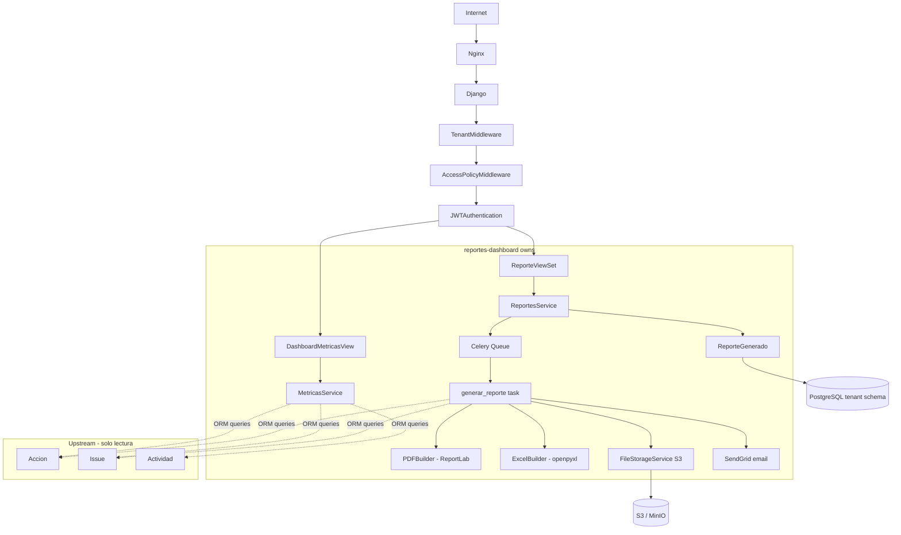
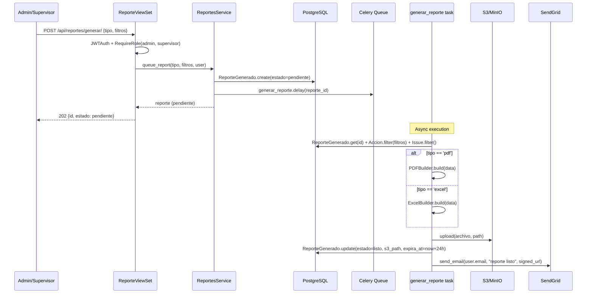
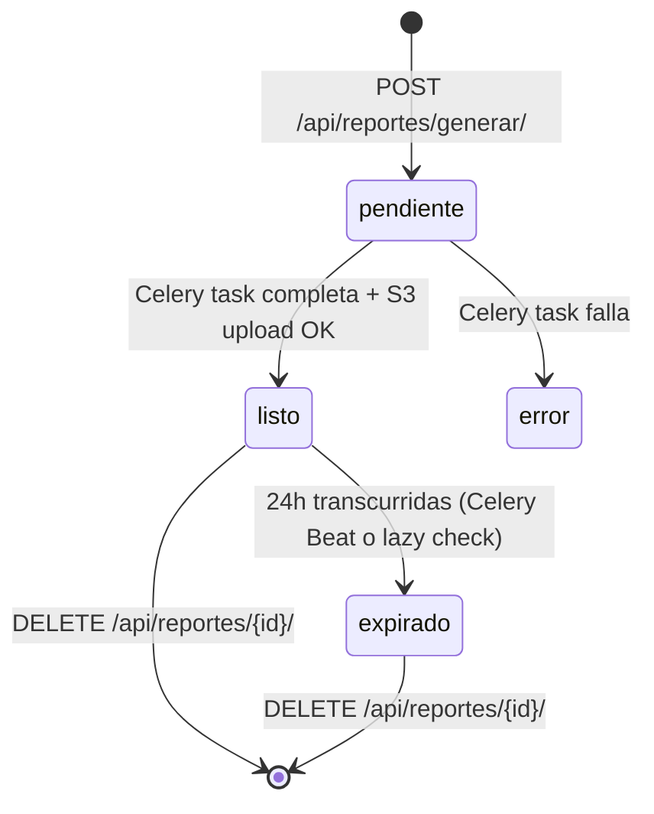
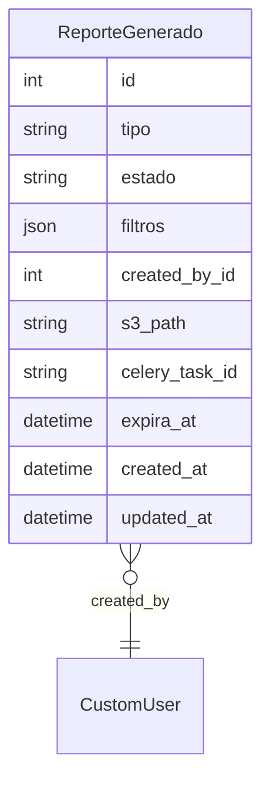

# Design: reportes-dashboard

## Overview

Reportes y Dashboard provee inteligencia ejecutiva de solo lectura sobre el ciclo de vida de acciones de seguridad en SGCA. El dashboard agrega datos de acciones, issues y actividades en métricas en tiempo real mediante endpoints de aggregation con Django ORM. Los reportes PDF y Excel se generan de forma asíncrona con Celery, se almacenan temporalmente en S3 con URLs firmadas de 1 hora, y se notifica al usuario por email directamente desde el Celery task vía SendGrid.

**Purpose**: Proveer visibilidad ejecutiva y capacidad de exportación de datos para admins y supervisores sin duplicar los modelos de dominio de otras specs.
**Users**: Admin (ve todos los reportes del tenant, acceso completo al dashboard) y Supervisor (ve sus propios reportes, acceso completo al dashboard). Los roles Responsable y Verificador no tienen acceso.
**Impact**: Esta spec es terminal (no tiene downstream). Solo lee datos de acciones, issues, planes-trabajo; cualquier cambio en esos modelos de fuente puede requerir revalidar las queries de aggregation.

### Goals
- Dashboard de métricas en tiempo real con aggregation queries sobre datos de upstream specs
- Generación async de PDF (ReportLab) y Excel (openpyxl) con estado de seguimiento
- Almacenamiento temporal en S3 con URLs firmadas; expiración automática a 24h
- Control de acceso estricto: solo admin y supervisor

### Non-Goals
- Modificar datos de otras specs (solo lectura vía ORM)
- Almacenamiento permanente de reportes
- BI externo (Power BI, Tableau)
- Acceso para roles responsable y verificador
- Reportes de verificación de eficacia detallados (extensión futura)

---

## Boundary Commitments

### This Spec Owns
- Modelo `ReporteGenerado` en schema privado del tenant
- Aggregation queries para métricas del dashboard
- Lógica de generación PDF (ReportLab) y Excel (openpyxl)
- Tarea Celery `sgca.reportes.generar_reporte` para generación async
- Upload de reportes generados a S3 con ruta `{tenant-slug}/reportes/{uuid}.{ext}`
- Generación de URLs firmadas para descarga de reportes
- Email de "reporte listo" enviado directamente vía SendGrid desde el Celery task
- Expiración automática de reportes (24h post-generación)
- Endpoints REST: dashboard métricas, gestión de reportes
- Frontend: Dashboard page con Recharts, Reportes management page

### Out of Boundary
- Datos de dominio (Accion, Issue, Actividad, PlanTrabajo) — solo consulta, nunca duplica
- Email de notificaciones de estado de acciones/actividades (→ notificaciones)
- Almacenamiento permanente de reportes generados
- Generación de reportes en tiempo real sin Celery (datasets grandes)
- Modelos de otras specs (cada spec es autoritaria sobre sus propios modelos)

### Allowed Dependencies
- `apps.acciones.models.Accion` — fuente de datos aggregation (solo lectura)
- `apps.issues.models.Issue` — fuente de datos aggregation (solo lectura)
- `apps.planes.models.Actividad` — fuente de datos aggregation deadlines (solo lectura)
- `apps.users.models.CustomUser` — FK created_by en ReporteGenerado
- `apps.users.permissions.RequireRole` — acceso solo admin/supervisor
- `apps.tenants.models.TenantModel` — herencia para aislamiento por schema
- `django-storages` + `boto3` — upload/signed URL a S3/MinIO
- `celery` + `redis` — generación asíncrona de reportes
- `reportlab` — generación de PDF
- `openpyxl` — generación de Excel
- `sendgrid` — envío de email "reporte listo"

### Revalidation Triggers
- Si cambia el modelo `Accion` (campos estado, tipo, o se añade área directa) → revisar aggregation queries
- Si cambia `Issue.area` o `Issue.fecha_evento` → revisar queries de tendencia y por área
- Si cambia `Actividad.fecha_limite` o `Actividad.estado` → revisar queries de compliance de deadlines
- Si cambia la estructura de rutas S3 del tenant → revisar `_build_report_path`
- Si cambia `RequireRole` → revisar permission_classes de todos los endpoints

---

## Architecture

### Architecture Pattern & Boundary Map



**Architecture Integration**:
- Pattern: DRF ViewSet + Service Layer + TenantModel + Celery async task
- `MetricasService` ejecuta aggregation queries (COUNT, GROUP BY) con Django ORM; no toca S3
- `ReportesService` gestiona el ciclo de vida de `ReporteGenerado` y despacha al Celery task
- El Celery task genera el archivo, lo sube a S3, actualiza el reporte y envía el email en una sola unidad atómica
- Las queries de aggregation usan el schema del tenant activo automáticamente vía `connection.schema_name`

### Technology Stack

| Layer | Elección | Rol en este feature |
|-------|----------|---------------------|
| Backend | Python 3.12 + Django 5 + DRF | Modelos, API, aggregation queries |
| Generación PDF | ReportLab | PDF con tablas y gráficas embebidas |
| Generación Excel | openpyxl | Excel multi-hoja |
| Task queue | Celery + Redis | Generación async de reportes |
| Storage | django-storages + boto3 | Upload reportes a S3/MinIO |
| Email | SendGrid | Notificación "reporte listo" |
| Multi-tenancy | django-tenants (TenantModel) | Aislamiento por schema |
| Frontend | React 18 + Vite + TailwindCSS + Recharts | Dashboard interactivo |

---

## File Structure Plan

### Directory Structure

```
backend/
└── apps/
    └── reportes/
        ├── __init__.py
        ├── models.py           # ReporteGenerado
        ├── services.py         # MetricasService (aggregation) + ReportesService (lifecycle)
        ├── tasks.py            # generar_reporte Celery task
        ├── builders.py         # PDFBuilder (ReportLab), ExcelBuilder (openpyxl)
        ├── serializers.py      # ReporteGeneradoSerializer, FiltrosReporteSerializer,
        │                       # MetricasDashboardSerializer
        ├── views.py            # DashboardMetricasView, ReporteViewSet
        ├── urls.py             # /api/dashboard/, /api/reportes/
        ├── storage.py          # ReporteStorage (django-storages, ruta por tenant)
        └── tests/
            ├── test_models.py          # ReporteGenerado expiracion, estados
            ├── test_services.py        # MetricasService aggregations, ReportesService lifecycle
            ├── test_builders.py        # PDFBuilder, ExcelBuilder con datos de prueba
            ├── test_tasks.py           # generar_reporte task (mock S3, mock SendGrid)
            └── test_api.py             # Endpoints: dashboard, generar, list, download

frontend/
└── src/
    ├── pages/
    │   ├── dashboard/
    │   │   └── DashboardPage.tsx       # Dashboard con todos los Recharts charts
    │   └── reportes/
    │       └── ReportesPage.tsx        # Listado y solicitud de reportes
    ├── components/
    │   └── dashboard/
    │       ├── AccionesPorEstadoChart.tsx    # Donut chart
    │       ├── AccionesPorTipoChart.tsx      # Bar chart
    │       ├── AccionesPorAreaChart.tsx      # Horizontal bar chart
    │       ├── CumplimientoDeadlinesChart.tsx # Stacked bar chart
    │       ├── TendenciaIncidentesChart.tsx  # Line chart (12 meses)
    │       └── DashboardFilters.tsx          # Panel de filtros fecha/area
    └── services/
        ├── dashboard.ts    # dashboardService: getMetricas(filtros)
        └── reportes.ts     # reportesService: solicitar, listar, download, delete
```

### Modified Files
- `backend/config/settings/base.py` — añadir `'apps.reportes'` a TENANT_APPS; añadir tarea Celery Beat opcional para expiración automática
- `backend/config/celery.py` — registrar task `sgca.reportes.generar_reporte`

---

## System Flows

### Flujo de Generación de Reporte



### Ciclo de Vida de ReporteGenerado



---

## Requirements Traceability

| Requisito | Resumen | Componentes | Contratos | Flujos |
|-----------|---------|-------------|-----------|--------|
| 1.1–1.7 | Dashboard métricas | DashboardMetricasView, MetricasService | GET /api/dashboard/metricas/ | — |
| 2.1–2.5 | Reporte PDF | ReporteViewSet, ReportesService, PDFBuilder, generar_reporte | POST /api/reportes/generar/ | Flujo generación |
| 3.1–3.4 | Reporte Excel | ReporteViewSet, ReportesService, ExcelBuilder, generar_reporte | POST /api/reportes/generar/ | Flujo generación |
| 4.1–4.5 | Descarga segura | ReporteViewSet, ReportesService | GET /api/reportes/{id}/download/ | — |
| 5.1–5.4 | Gestión de estado | ReporteViewSet, ReportesService | GET/DELETE /api/reportes/ | Ciclo de vida |
| 6.1–6.4 | Filtros | FiltrosReporteSerializer, MetricasService, generar_reporte | Todos los endpoints | — |

---

## Components and Interfaces

### Resumen de Componentes

| Componente | Layer | Intent | Req Coverage | Dependencias Clave |
|------------|-------|--------|--------------|---------------------|
| ReporteGenerado | Modelo | Seguimiento de solicitudes de reporte | 2, 3, 4, 5 | TenantModel, CustomUser (P0) |
| MetricasService | Service | Aggregation queries para dashboard | 1, 6 | Accion, Issue, Actividad (P0) |
| ReportesService | Service | Lifecycle de ReporteGenerado, queue, signed URL | 2–5 | ReporteGenerado, Celery, S3 (P0) |
| generar_reporte | Celery Task | Generación async de PDF/Excel + S3 + email | 2, 3 | PDFBuilder, ExcelBuilder, S3, SendGrid (P0) |
| PDFBuilder | Builder | Generación de PDF con ReportLab | 2 | reportlab (P0) |
| ExcelBuilder | Builder | Generación de Excel con openpyxl | 3 | openpyxl (P0) |
| DashboardMetricasView | API | GET métricas dashboard | 1, 6 | MetricasService, RequireRole (P0) |
| ReporteViewSet | API | CRUD reportes + download | 2–6 | ReportesService, RequireRole (P0) |

---

### Modelo

#### ReporteGenerado

| Field | Detail |
|-------|--------|
| Intent | Registro del estado de una solicitud de reporte PDF o Excel para un tenant |
| Requirements | 2.1, 2.2, 3.1, 4.1, 5.1, 5.2, 5.3 |

**Contracts**: Service [x]

```python
class ReporteGenerado(TenantModel):
    TIPOS = [('pdf', 'PDF'), ('excel', 'Excel')]
    ESTADOS = [
        ('pendiente', 'Pendiente'),
        ('listo', 'Listo'),
        ('expirado', 'Expirado'),
        ('error', 'Error'),
    ]

    tipo = CharField(max_length=10, choices=TIPOS)
    estado = CharField(max_length=20, choices=ESTADOS, default='pendiente')
    filtros = JSONField(default=dict)
    # filtros estructura: {fecha_inicio, fecha_fin, area, estado_accion, tipo_accion}
    created_by = ForeignKey('users.CustomUser', on_delete=PROTECT)
    s3_path = CharField(max_length=500, blank=True, default='')
    celery_task_id = CharField(max_length=255, blank=True, default='')
    expira_at = DateTimeField(null=True, blank=True)  # now + 24h al ponerse 'listo'
    created_at = DateTimeField(auto_now_add=True)
    updated_at = DateTimeField(auto_now=True)
```

**Invariants**:
- `s3_path` solo tiene valor cuando `estado == 'listo'`
- `expira_at` solo tiene valor cuando `estado == 'listo'`
- La expiración se verifica lazy en el endpoint de download y en el listado
- `filtros` puede ser dict vacío (reporte sin filtros = todos los datos del tenant)
- Solo `created_by` o un admin pueden ver/eliminar un ReporteGenerado

---

### Service Layer

#### MetricasService

| Field | Detail |
|-------|--------|
| Intent | Ejecuta aggregation queries sobre modelos de upstream specs para el dashboard |
| Requirements | 1.1, 1.2, 1.3, 1.4, 1.5, 6.1, 6.2, 6.3, 6.4 |

**Contracts**: Service [x]

```python
class MetricasService:
    def get_metricas_dashboard(self, filtros: dict) -> dict:
        """
        Retorna todas las métricas del dashboard para el tenant activo.
        filtros: {fecha_inicio?, fecha_fin?, area?}
        Retorna:
        {
          acciones_por_estado: [{estado, count}],
          acciones_por_tipo: [{tipo, count}],
          acciones_por_area: [{area, count}],
          cumplimiento_deadlines: {a_tiempo: int, vencidas: int},
          tendencia_issues: [{mes: "YYYY-MM", count: int}],  # últimos 12 meses
        }
        Raises: ValidationError si filtros inválidos.
        """

    def _base_accion_qs(self, filtros: dict) -> QuerySet:
        """Aplica filtros de fecha y área al queryset de Accion."""

    def _base_issue_qs(self, filtros: dict) -> QuerySet:
        """Aplica filtros de fecha al queryset de Issue."""
```

**Preconditions**: `connection.schema_name` es el schema del tenant activo
**Postconditions**: Solo lectura; ningún modelo es modificado
**Invariants**: Las queries son siempre restringidas al tenant activo (TenantModel)

---

#### ReportesService

| Field | Detail |
|-------|--------|
| Intent | Gestiona el ciclo de vida de ReporteGenerado: queue, estado, signed URL, expiración |
| Requirements | 2.1, 2.2, 3.1, 4.1, 4.2, 4.3, 4.4, 5.1, 5.2, 5.3, 5.4 |

**Contracts**: Service [x]

```python
class ReportesService:
    def queue_report(
        self,
        tipo: str,
        filtros: dict,
        created_by: CustomUser,
    ) -> ReporteGenerado:
        """
        Crea ReporteGenerado con estado='pendiente' y encola generar_reporte.delay(reporte_id).
        Raises: ValidationError si tipo inválido o filtros inválidos.
        """

    def get_download_url(self, reporte: ReporteGenerado, requesting_user: CustomUser) -> str:
        """
        Verifica permisos y estado. Genera URL firmada de S3 (expiry=3600s).
        Marca como 'expirado' si expira_at < now.
        Raises: PermissionDenied, ReporteNotReadyError, ReporteExpiredError.
        """

    def delete_report(self, reporte: ReporteGenerado, requesting_user: CustomUser) -> None:
        """
        Borra archivo de S3 (si existe) y el registro DB.
        Raises: PermissionDenied si requesting_user no es creator ni admin.
        """

    def queryset_for_user(self, user: CustomUser) -> QuerySet[ReporteGenerado]:
        """
        admin: todos los reportes del tenant.
        supervisor: solo sus propios reportes.
        """

    def _check_expiry(self, reporte: ReporteGenerado) -> None:
        """Si estado=='listo' y expira_at < now, actualiza estado a 'expirado'."""
```

---

### Celery Task

#### generar_reporte

| Field | Detail |
|-------|--------|
| Intent | Genera el archivo PDF o Excel, lo sube a S3, actualiza el ReporteGenerado y envía el email |
| Requirements | 2.1, 2.3, 2.4, 2.5, 3.1, 3.2, 3.3, 3.4 |

**Contracts**: Batch [x]

```python
@shared_task(name='sgca.reportes.generar_reporte', bind=True, max_retries=3)
def generar_reporte(self, reporte_id: int) -> None:
    """
    Trigger: ReportesService.queue_report() vía .delay(reporte_id)
    Input: reporte_id (ReporteGenerado.id en el tenant activo)
    Output: ReporteGenerado con estado='listo' + archivo en S3 + email enviado
    Idempotency: Si reporte ya está en estado 'listo', skip (idempotente)
    Recovery: Si falla, marca estado='error' en el except final; 3 retries con backoff
    """
```

**Task Name**: `sgca.reportes.generar_reporte` (no colisiona con `sgca.verificacion.*` ni `sgca.notificaciones.*`)

**Pasos internos**:
1. Cargar `ReporteGenerado` desde DB
2. Ejecutar queries de datos con filtros del reporte
3. Construir archivo: `PDFBuilder.build(data)` o `ExcelBuilder.build(data)`
4. Subir a S3: `path = f"{tenant_slug}/reportes/{uuid4()}.{ext}"`
5. Actualizar `ReporteGenerado`: `estado='listo'`, `s3_path`, `expira_at=now+24h`
6. Enviar email via SendGrid con URL firmada (válida 1h para el email)
7. En `except`: marcar `estado='error'`, log ERROR

---

### Builders

#### PDFBuilder

| Field | Detail |
|-------|--------|
| Intent | Genera archivo PDF con tablas de acciones, issues y métricas usando ReportLab |
| Requirements | 2.4 |

**Contracts**: Service [x]

```python
class PDFBuilder:
    def build(self, data: dict, filtros: dict) -> bytes:
        """
        Genera PDF en memoria. Retorna bytes del PDF.
        data: {acciones: QuerySet, issues: QuerySet, metricas: dict}
        Estructura del PDF: portada + resumen de métricas + tabla de acciones + tabla de issues
        """
```

#### ExcelBuilder

| Field | Detail |
|-------|--------|
| Intent | Genera archivo Excel multi-hoja con openpyxl |
| Requirements | 3.3 |

**Contracts**: Service [x]

```python
class ExcelBuilder:
    def build(self, data: dict, filtros: dict) -> bytes:
        """
        Genera Excel en memoria. Retorna bytes.
        Hojas: 'Acciones' (todas las columnas), 'Issues', 'Resumen' (métricas).
        """
```

---

### API

#### DashboardMetricasView

| Field | Detail |
|-------|--------|
| Intent | Endpoint GET que retorna todas las métricas del dashboard para el tenant activo |
| Requirements | 1.1, 1.2, 1.3, 1.4, 1.5, 1.6, 1.7, 6.1, 6.2, 6.3, 6.4 |

**Contracts**: API [x]

| Method | Endpoint | Roles | Request | Response | Errors |
|--------|----------|-------|---------|----------|--------|
| GET | `/api/dashboard/metricas/` | admin, supervisor | query params (filtros) | `MetricasDashboardSerializer` | 400, 401, 403 |

```python
# Query params aceptados (todos opcionales):
# fecha_inicio: date (YYYY-MM-DD)
# fecha_fin: date (YYYY-MM-DD)
# area: string

# Response:
{
  "acciones_por_estado": [{"estado": "abierto", "count": 12}, ...],
  "acciones_por_tipo": [{"tipo": "correctiva", "count": 8}, ...],
  "acciones_por_area": [{"area": "Planta A", "count": 5}, ...],
  "cumplimiento_deadlines": {"a_tiempo": 30, "vencidas": 7},
  "tendencia_issues": [{"mes": "2026-01", "count": 3}, ...]
}

# Error 400 (filtros inválidos)
{"detail": "fecha_inicio no puede ser posterior a fecha_fin."}

# Error 403 (rol insuficiente)
{"detail": "No tienes permiso para acceder al dashboard."}
```

---

#### ReporteViewSet

| Field | Detail |
|-------|--------|
| Intent | Endpoints para solicitar, listar, descargar y eliminar reportes |
| Requirements | 2.1, 2.2, 3.1, 4.1, 4.2, 4.3, 4.4, 5.1, 5.2, 5.3, 5.4, 6.1, 6.2, 6.3, 6.4 |

**Contracts**: API [x]

| Method | Endpoint | Roles | Request | Response | Errors |
|--------|----------|-------|---------|----------|--------|
| POST | `/api/reportes/generar/` | admin, supervisor | `SolicitarReporteSerializer` | `ReporteGeneradoSerializer` | 400, 401, 403 |
| GET | `/api/reportes/` | admin, supervisor | — | `Page[ReporteGeneradoSerializer]` | 401, 403 |
| GET | `/api/reportes/{id}/download/` | admin, supervisor | — | `{url, expires_at}` | 401, 403, 404, 409 |
| DELETE | `/api/reportes/{id}/` | admin, supervisor | — | `{}` | 401, 403, 404 |

```python
# SolicitarReporteSerializer (request)
class SolicitarReporteSerializer:
    tipo: str               # required: 'pdf' | 'excel'
    fecha_inicio: date      # optional
    fecha_fin: date         # optional
    area: str               # optional
    estado_accion: str      # optional, choices
    tipo_accion: str        # optional, choices

# ReporteGeneradoSerializer (response)
class ReporteGeneradoSerializer:
    id: int
    tipo: str
    estado: str
    filtros: dict
    created_by_nombre: str
    created_at: datetime
    expira_at: datetime | None

# Error 409 (reporte pendiente)
{"detail": "El reporte aún está siendo generado. Intente nuevamente en unos minutos."}

# Error 410 (reporte expirado)
{"detail": "El reporte ha expirado. Por favor genere uno nuevo."}
```

---

## Data Models

### Domain Model



### Logical Data Model

**ReporteGenerado** (TenantModel, schema privado):
- `tipo`: CharField(max_length=10), choices=['pdf','excel'], non-null
- `estado`: CharField(max_length=20), choices=['pendiente','listo','expirado','error'], default='pendiente'
- `filtros`: JSONField, default=dict, estructura libre (validada en serializer)
- `created_by`: FK(CustomUser, PROTECT), non-null
- `s3_path`: CharField(max_length=500), blank=True — ruta interna en S3
- `celery_task_id`: CharField(max_length=255), blank=True — para cancelación futura
- `expira_at`: DateTimeField(null=True) — calculado como `created_at + 24h` al pasar a 'listo'
- Índices: `created_by` (filtro por usuario), `estado` (filtros de listado), `expira_at` (limpieza)

### Data Contracts & Integration

```python
# Aggregation queries (MetricasService) — ejemplos
from apps.acciones.models import Accion
from apps.issues.models import Issue
from apps.planes.models import Actividad
from django.db.models import Count
from django.db.models.functions import TruncMonth

# Acciones por estado
Accion.objects.values('estado').annotate(count=Count('id'))

# Acciones por área — Accion no tiene campo area propio; se traversa via Issue FK
# Accion.issue es la FK de Accion a Issue definida en apps.acciones
Accion.objects.values('issue__area').annotate(count=Count('id'))
# La API responde como [{area: "Planta A", count: 5}, ...] renombrando issue__area → area

# Tendencia issues (últimos 12 meses)
Issue.objects.annotate(mes=TruncMonth('fecha_evento')).values('mes').annotate(count=Count('id')).order_by('mes')

# Compliance deadlines
hoy = date.today()
Actividad.objects.filter(estado__in=['pendiente', 'en_proceso']).aggregate(
    vencidas=Count('id', filter=Q(fecha_limite__lt=hoy)),
    a_tiempo=Count('id', filter=Q(fecha_limite__gte=hoy)),
)

# S3 path para reportes
f"{tenant_slug}/reportes/{uuid4()}.{extension}"
```

---

## Error Handling

### Error Strategy
Validación de filtros en `FiltrosReporteSerializer` (fecha_inicio < fecha_fin, choices válidos). Permisos verificados en endpoints antes de delegar al service. El Celery task usa try/except final para marcar estado='error' y loguear; usa `max_retries=3` con backoff exponencial. La expiración se verifica lazy en el endpoint de download (no requiere Celery Beat propio).

### Error Categories and Responses

| Categoría | Escenario | Respuesta |
|-----------|-----------|-----------|
| 400 Bad Request | Filtros inválidos, tipo de reporte inválido | `{"detail": "..."}` o `{"field": ["msg"]}` |
| 401 Unauthorized | Token JWT ausente o inválido | simplejwt default |
| 403 Forbidden | Rol insuficiente (responsable/verificador) o acceso a reporte ajeno | `{"detail": "..."}` |
| 404 Not Found | ReporteGenerado no existe en el tenant | `{"detail": "No encontrado."}` |
| 409 Conflict | Reporte solicitado todavía en estado 'pendiente' | `{"detail": "El reporte aún está siendo generado."}` |
| 410 Gone | Reporte expirado | `{"detail": "El reporte ha expirado."}` |

### Monitoring
- Log INFO al encolar cada reporte: `reporte_id`, `tipo`, `tenant`, `created_by`
- Log INFO al completar generación: `reporte_id`, `tipo`, duración en ms, tamaño en bytes
- Log ERROR si la generación falla: excepción completa, `reporte_id`, `celery_task_id`

---

## Testing Strategy

### Unit Tests
1. `MetricasService.get_metricas_dashboard` — con datos mock: acciones en distintos estados, issues por mes
2. `ReportesService.get_download_url` — estado listo → URL; estado pendiente → ReporteNotReadyError; estado expirado → ReporteExpiredError
3. `ReportesService.queryset_for_user` — admin ve todos; supervisor solo los suyos
4. `ReportesService._check_expiry` — expira_at en el pasado actualiza estado a 'expirado'
5. `PDFBuilder.build` — retorna bytes non-empty con datos válidos
6. `ExcelBuilder.build` — retorna bytes non-empty con 3 hojas ('Acciones', 'Issues', 'Resumen')

### Integration Tests
1. `POST /api/reportes/generar/` como admin → reporte pendiente creado; como responsable → 403
2. `POST /api/reportes/generar/` con `fecha_inicio > fecha_fin` → 400
3. `GET /api/dashboard/metricas/` con filtros válidos → respuesta con todas las claves
4. `GET /api/reportes/{id}/download/` — reporte listo → URL; pendiente → 409; expirado → 410
5. `DELETE /api/reportes/{id}/` — elimina registro y archivo S3 (mock)
6. `GET /api/reportes/` como supervisor — solo ve sus propios reportes; admin ve todos
7. Aislamiento de tenant: reporte de tenant A no accesible desde tenant B (404)
8. `generar_reporte` task (mock S3 + mock SendGrid) → reporte pasa a 'listo' + email enviado

### E2E Tests
1. Admin solicita PDF → espera task → reporte listo → descarga URL firmada → accede al archivo
2. Supervisor solicita Excel con filtros de área → solo datos de esa área en el reporte
3. Admin accede al dashboard → todos los charts renderizan sin errores con datos reales

## Security Considerations
- URLs firmadas de S3 tienen expiración de 1 hora; el `s3_path` nunca se expone en la API
- Solo `created_by` o admin puede acceder/eliminar un ReporteGenerado (evita IDOR)
- Los filtros se validan estrictamente antes de usarlos en queries (no interpolación raw SQL)
- El tenant activo limita automáticamente todas las queries (TenantModel)
