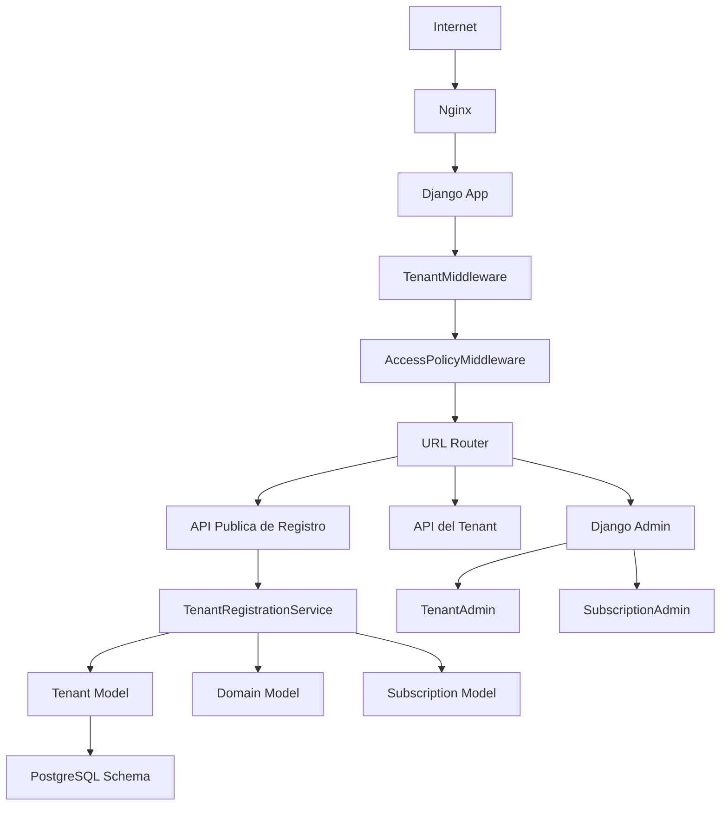
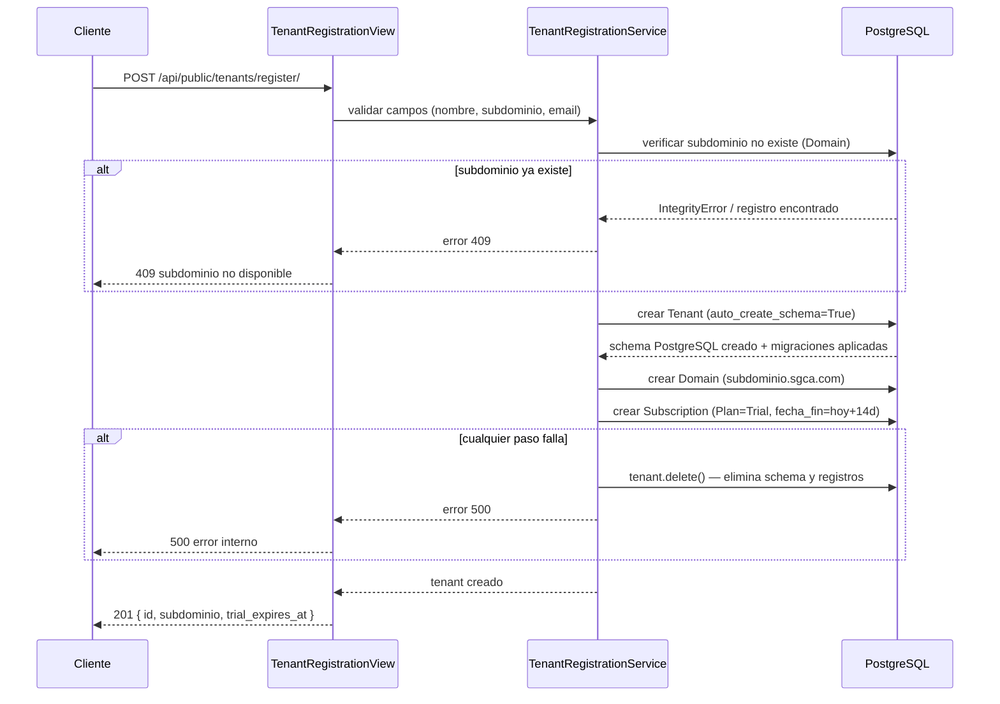
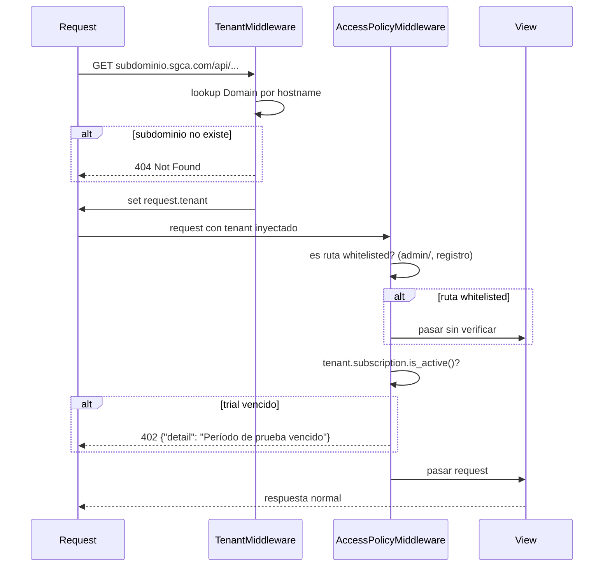
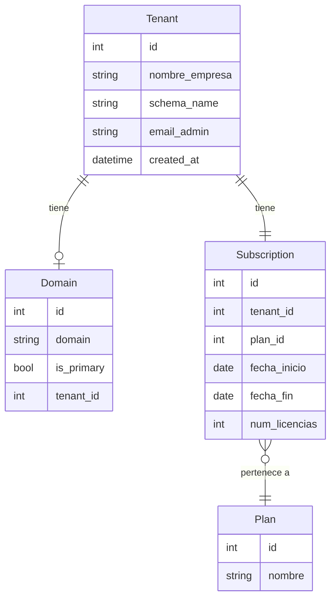

# Design: tenant-onboarding

## Overview
Tenant Onboarding es el spec fundacional del SGCA. Provisiona el espacio de datos aislado de cada empresa, gestiona los planes de suscripción (Trial/Enterprise) y controla el acceso por subdominio. Todo el resto del sistema asume que este spec está implementado y funcionando.

**Purpose**: Incorporar nuevas empresas industriales al SGCA con aislamiento de datos garantizado y gestión de planes sin autoservicio de pagos.
**Users**: Representantes de empresas (registro), usuarios del tenant (acceso vía subdominio), system admin (gestión de planes y licencias).
**Impact**: Establece la infraestructura multi-tenant base; sin este spec ningún otro spec puede funcionar.

### Goals
- Registro de tenant con aprovisionamiento automático de schema PostgreSQL aislado
- Planes Trial (14 días) y Enterprise con control de licencias
- Identificación de tenant por subdominio en cada request
- Bloqueo de acceso a trials vencidos sin pérdida de datos
- Panel de system admin para gestión de tenants y planes

### Non-Goals
- Autenticación de usuarios dentro del tenant (→ auth-rbac)
- Pagos, facturación o upgrades automáticos (fuera del MVP)
- UI de onboarding elaborada tipo wizard
- SSO/OAuth o 2FA
- Rate limiting en el endpoint de registro (responsabilidad de Nginx/infraestructura)

---

## Boundary Commitments

### This Spec Owns
- Modelos públicos: `Tenant`, `Domain`, `Plan`, `Subscription`
- Aprovisionamiento automático del schema PostgreSQL del tenant al registrarse
- Endpoint de registro de tenant (`POST /api/public/tenants/register/`)
- `TenantMiddleware` (django-tenants) configurado: identificación de tenant por subdominio
- `AccessPolicyMiddleware`: bloqueo de acceso a trials vencidos
- Panel de system admin (Django Admin extendido) para gestión de tenants, planes y licencias
- Validación de unicidad de subdominio y formato válido
- Lógica de acceso activo/bloqueado basada en el estado de `Subscription`

### Out of Boundary
- Custom user model y autenticación JWT (→ auth-rbac)
- Gestión de usuarios dentro del tenant (→ auth-rbac)
- Modelos de negocio en el schema del tenant: issues, acciones, planes de trabajo, etc. (→ specs Wave 2+)
- Notificaciones por email al registrarse (→ notificaciones)
- Pagos o integración con Stripe

### Allowed Dependencies
- `django-tenants 4.x`: schema-per-tenant, `TenantMixin`, `DomainMixin`, `TenantMiddleware`
- `PostgreSQL 16`: CREATE SCHEMA, migraciones por schema
- Django Admin (built-in): panel de system admin
- Django REST Framework: endpoint de registro

### Revalidation Triggers
- Cambios en la forma del modelo `Tenant` o `Subscription` requieren revisión en auth-rbac (usa FK a Tenant)
- Cambios en el formato del subdominio o en la lógica de routing afectan a todos los specs que dependen del middleware
- Cambios en la estructura de SHARED_APPS / TENANT_APPS requieren revisión en todos los specs de Wave 2+
- Si `AccessPolicyMiddleware` agrega nuevas rutas a la whitelist, verificar que no exponga endpoints de negocio sin protección

---

## Architecture

### Architecture Pattern & Boundary Map



**Architecture Integration**:
- Pattern: Django MVT + django-tenants schema-per-tenant
- Public schema: `Tenant`, `Domain`, `Plan`, `Subscription` (SHARED_APPS)
- Private schema por tenant: todos los modelos de negocio de Wave 2+ (TENANT_APPS)
- `TenantMiddleware` (django-tenants built-in): resuelve el subdominio → tenant antes de llegar a las vistas
- `AccessPolicyMiddleware` (custom): inspecciona `request.tenant.subscription` después de que TenantMiddleware lo inyecta

### Technology Stack

| Layer | Elección | Rol en este feature |
|-------|----------|---------------------|
| Backend | Python 3.12 + Django 5 + DRF | API de registro, modelos, middleware |
| Multi-tenancy | django-tenants 4.x | Schema-per-tenant, TenantMiddleware |
| Base de datos | PostgreSQL 16 | Public schema + schemas por tenant |
| Admin | Django Admin (built-in) | Panel de system admin |
| Frontend | React 18 + Vite (minimal) | Formulario de registro simple |

---

## File Structure Plan

### Directory Structure

```
backend/
├── config/
│   ├── settings/
│   │   └── base.py              # SHARED_APPS, TENANT_APPS, MIDDLEWARE order, DATABASE_ROUTERS
│   ├── urls_public.py           # URL patterns del schema público (registro, admin)
│   └── urls_tenant.py           # URL patterns del schema de tenant (Wave 2+)
└── apps/
    └── tenants/
        ├── __init__.py
        ├── models.py            # Tenant, Domain, Plan, Subscription
        ├── serializers.py       # TenantRegistrationSerializer
        ├── services.py          # TenantRegistrationService (orquesta Tenant + Domain + Subscription)
        ├── views.py             # TenantRegistrationView (APIView público, delega a TenantRegistrationService)
        ├── urls.py              # POST /api/public/tenants/register/
        ├── middleware.py        # AccessPolicyMiddleware
        ├── admin.py             # TenantAdmin, SubscriptionAdmin, actions de gestión
        ├── validators.py        # validate_subdomain_format()
        └── tests/
            ├── test_models.py           # Plan, Subscription lógica is_active
            ├── test_registration.py     # Flujo completo de registro + casos de error
            ├── test_middleware.py       # AccessPolicyMiddleware: trial activo, vencido, Enterprise, whitelist
            └── test_admin.py           # Acciones de admin: change_plan, extend_trial, set_licenses

frontend/
└── src/
    └── pages/
        └── Register/
            ├── RegisterPage.tsx         # Formulario de registro simple (nombre, subdominio, email)
            └── RegisterPage.test.tsx
```

### Modified Files
- `backend/config/settings/base.py` — agregar django-tenants a SHARED_APPS, configurar TENANT_MODEL, DATABASE_ROUTERS, MIDDLEWARE con TenantMiddleware primero
- `backend/config/urls.py` → separar en `urls_public.py` y `urls_tenant.py` (requerido por django-tenants)

---

## System Flows

### Flujo de Registro de Tenant



### Flujo de Routing por Subdominio + Access Policy



---

## Requirements Traceability

| Requisito | Resumen | Componentes | Contratos | Flujos |
|-----------|---------|-------------|-----------|--------|
| 1.1–1.5 | Registro de tenant | TenantRegistrationView, TenantRegistrationService | POST /api/public/tenants/register/ | Flujo de Registro |
| 2.1–2.4 | Aislamiento de datos | Tenant (auto_create_schema), django-tenants | — | Flujo de Registro |
| 3.1–3.5 | Gestión de planes | Plan, Subscription, SubscriptionAdmin | Admin actions | — |
| 4.1–4.3 | Subdominio routing | TenantMiddleware, Domain | — | Flujo de Routing |
| 5.1–5.5 | Bloqueo trial vencido | AccessPolicyMiddleware, Subscription.is_active() | — | Flujo de Routing |
| 6.1–6.5 | Panel system admin | TenantAdmin, SubscriptionAdmin | Django Admin | — |

---

## Components and Interfaces

### Resumen de Componentes

| Componente | Layer | Intent | Requisitos | Dependencias Clave |
|------------|-------|--------|------------|---------------------|
| TenantRegistrationView | API (público) | Endpoint de registro de nuevos tenants | 1.1–1.5 | TenantRegistrationService (P0) |
| TenantRegistrationService | Service | Orquesta la creación de Tenant, Domain, Subscription con cleanup | 1.1–1.5, 2.1–2.4 | Tenant, Domain, Subscription models (P0) |
| AccessPolicyMiddleware | Middleware | Bloquea acceso a trials vencidos | 5.1–5.5 | Subscription.is_active() (P0) |
| TenantAdmin / SubscriptionAdmin | Admin | Panel de gestión para system admin | 6.1–6.5 | Django Admin (P0) |
| Tenant, Domain, Plan, Subscription | Data | Modelos del schema público | 1–6 | django-tenants (P0) |

---

### API Pública

#### TenantRegistrationView

| Field | Detail |
|-------|--------|
| Intent | Punto de entrada para el registro de nuevas empresas en SGCA |
| Requirements | 1.1, 1.2, 1.3, 1.4, 1.5 |

**Contracts**: API [x]

##### API Contract

| Method | Endpoint | Request | Response | Errors |
|--------|----------|---------|----------|--------|
| POST | `/api/public/tenants/register/` | `TenantRegistrationRequest` | `TenantRegistrationResponse` | 400, 409, 500 |

```python
# Request
class TenantRegistrationRequest:
    nombre_empresa: str          # max_length=200, required
    subdominio: str              # max_length=63, regex: ^[a-z0-9][a-z0-9-]*[a-z0-9]$, required
    email_admin: str             # EmailField, required

# Response (201 Created)
class TenantRegistrationResponse:
    id: int
    nombre_empresa: str
    subdominio: str
    trial_expires_at: date       # fecha_inicio + 14 días
    message: str                 # "Tenant registrado. Accede en {subdominio}.sgca.com"

# Error Responses
# 400: { "field": ["mensaje de error"] }  — validación de campos
# 409: { "detail": "El subdominio '{x}' ya está registrado" }
# 500: { "detail": "Error interno al aprovisionar el tenant" }
```

**Implementation Notes**:
- El endpoint es público (sin autenticación); usa la URL pública (no de tenant)
- Riesgo: race condition en subdominio → mitigado por unique constraint en Domain + captura de IntegrityError → 409

---

### Service Layer

#### TenantRegistrationService

| Field | Detail |
|-------|--------|
| Intent | Orquesta la creación atómica de Tenant, Domain y Subscription con cleanup en caso de fallo |
| Requirements | 1.1, 1.4, 2.1, 2.2, 2.3, 2.4 |

**Contracts**: Service [x]

```python
class TenantRegistrationService:
    def register(
        self,
        nombre_empresa: str,
        subdominio: str,
        email_admin: str
    ) -> Tenant:
        """
        Crea Tenant + Domain + Subscription(Trial).
        En caso de fallo en cualquier paso, invoca tenant.delete() para limpiar.
        Raises: SubdomainAlreadyExistsError, TenantProvisioningError
        """
```

- **Preconditions**: subdominio validado con regex, email válido, nombre_empresa no vacío
- **Postconditions**: Tenant con schema PostgreSQL inicializado + Domain + Subscription(Trial, 14 días)
- **Invariants**: Si cualquier paso falla, no quedan recursos huérfanos en el sistema

**Implementation Notes**:
- `Tenant.save()` con `auto_create_schema=True` ejecuta CREATE SCHEMA + migraciones automáticamente (django-tenants)
- La creación del schema es DDL → auto-commit en PostgreSQL → no reversible con transaction.atomic
- Cleanup: `tenant.delete()` con `auto_drop_schema=True` elimina el schema si existe

---

### Middleware

#### AccessPolicyMiddleware

| Field | Detail |
|-------|--------|
| Intent | Intercepta requests de tenants con trial vencido y retorna 402 antes de llegar a las vistas |
| Requirements | 5.1, 5.2, 5.3, 5.4, 5.5 |

**Contracts**: Service [x]

**Responsibilities & Constraints**:
- Se registra en MIDDLEWARE después de `TenantMiddleware` (requiere `request.tenant`)
- Whitelist de rutas que siempre pasan: `/admin/`, `/api/public/`, archivos estáticos (`/static/`, `/media/`)
- Para requests de API (Accept: application/json): retorna 402 JSON
- Para requests de browser: retorna 402 con mensaje HTML
- Bypass completo para el schema público (sin tenant inyectado)

```python
RESPONSE_TRIAL_EXPIRED = {
    "detail": "El período de prueba ha vencido. Contacte al administrador del sistema.",
    "code": "trial_expired"
}
```

---

### Admin Panel

#### TenantAdmin + SubscriptionAdmin

| Field | Detail |
|-------|--------|
| Intent | Panel de gestión para system admin: listar tenants, cambiar plan, asignar licencias, extender trial |
| Requirements | 6.1, 6.2, 6.3, 6.4, 6.5 |

**Contracts**: Service [x]

**Custom Admin Actions**:

```python
# Acción 1: Cambiar de Trial a Enterprise
def change_to_enterprise(modeladmin, request, queryset):
    # Solicita num_licencias via popup/form
    # Valida num_licencias > 0
    # Actualiza Subscription: plan=Enterprise, fecha_fin=None, num_licencias=N

# Acción 2: Extender trial
def extend_trial(modeladmin, request, queryset):
    # Solicita nueva fecha_fin via form
    # Actualiza Subscription.fecha_fin
    # Si el tenant estaba bloqueado, el acceso se restaura automáticamente

# Acción 3: Actualizar número de licencias (Enterprise)
def update_license_count(modeladmin, request, queryset):
    # Solicita nuevo num_licencias (> 0)
    # Actualiza Subscription.num_licencias
```

**List Display** (TenantAdmin): nombre_empresa, subdominio, plan_actual, estado_acceso, trial_expires_at, num_licencias

---

## Data Models

### Domain Model



### Logical Data Model

**Tenant** (extiende TenantMixin de django-tenants):
- `schema_name`: str, unique — nombre del schema PostgreSQL (= subdominio)
- `nombre_empresa`: str (max_length=200), required
- `email_admin`: EmailField, required
- `created_at`: DateTimeField, auto_now_add
- `auto_create_schema = True`
- `auto_drop_schema = True`

**Domain** (extiende DomainMixin de django-tenants):
- `domain`: str, unique — hostname completo (ej. `empresa.sgca.com`)
- `tenant`: FK(Tenant), CASCADE
- `is_primary`: bool

**Plan**:
- `nombre`: str, choices=[`trial`, `enterprise`], unique
- Datos fijos; se cargan via fixture/migration inicial

**Subscription** (schema público — no hereda de TenantModel):
- `tenant`: OneToOneField(Tenant), CASCADE
- `plan`: FK(Plan)
- `fecha_inicio`: DateField, auto_now_add
- `fecha_fin`: DateField, null=True — null para Enterprise (sin vencimiento)
- `num_licencias`: PositiveIntegerField, null=True — null para Trial

**Regla de negocio `is_active()`**:
```python
def is_active(self) -> bool:
    if self.plan.nombre == 'enterprise':
        return True
    return self.fecha_fin >= date.today()
```

**Índices**:
- `Domain.domain`: unique index (acceso frecuente por TenantMiddleware en cada request)
- `Subscription.tenant_id`: unique (OneToOne)

### Data Contracts & Integration

```python
# Contrato de salida hacia auth-rbac
# auth-rbac asume que request.tenant es una instancia de Tenant con:
# - tenant.schema_name: str
# - tenant.subscription.is_active(): bool
# - tenant.subscription.num_licencias: int | None
```

---

## Error Handling

### Error Strategy
Validación temprana en el serializer (campos obligatorios, formato subdominio). Manejo de IntegrityError en el service para race conditions. Cleanup explícito del schema si el aprovisionamiento falla parcialmente.

### Error Categories and Responses

| Categoría | Escenario | Respuesta |
|-----------|-----------|-----------|
| 400 Bad Request | Campos faltantes o formato inválido | `{"field": ["mensaje"]}` |
| 404 Not Found | Subdominio inexistente (TenantMiddleware) | `{"detail": "Tenant no encontrado"}` |
| 409 Conflict | Subdominio ya registrado | `{"detail": "El subdominio ya está registrado"}` |
| 402 Payment Required | Trial vencido (AccessPolicyMiddleware) | `{"detail": "...", "code": "trial_expired"}` |
| 500 Internal | Fallo en aprovisionamiento del schema | `{"detail": "Error interno"}` + log detallado |

### Monitoring
- Log WARNING en AccessPolicyMiddleware cuando bloquea un tenant (para detectar tenants que necesitan upgrade)
- Log ERROR en TenantRegistrationService si el cleanup falla (schema huérfano)
- Métrica: `tenants.registered` (counter), `tenants.trial_expired` (gauge)

---

## Testing Strategy

### Unit Tests
1. `Subscription.is_active()` — trial activo, trial vencido (fecha hoy), trial vencido (fecha pasada), Enterprise sin fecha_fin
2. `validate_subdomain_format()` — caracteres válidos, guión al inicio/final, mayúsculas, caracteres especiales
3. `TenantRegistrationService.register()` — fallo en Domain creation → cleanup del Tenant + schema

### Integration Tests
1. `POST /api/public/tenants/register/` — flujo completo: verifica Tenant, Domain, Subscription y schema creados
2. `POST /api/public/tenants/register/` con subdominio duplicado → 409
3. `GET {subdominio}.sgca.com/api/...` con trial vencido → AccessPolicyMiddleware retorna 402
4. `GET {subdominio}.sgca.com/api/...` con trial vigente → request pasa sin bloqueo
5. `GET {subdominio}.sgca.com/admin/` con trial vencido → whitelist: pasa sin bloqueo
6. System admin extiende trial → acceso restaurado inmediatamente

### E2E Tests
1. Registro de empresa nueva → subdominio activo → acceso a API del tenant
2. Trial vence → acceso bloqueado → system admin extiende → acceso restaurado
3. System admin cambia a Enterprise → sin límite de tiempo → sin bloqueo

---

## Security Considerations

- El endpoint de registro es público (sin auth): riesgo de spam. Mitigación por Nginx rate limiting (fuera del scope de esta spec).
- `AccessPolicyMiddleware` debe ser el único punto de control de acceso por plan — no duplicar esta lógica en views individuales.
- El Django Admin usa `is_staff + is_superuser` built-in; no crear roles adicionales para el system admin en esta spec.
- Los schemas PostgreSQL están aislados a nivel de BD — ninguna query de un tenant puede leer datos de otro tenant por diseño de django-tenants.
- `email_admin` se almacena pero no se usa para autenticación en este spec; auth-rbac creará el usuario admin con ese email.
