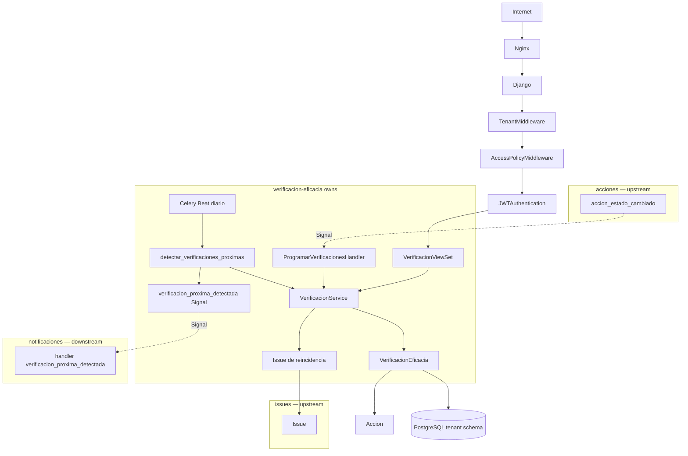
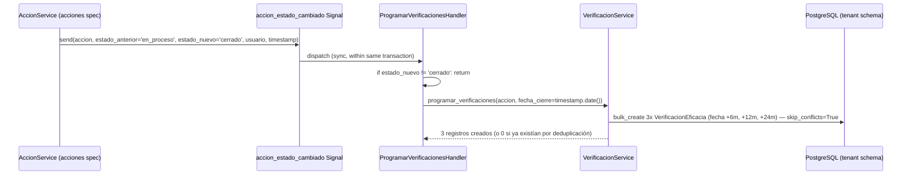
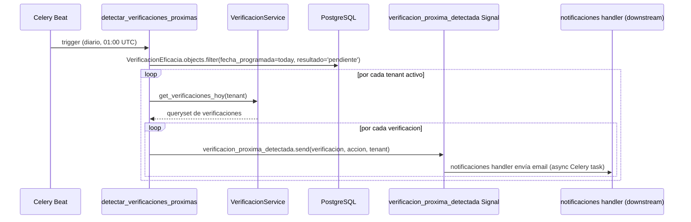
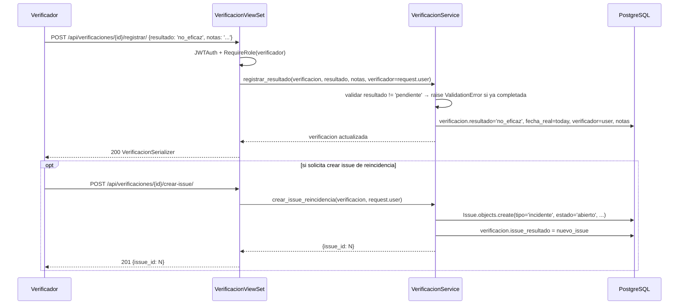
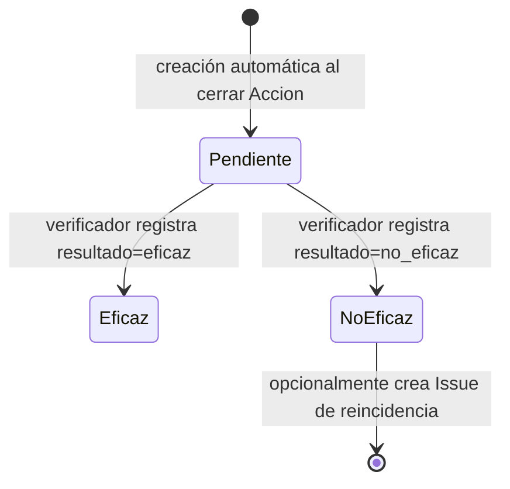
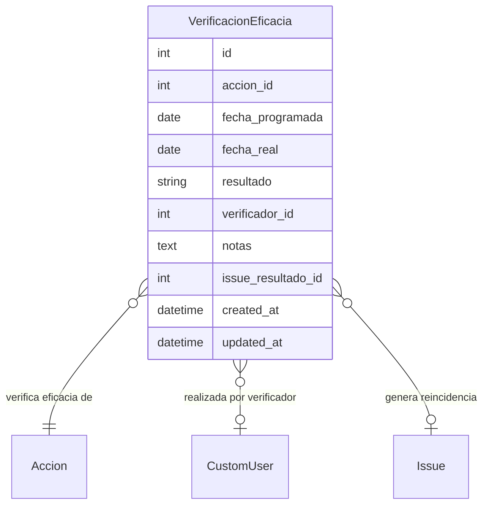

# Design: verificacion-eficacia

## Overview

Verificación de Eficacia cierra el ciclo de gestión de acciones correctivas del SGCA con seguimiento a largo plazo. Al detectar que una Accion llega a estado "cerrado", programa automáticamente tres verificaciones futuras (6, 12 y 24 meses). Una tarea Celery Beat diaria detecta las verificaciones con fecha de hoy y emite una señal para que la spec notificaciones envíe el correo al verificador. El verificador registra el resultado vía API; si la acción no fue eficaz, puede generar un nuevo Issue.

**Purpose**: Proveer trazabilidad formal de efectividad real de las acciones de seguridad y facilitar la detección de problemas recurrentes.
**Users**: Verificador (registra resultados), Admin y Supervisor (consultan historial para auditoría).
**Impact**: Define el modelo VerificacionEficacia y la señal verificacion_proxima_detectada que notificaciones consume. También emite un issue de reincidencia hacia la spec issues cuando el resultado es no_eficaz.

### Goals
- Programación automática de 3 verificaciones al cerrar una Accion, sin intervención manual
- Tarea Celery Beat diaria idempotente para detección de fechas y emisión de evento a notificaciones
- Registro de resultado (eficaz/no_eficaz) con trazabilidad completa y restricción de rol
- Flujo de reincidencia: nuevo Issue vinculado cuando resultado es no_eficaz
- Consulta de historial de verificaciones por acción para admin/supervisor

### Non-Goals
- Envío del email de notificación de verificación (→ notificaciones, que escucha verificacion_proxima_detectada)
- Upload de archivos de evidencia en la verificación (→ planes-trabajo)
- Transición de la Accion a estado "Verificado" (→ acciones, que propia su máquina de estados)
- Generación de reportes de eficacia agregados (→ reportes-dashboard)

---

## Boundary Commitments

### This Spec Owns
- Modelo `VerificacionEficacia` en el schema privado del tenant
- Handler de señal sobre `accion_estado_cambiado` para crear las 3 verificaciones
- Señal `verificacion_proxima_detectada` (definición + emisión desde la tarea Celery Beat)
- Tarea Celery Beat `sgca.verificacion.detectar_verificaciones_proximas`
- `VerificacionService`: lógica de programación, registro de resultado, deduplicación y creación de issue de reincidencia
- Endpoints REST: listado de verificaciones por acción y registro de resultado
- La FK `VerificacionEficacia.id` y la señal `verificacion_proxima_detectada` como contratos de salida

### Out of Boundary
- Envío del email (→ notificaciones registra handler de `verificacion_proxima_detectada` en su propio app)
- Máquina de estados de Accion (→ acciones; esta spec solo escucha la señal, no modifica Accion.estado)
- Upload y almacenamiento de evidencia de verificación (→ planes-trabajo)
- Transición de Accion a estado "Verificado" (→ acciones, AccionService.transition_state)
- Reportes y métricas de eficacia agregadas (→ reportes-dashboard)

### Allowed Dependencies
- `apps.acciones.signals.accion_estado_cambiado` — señal upstream escuchada (solo lectura; no modifica acciones)
- `apps.acciones.models.Accion` — FK en VerificacionEficacia
- `apps.issues.models.Issue` — creación de Issue de reincidencia vía `IssueService.create_issue()` (nunca instanciar Issue directamente, para mantener el historial de transición y consistencia de la FSM)
- `apps.users.models.CustomUser` — FK verificador; RequireRole para permisos
- `apps.users.permissions.RequireRole`, `IsAdminTenant` — permisos de endpoints
- `apps.tenants.models.TenantModel` — herencia para aislamiento por schema
- `celery` + `django_celery_beat` — tarea periódica diaria
- `django.dispatch.Signal` — señal verificacion_proxima_detectada
- `djangorestframework` — ViewSet, Serializer

### Revalidation Triggers
- Si cambia la firma de `accion_estado_cambiado` (args, nombre) → revalidar este spec (el handler depende de esa firma)
- Si cambia el modelo `Accion` (especialmente la fecha de transición a "cerrado") → revalidar lógica de fecha_cierre en el handler
- Si cambia la firma de `verificacion_proxima_detectada` → revalidar notificaciones (consume esta señal)
- Si cambia `RequireRole` de auth-rbac → revalidar permisos de todos los endpoints de este spec
- Si cambia `IssueService.create_issue` en issues → revalidar flujo de reincidencia

---

## Architecture

### Architecture Pattern & Boundary Map



**Architecture Integration**:
- Pattern: Django Signals (listener on acciones) + Celery Beat (producer to notificaciones) + DRF ViewSet + TenantModel
- El handler `ProgramarVerificacionesHandler` se conecta a `accion_estado_cambiado` en `apps.ready()`
- `detectar_verificaciones_proximas` es idempotente: usa `select_for_update` o comprueba fecha antes de emitir
- La señal `verificacion_proxima_detectada` desacopla la detección (este spec) del envío de email (notificaciones)
- Celery Beat task name: `sgca.verificacion.detectar_verificaciones_proximas` (evita colisión con notificaciones)

### Technology Stack

| Layer | Elección | Rol en este feature |
|-------|----------|---------------------|
| Backend | Python 3.12 + Django 5 + DRF | Modelo, API, lógica de negocio |
| Multi-tenancy | django-tenants (TenantModel) | Aislamiento por schema PostgreSQL |
| Señales | Django Signals | Escuchar accion_estado_cambiado; emitir verificacion_proxima_detectada |
| Tareas async | Celery + Redis | Tarea periódica diaria |
| Scheduler | Celery Beat | Schedule de la tarea diaria |
| DB | PostgreSQL 16 | Schema privado del tenant |
| Frontend | React 18 + Vite + TailwindCSS | Lista de verificaciones, formulario de resultado |

---

## File Structure Plan

### Directory Structure

```
backend/
└── apps/
    └── verificacion/
        ├── __init__.py
        ├── apps.py           # VerificacionConfig — conecta señales en ready()
        ├── models.py         # VerificacionEficacia
        ├── signals.py        # verificacion_proxima_detectada Signal + ProgramarVerificacionesHandler
        ├── serializers.py    # VerificacionSerializer, RegistrarResultadoSerializer,
        │                     # CrearIssueReincidenciaSerializer
        ├── services.py       # VerificacionService: programar, registrar, crear_issue_reincidencia
        ├── tasks.py          # detectar_verificaciones_proximas (Celery Beat)
        ├── views.py          # VerificacionViewSet (list by accion), RegistrarResultadoView
        ├── urls.py           # /api/acciones/{accion_id}/verificaciones/
        │                     # /api/verificaciones/{id}/registrar/
        │                     # /api/verificaciones/{id}/crear-issue/
        └── tests/
            ├── test_models.py        # VerificacionEficacia constraints, cascade
            ├── test_signals.py       # ProgramarHandler: 3 verificaciones creadas, deduplicación
            ├── test_tasks.py         # detectar_verificaciones_proximas: idempotencia, multi-tenant
            ├── test_services.py      # VerificacionService: programar, registrar, crear_issue
            └── test_api.py           # Endpoints: listado, registro resultado, permisos, aislamiento

frontend/
└── src/
    ├── pages/
    │   └── verificaciones/
    │       └── VerificacionListPage.tsx   # Lista de verificaciones de una acción
    ├── components/
    │   └── verificaciones/
    │       ├── VerificacionCard.tsx        # Tarjeta: fecha, resultado, verificador, notas
    │       └── RegistrarResultadoForm.tsx  # Formulario: resultado + notas + opción crear issue
    └── services/
        └── verificaciones.ts              # verificacionService: list, registrar, crearIssue
```

### Modified Files
- `backend/config/settings/base.py` — añadir `'apps.verificacion'` a TENANT_APPS
- `backend/config/celery.py` — registrar el schedule diario de `detectar_verificaciones_proximas`

---

## System Flows

### Flujo: Cierre de acción → programación de verificaciones



### Flujo: Detección diaria y emisión de evento



### Flujo: Registro de resultado



### Máquina de estados de VerificacionEficacia



---

## Requirements Traceability

| Requisito | Resumen | Componentes | Contratos | Flujos |
|-----------|---------|-------------|-----------|--------|
| 1.1–1.5 | Programación automática al cerrar acción | ProgramarVerificacionesHandler, VerificacionService | accion_estado_cambiado Signal (listener) | Cierre → programación |
| 2.1–2.5 | Detección diaria y emisión de evento | detectar_verificaciones_proximas, verificacion_proxima_detectada | Celery Beat schedule, Signal (producer) | Detección diaria |
| 3.1–3.5 | Registro de resultado por verificador | VerificacionViewSet, VerificacionService | POST /api/verificaciones/{id}/registrar/ | Registro de resultado |
| 4.1–4.4 | Creación de issue de reincidencia | VerificacionService, VerificacionViewSet | POST /api/verificaciones/{id}/crear-issue/ | Registro de resultado (opt) |
| 5.1–5.4 | Historial de verificaciones por acción | VerificacionViewSet | GET /api/acciones/{id}/verificaciones/ | — |
| 6.1–6.3 | Aislamiento por tenant | TenantModel, VerificacionService.get_verificaciones_hoy | — | Detección diaria (multi-tenant) |

---

## Components and Interfaces

### Resumen de Componentes

| Componente | Layer | Intent | Req Coverage | Dependencias Clave |
|------------|-------|--------|--------------|---------------------|
| VerificacionEficacia | Modelo | Registro de verificación programada y su resultado | 1, 3, 4, 5, 6 | TenantModel, Accion, CustomUser (P0) |
| ProgramarVerificacionesHandler | Signal handler | Escucha accion_estado_cambiado y crea 3 verificaciones | 1 | accion_estado_cambiado, VerificacionService (P0) |
| verificacion_proxima_detectada | Signal | Contrato de salida hacia notificaciones | 2 | Django Signals (P0) |
| detectar_verificaciones_proximas | Celery task | Tarea diaria de detección e emisión de evento | 2 | VerificacionService, verificacion_proxima_detectada (P0) |
| VerificacionService | Service | Programar, registrar resultado, deduplicar, crear issue | 1, 2, 3, 4, 5, 6 | VerificacionEficacia, Issue, Accion (P0) |
| VerificacionViewSet | API | Listado de verificaciones, registro de resultado, crear issue | 3, 4, 5 | VerificacionService, RequireRole (P0) |

---

### Modelos

#### VerificacionEficacia

| Field | Detail |
|-------|--------|
| Intent | Registro de una verificación de eficacia programada para una Accion |
| Requirements | 1.1, 1.2, 1.3, 1.4, 3.1, 4.4, 5.2, 6.1 |

**Contracts**: Service [x]

```python
class VerificacionEficacia(TenantModel):
    RESULTADOS = [
        ('pendiente', 'Pendiente'),
        ('eficaz', 'Eficaz'),
        ('no_eficaz', 'No Eficaz'),
    ]

    accion = ForeignKey('acciones.Accion', on_delete=CASCADE, related_name='verificaciones')
    fecha_programada = DateField()
    fecha_real = DateField(null=True, blank=True)
    resultado = CharField(max_length=20, choices=RESULTADOS, default='pendiente')
    verificador = ForeignKey(
        'users.CustomUser', on_delete=PROTECT, null=True, blank=True,
        related_name='verificaciones_realizadas'
    )
    notas = TextField(blank=True, default='')
    issue_resultado = ForeignKey(
        'issues.Issue', on_delete=SET_NULL, null=True, blank=True,
        related_name='verificacion_origen'
    )
    created_at = DateTimeField(auto_now_add=True)
    updated_at = DateTimeField(auto_now=True)

    class Meta:
        unique_together = [('accion', 'fecha_programada')]  # deduplicación
        ordering = ['fecha_programada']
        indexes = [
            Index(fields=['fecha_programada', 'resultado']),  # lookup diario
        ]
```

**Invariants**:
- `unique_together = ('accion', 'fecha_programada')` garantiza deduplicación (Req 1.3)
- Solo `resultado='pendiente'` puede transicionar; una vez registrado no puede modificarse (Req 3.5)
- `verificador`, `fecha_real` y `notas` solo se establecen al registrar resultado (Req 3.1)
- `issue_resultado` solo se establece si el verificador solicita crear el Issue de reincidencia (Req 4.4)

---

### Signal Handler

#### ProgramarVerificacionesHandler

| Field | Detail |
|-------|--------|
| Intent | Escucha accion_estado_cambiado y programa automáticamente las 3 verificaciones al detectar estado_nuevo='cerrado' |
| Requirements | 1.1, 1.2, 1.3, 1.5 |

**Contracts**: Event [x]

```python
# En apps/verificacion/signals.py

from django.dispatch import Signal, receiver
from apps.acciones.signals import accion_estado_cambiado

verificacion_proxima_detectada = Signal()
# Kwargs:
# - verificacion: VerificacionEficacia
# - accion: Accion
# - tenant: connection.tenant (para multi-tenant processing en Celery)

@receiver(accion_estado_cambiado)
def programar_verificaciones_handler(sender, accion, estado_nuevo, timestamp, **kwargs):
    if estado_nuevo != 'cerrado':
        return
    from apps.verificacion.services import VerificacionService
    VerificacionService().programar_verificaciones(accion, fecha_cierre=timestamp.date())
```

**Ordering / delivery guarantees**:
- Se ejecuta sincrónicamente dentro de la transacción del cambio de estado de la Accion
- Si el handler falla, no revierte la transición de la Accion (handlers deben capturar sus excepciones)
- `programar_verificaciones` usa `bulk_create(ignore_conflicts=True)` para idempotencia (Req 1.3)

---

### Service Layer

#### VerificacionService

| Field | Detail |
|-------|--------|
| Intent | Centraliza la lógica de programación, detección, registro de resultado y creación de issue de reincidencia |
| Requirements | 1.1–1.5, 2.1–2.5, 3.1–3.5, 4.1–4.4, 5.1–5.4, 6.1–6.3 |

**Contracts**: Service [x]

```python
class VerificacionService:
    def programar_verificaciones(
        self,
        accion: Accion,
        fecha_cierre: date,
    ) -> list[VerificacionEficacia]:
        """
        Crea 3 VerificacionEficacia para +6m, +12m, +24m desde fecha_cierre.
        Usa bulk_create(ignore_conflicts=True) para deduplicación.
        Returns lista de objetos creados (puede ser vacía si ya existían).
        """

    def get_verificaciones_hoy(self) -> QuerySet[VerificacionEficacia]:
        """
        Retorna VerificacionEficacia con fecha_programada==today y resultado=='pendiente'.
        TenantModel garantiza el scope del tenant activo.
        """

    def registrar_resultado(
        self,
        verificacion: VerificacionEficacia,
        resultado: str,
        notas: str,
        verificador: CustomUser,
    ) -> VerificacionEficacia:
        """
        Registra resultado, fecha_real y verificador.
        Raises: ValidationError si resultado != 'pendiente' (ya completada).
        Raises: ValidationError si resultado no es 'eficaz' ni 'no_eficaz'.
        """

    def crear_issue_reincidencia(
        self,
        verificacion: VerificacionEficacia,
        solicitado_por: CustomUser,
    ) -> Issue:
        """
        Crea Issue tipo='incidente', estado='abierto' vinculado a la Accion original.
        Vincula verificacion.issue_resultado = issue creado.
        Raises: ValidationError si verificacion.resultado != 'no_eficaz'.
        Raises: ValidationError si ya existe un issue de reincidencia para esta verificación.
        """
```

**Preconditions**: `connection.schema_name` es el schema del tenant activo
**Postconditions**: Objetos creados/modificados en el schema del tenant activo
**Invariants**: `programar_verificaciones` es idempotente; `registrar_resultado` es one-shot (no permite re-registro)

---

### Celery Task

#### detectar_verificaciones_proximas

| Field | Detail |
|-------|--------|
| Intent | Tarea Celery Beat diaria que detecta verificaciones con fecha hoy y emite verificacion_proxima_detectada para cada una |
| Requirements | 2.1–2.5, 6.2 |

**Contracts**: Batch [x]

```python
# En apps/verificacion/tasks.py
from celery import shared_task
from apps.tenants.models import Tenant
from django_tenants.utils import schema_context

@shared_task(name='sgca.verificacion.detectar_verificaciones_proximas')
def detectar_verificaciones_proximas():
    """
    Itera sobre tenants activos. Para cada tenant, obtiene VerificacionEficacia
    con fecha_programada==today y resultado=='pendiente'. Emite verificacion_proxima_detectada.
    Idempotente: la misma verificación no debe emitir señal dos veces el mismo día.
    """
    from apps.verificacion.signals import verificacion_proxima_detectada
    from apps.verificacion.services import VerificacionService

    for tenant in Tenant.objects.filter(subscription__is_active=True):
        with schema_context(tenant.schema_name):
            service = VerificacionService()
            verificaciones = service.get_verificaciones_hoy()
            for verificacion in verificaciones:
                verificacion_proxima_detectada.send(
                    sender=VerificacionEficacia,
                    verificacion=verificacion,
                    accion=verificacion.accion,
                    tenant=tenant,
                )
```

- **Trigger**: Celery Beat schedule (diario, 01:00 UTC) — registrado en `celery.py`
- **Task name**: `sgca.verificacion.detectar_verificaciones_proximas` (sin colisión con notificaciones)
- **Idempotency**: La señal se emite solo para verificaciones con `resultado=='pendiente'`; una vez registrado el resultado ya no aparecen en el query
- **Multi-tenant**: Itera sobre tenants con `schema_context` de django-tenants

---

### API

#### VerificacionViewSet

| Field | Detail |
|-------|--------|
| Intent | Endpoints REST para listar verificaciones de una acción, registrar resultado y crear issue de reincidencia |
| Requirements | 3.1–3.5, 4.1–4.4, 5.1–5.4, 6.1, 6.3 |

**Contracts**: API [x]

| Method | Endpoint | Roles | Request | Response | Errors |
|--------|----------|-------|---------|----------|--------|
| GET | `/api/acciones/{accion_id}/verificaciones/` | admin, supervisor | — | `[VerificacionSerializer]` | 401, 403, 404 |
| POST | `/api/verificaciones/{id}/registrar/` | verificador | `RegistrarResultadoSerializer` | `VerificacionSerializer` | 400, 401, 403, 404 |
| POST | `/api/verificaciones/{id}/crear-issue/` | verificador | `{}` | `{issue_id: int}` | 400, 401, 403, 404 |

```python
# VerificacionSerializer (lectura)
class VerificacionSerializer:
    id: int
    accion_id: int
    fecha_programada: date
    fecha_real: date | None
    resultado: str          # 'pendiente' | 'eficaz' | 'no_eficaz'
    verificador: UserBasicSerializer | None   # {id, nombre_completo}
    notas: str
    issue_resultado_id: int | None
    created_at: datetime

# RegistrarResultadoSerializer (escritura)
class RegistrarResultadoSerializer:
    resultado: str   # required, choices=['eficaz', 'no_eficaz'] — no permite 'pendiente'
    notas: str       # optional, default=''

# Error 400 (ya completada)
{"detail": "Esta verificación ya fue completada. No se puede registrar el resultado nuevamente."}

# Error 400 (resultado inválido)
{"resultado": ["Valor inválido. Opciones válidas: eficaz, no_eficaz."]}

# Error 403 (rol insuficiente)
{"detail": "Solo el verificador puede registrar el resultado de una verificación."}

# Error 400 (crear-issue sin resultado no_eficaz)
{"detail": "Solo se puede crear un issue de reincidencia si el resultado es no_eficaz."}

# Error 400 (issue ya creado)
{"detail": "Ya existe un issue de reincidencia para esta verificación."}
```

---

## Data Models

### Domain Model



### Logical Data Model

**VerificacionEficacia** (TenantModel, schema privado):
- `accion`: FK(Accion, CASCADE) — non-null, immutable tras creación
- `fecha_programada`: DateField — non-null, inmutable tras creación
- `resultado`: CharField choices=[pendiente/eficaz/no_eficaz], default='pendiente'
- `fecha_real`: DateField — null hasta que verificador registra resultado
- `verificador`: FK(CustomUser, PROTECT) — null hasta registro; rol verificador validado en service
- `notas`: TextField — blank permitido
- `issue_resultado`: FK(Issue, SET_NULL) — null; solo si resultado=no_eficaz y verificador crea issue
- `unique_together`: ('accion', 'fecha_programada') — deduplicación de programación
- Índice compuesto: (fecha_programada, resultado) — lookup diario de la tarea Celery Beat

### Data Contracts & Integration

```python
# Contrato de entrada: señal accion_estado_cambiado (de acciones spec)
# handler recibe: accion: Accion, estado_nuevo: str, timestamp: datetime

# Contrato de salida: señal verificacion_proxima_detectada (hacia notificaciones)
# verificacion_proxima_detectada.send(
#     sender=VerificacionEficacia,
#     verificacion=verificacion,  # VerificacionEficacia
#     accion=verificacion.accion,  # Accion
#     tenant=tenant,               # Tenant (para que notificaciones identifique a quién enviar)
# )

# Contrato de salida: FK Issue de reincidencia (hacia issues spec)
# VerificacionEficacia.issue_resultado = ForeignKey(Issue, SET_NULL)
# El Issue se crea con tipo='incidente', estado='abierto', reportado_por=verificador
```

---

## Error Handling

### Error Strategy
Validación de campos en serializers. Validación de estado de verificación (resultado != 'pendiente') en VerificacionService. Restricción de rol en endpoint con RequireRole. Aislamiento garantizado por TenantModel. Deduplicación via `unique_together` con `ignore_conflicts=True` en bulk_create.

### Error Categories and Responses

| Categoría | Escenario | Respuesta |
|-----------|-----------|-----------|
| 400 Bad Request | Campo resultado ausente o inválido; verificación ya completada; issue ya creado; crear-issue sin resultado no_eficaz | `{"detail": "..."}` o `{"field": ["msg"]}` |
| 401 Unauthorized | Token JWT ausente o inválido | simplejwt default |
| 403 Forbidden | Rol distinto a verificador intenta registrar resultado; rol sin acceso al historial | `{"detail": "..."}` |
| 404 Not Found | Verificación o Accion no existe en el tenant activo | `{"detail": "No encontrado."}` |

### Monitoring
- Log INFO cuando se crean las 3 verificaciones al cerrar una Accion: `accion_id`, `fechas_programadas`
- Log INFO por cada verificacion_proxima_detectada emitida: `verificacion_id`, `tenant_schema`
- Log WARNING si la tarea Celery Beat encuentra una verificación con fecha_programada pasada y resultado='pendiente' (verificación vencida sin registrar)

---

## Testing Strategy

### Unit Tests
1. `VerificacionService.programar_verificaciones` — crea exactamente 3 fechas correctas; idempotente (no duplica con unique_together)
2. `VerificacionService.registrar_resultado` — actualiza campos correctamente; lanza ValidationError si ya completada
3. `VerificacionService.crear_issue_reincidencia` — crea Issue con datos correctos; lanza error si resultado != no_eficaz; lanza error si issue ya existe
4. `ProgramarVerificacionesHandler` — solo actúa cuando estado_nuevo=='cerrado'; ignora otros estados
5. `detectar_verificaciones_proximas` — query correcto (fecha==hoy, resultado=='pendiente'); emite señal por cada una

### Integration Tests
1. `accion_estado_cambiado` con estado_nuevo='cerrado' → 3 registros VerificacionEficacia creados en el schema del tenant
2. `accion_estado_cambiado` dos veces con mismo Accion (re-cierre) → no duplica registros (unique_together)
3. `POST /api/verificaciones/{id}/registrar/` como verificador → actualiza registro; como admin → 403
4. `POST /api/verificaciones/{id}/registrar/` segunda vez → 400 (ya completada)
5. `POST /api/verificaciones/{id}/crear-issue/` con resultado no_eficaz → Issue creado en mismo tenant
6. `POST /api/verificaciones/{id}/crear-issue/` con resultado eficaz → 400
7. `GET /api/acciones/{id}/verificaciones/` como admin → lista ordenada; como responsable → 403
8. Aislamiento de tenant: verificación de tenant A no accesible desde tenant B (404)
9. `detectar_verificaciones_proximas` — procesa tenant A y tenant B sin mezclar datos

### E2E Tests
1. Admin crea issue → acción correctiva → supervisor cierra → 3 verificaciones programadas → verificador registra 'no_eficaz' → crea issue de reincidencia → admin ve historial completo
2. Tarea Celery Beat detecta verificación con fecha hoy → señal emitida → (notificaciones enviaría email)
3. Verificador intenta registrar misma verificación dos veces → segundo intento rechazado con 400
